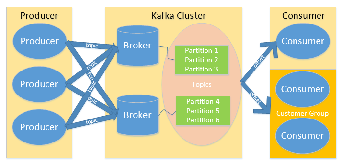
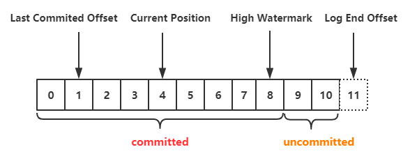
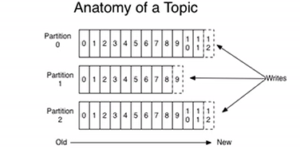
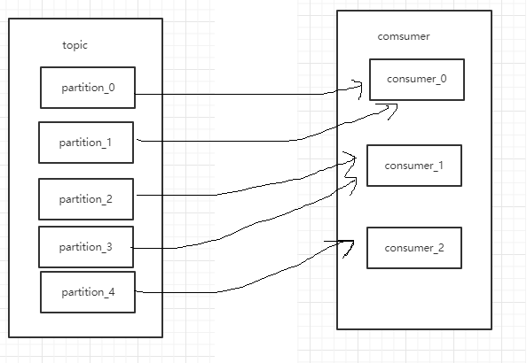
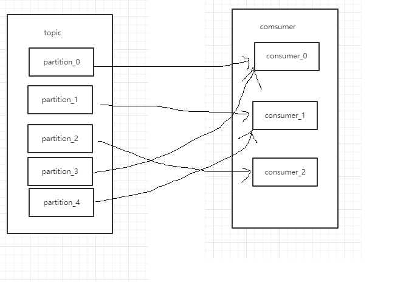
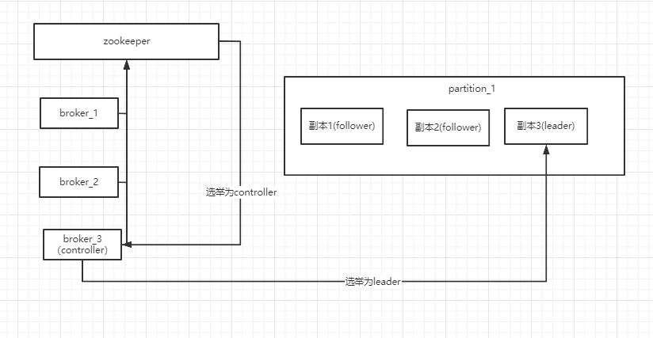

# kafka 介绍

kafka 是一款基于发布订阅的消息系统，Kafka的最大的特点就是高吞吐量以及可水平扩展，
Kafka擅长处理数据量庞大的业务，例如使用Kafka做日志分析、数据计算等。

## kafka 概念角色介绍

- Broker：kafka 中 broker概念和rabbitMQ的broker概念类似，一个独立的 Kafka 服务器被称为broker，接收来自生产者的消息，为消息设置偏移量，并提交消息到磁盘保存；
- Topic：Topic为主题，也就是相当于消息系统中的队列(queue)，一个Topic中存在多个Partition；注意，这里区别于 rabbitMQ 的 Topic；
- Partition：Partition为分区，是构成Kafka存储结构的最小单位；
- Group：消费者组，一组消费者构成消费者组
- Message：消息

# kafka 安装及使用
kafka 的运行依赖于 zookeeper，它的安装相对于 rabbitMQ来说比较简单。下面介绍Windows下 kafka的安装及其使用。

kafka是依赖于zookeeper的，所以我们先要安装zookeeper ，当然kafka的二进制包里面，包含了zookeeper 的安装包，我们不需要单独的再去下载ZK的安装包；

 在 kafka 官网下载 二进制的 tgz 压缩包： http://kafka.apache.org/downloads.html，解压后它的 bin/windows下有 zk的启动脚本和kafka的启动脚本，
 zk的配置文件和kafka的配置文件在 config文件夹下，分别对应 zookeeper.properties和server.properties。
 由于本人对zk使用的频率也比较高，因此我是单独安装的zk。
 
 下面我们对kafka进行配置及启动，配置文件说明：
 ```
 # 对外暴露的服务端口
advertised.listeners=PLAINTEXT://ip:9092
# 机器的标识
broker.id=1
# kafka日志存储的位置
log.dirs=c:xxx
# zk的地址
zookeeper.connect=localhost:2181
```
 
启动脚本： 
 ```bat
.\bin\windows\kafka-server-start.bat .\config\server.properties
```

接下来我们做一下简单的测试。

执行脚本
```bat
.\bin\windows\kafka-topics.bat --create --zookeeper localhost:2181 --replication-factor 1 --partitions 1 --topic test
```

该操作创建了一个 名为 test 的 kafka 主题，接下来我们可以在主题中写入消息并消费消息了。

执行脚本
```bat
.\bin\windows\kafka-console-producer.bat --broker-list 127.0.0.1:9092 --topic test 
xxx
xxx
```
该操作创建了一个消息生产者，并发送消息 "xxx"

执行脚本,消费消息：
```bat
kafka-console-consumer.bat --bootstrap-server localhost:9092 --topic test --from-beginning

```


# kafka 原理

消息队列一般包含两种模式，一种是点对点的模式，一种是发布订阅的模式。前文提到过 kafka 是一款基于发布订阅的消息队列。
那么kafka是怎么去发布消息，怎么去保存消息，订阅消息的呢？首先我们从kafka的发布订阅模型开始分析。

下图为kafka的发布订阅模型：


## kafka 运行流程

kafka 总体流程可以粗略的归纳为：
Producer 生产一个消息并指定消息的主题 Topic -> producer 将生产的消息投递给 kafka cluster -> kafka cluster 
将消息根据 Topic 拆分成多个partition 存储到各个 broker 中 -> 消费者组订阅主题，负载均衡的消费消息。
接下来我们分析 kafka 的数据分区保存和记录消息消费与生产的方式。

## partition(分区)

kafka 对于 topic 有一个分区的默认值，通过config/server.properties中通过配置项num.partitions来指定新建Topic的默认Partition数量，
同时也可在创建Topic时通过参数指定或者在Topic创建之后通过Kafka提供的工具修改。生产者将数据写入到kafka主题后，
kafka通过不同的策略将数据分配到不同分区中，常见的有三种策略，轮询策略，随机策略，和按键保存策略。

在消费者这一端，一个consumer可以消费一个或多个partition，1个partition只能被同组的一个consumer消费，
但是可以被不同组的多个 consumer 消费。如果一个consumer group中的consumer个数多于topic中的partition的个数，
多出来的consumer会闲置。

分区本身会有多个副本，这多个副本中只有一个是leader，而其他的都是follower。仅有leader副本可以对外提供服务。
通常follower不和leader在同一个broker中，这样当leader 挂掉 follower 不会跟着挂，
而是从众多follower中选一个出来作为leader继续提供服务。

## offset

每个分区中还会维护一个 offset (偏移量)，这是一个很重要的数据，消息的存取都依赖它。
现在我们可以先简单的理解为往每个分区中写一条数据就会加一个偏移量，而消费一条数据就会减一个偏移量，就好像队列的游标一样。
后文会具体分析它的工作原理。下图为 offset 示意图：




通常由如下几种 Kafka Offset 的管理方式：

- Spark Checkpoint：在 Spark Streaming 执行Checkpoint 操作时，将 Kafka Offset 一并保存到 HDFS 中。

- HBASE、Redis 等外部 NOSQL 数据库：这一方式可以支持大吞吐量的 Offset 更新。

- ZOOKEEPER：老版本的位移offset是提交到zookeeper中的，目录结构是 ：/consumers/<group.id>/offsets/ <topic>/<partitionId> ，当存在频繁的 Offset 更新时，ZOOKEEPER 集群本身可能成为瓶颈。

- KAFKA：存入自身的一个特殊 Topic中，这种方式支持大吞吐量的Offset 更新，又不需要手动编写 Offset 管理程序或者维护一套额外的集群。


后文我们会介绍关于 kafka 的 partition 与 offset 的一些机制，如数据存储与同步，分区原则，分区策略，可靠性保证，高效读写原理等。


# kafka 原理深度解读

前文介绍了kafka的一些基本原理，接下来我们深入了解下关于kafka的一些机制和优化


## partition 文件存储机制

前文提到过，一个topic是分成多个partition 存储的；topic是逻辑上的概念，partition是物理上的概念，如图所示：

通过图片我们可以看出，虽然每个partition内部是有序的，但对于整个topic而言它是无法保证有序性的。
partition 的数据会以 日志文件的形式存储到磁盘中，在配置文件 `server.properties` 中通过属性 `log.dirs` 指定。
在该文件夹下会根据topic和序号来创建文件夹，在该 partition 文件夹中以 `.log` 结尾的文件是实际存储数据的文件，当生产者生产数据，。
以 `.index` 结尾的文件是索引文件，index 和log 组成一个 `segment`。 .log 文件默认只会保持7天内的数据，通过 `log.retention.hours` 配置项指定数据保持时长。
当.log 文件超出最大值时会创建新的 .log文件和.index文件，也就是一个新的segment；其中文件的名称以消息起始偏移量命名。 
`log.segment.bytes` 指定log文件的最大值。当我们去寻找一条消息的时候，会先根据偏移量来定位到属于哪一个 `segment`，
再通过二分查找从index文件中寻找该偏移量对应的索引，再通过索引去log文件中找到真正的消息。

## 数据可靠性保证
为保证producer 发送的数据不丢失，broker 接收到数据后都需要对producer发送ack(确认接收) ，如果producer 未收到ack则会重新发送该条消息。producer 的 ack 策略又分为三种：

- ack=0 producer不等待broker同步完成的确认，继续发送下一条(批)信息
- ack=1 producer要等待leader成功收到数据并得到确认，才发送下一条message。
- ack=-1 producer得到follwer确认(全副本同步完成)，才发送下一条数据

## isr（同步副本表） 

采用全副本同步完成再ack会有一个问题：
当leader 接收完数据，所有的follower开始同步数据，但一旦有一个follower不能与leader进行同步，那leader会一直等下去，这样会非常的浪费时间。
为此kafka引入了 isr 机制——leader会维护一个动态的 isr（in-sync replica set）列表，这个列表维护了和leader保持同步的集合。当ISR中的follower完成数据的同步之后，leader就会发送ack。如果follower 长时间未向leader同步数据，则该follower将会被踢出 isr，当其他满足条件的follower也会被加入到isr。这个同步最大时间配置项为`replica.lag.time.max.ms` 参数设置。如果leader故障了，也会从isr的follower中选举新的leader。

## 数据一致性问题
因为副本的消息数是存在差异的，可能leader10条，而follower只同步了8条；当leader挂掉，数据就有可能会发生丢失，通过一种机制来保证消费者消费数据的一致性就很有必要了。kafka的数据一致性通过  LEO（每个副本的最后一条o'f'fset）和HW（所有的LEO中最小的那个）来保证。示意图：
消费者只能看到offset<=HW 的消息。

## 消费策略

kafka 对消息消费的处理有两种：
- （at least once）至少一次
- (at most once)至多一次
- (exactly once) 有且只有一次

因为ack机制的存在，producer 向kafka发送消息时如果 ack=0，由于producer不等确认消息是否投递成功就不管了 ，可能丢失数据，此时消费者最多消费一次消息；如果ack=1，当producer未收到消息确认投递成功时会再次投递，这个时候可能消息被投递了多次，可能会存在重复消费的情况。当kafka开启数据幂等性且ack=1的时候，此时重复的消息会被去重，因此不会产生重复消费的情况。
启用幂等性的方式是将producer中的参数 `enable.idompotence` 设置为true。

## 消费者相关特性

和rabbitMQ一样，可以指定消费者消费消息是推模式还是拉模式，逻辑是和 rabbit 一样的，这里就不多做解释了。在消费者组中，有多个消费者，一个topic中有多个partition。那么消息的分配是怎么样的呢，首先前文提到过一个消费者组中的消费者不能同时消费同一个partition，这是基本原则。
然后partiotion的分配机制有两种，一种是range（范围） 一种是 RoundRobin（轮询），range示 意图：



RoundRobin 示意图：




由于consumer也可能会宕机挂掉，当consumer恢复的时候必须要能够从上一次消费的地方重新开始消费。所以consumer需要实时记录自己消费到了哪一个offset，以便能够恢复到宕机前状态。

## kafka高效读写保证

kafka的producer生产数据，要以追加的形式写入到log文件中，这个写磁盘的过程是顺序写，相对于磁盘的随机写来说，这个效率要高出很多，这个是kafka高效读写的保证之一。而另外的一个保证高效读写的技术是零拷贝，用过netty的小伙伴应该知道这个技术，中间少了两次用户态的切换。

## kafka 集群特性

kafka的集群中会有一个broker会被选举为 controller，负责管理集群broker的上下线，所有topic的副本leader的选举工作，
而controller的这些管理工作都是需要依赖于kafka的。
下图为leader的选举示意图：



第一步：kafka利用zookeeper去选举出controller；第二步：kafka通过controller选指定出leader。

# kafka 事务

## kafka 事务介绍


kafka特性介绍完毕，接下来进入springboot实战章节
# springboot 与kafka

## 在springboot中kafka的基本使用

接下来让我们看看怎么在springboot中使用kafka,首先导入依赖
```xml
<dependency>
   <groupId>org.springframework.kafka</groupId>
   <artifactId>spring-kafka</artifactId>
</dependency>
```
然后启动项添加注解 `@EnableScheduling`，`@EnableKafka` 。第一个注解是用来添加springboot定时任务以方便测试，第二个注解是装配kafka 配置。

接下来我们要在 application 的配置文件：

```properties
# 生产者配置
spring.kafka.consumer.bootstrap-servers=localhost:9092
spring.kafka.consumer.group-id=test-consumer-group
spring.kafka.consumer.auto-offset-reset=earliest
spring.kafka.consumer.key-deserializer=org.apache.kafka.common.serialization.StringDeserializer
spring.kafka.consumer.value-deserializer=org.apache.kafka.common.serialization.StringDeserializer

# 消费者配置
spring.kafka.producer.bootstrap-servers=localhost:9092
spring.kafka.producer.key-serializer=org.apache.kafka.common.serialization.StringSerializer
spring.kafka.producer.value-serializer=org.apache.kafka.common.serialization.StringSerializer

#消费监听接口监听的主题不存在时，默认会报错
spring.kafka.listener.missing-topics-fatal=false

```

注册一个 `AdminClient` :
```java
    @Bean
    public AdminClient init( KafkaProperties kafkaProperties){
        return KafkaAdminClient.create(kafkaProperties.buildAdminProperties());
    }
```

这里因为是demo，我就将生产者和消费者写在一个程序里面了。

先测试一个简单的收发消息：
```java
@RestController
public class TestController {

    @Autowired
    private KafkaTemplate<String, String> kafkaTemplate;

    @Autowired
    private   AdminClient adminClient;

    @Scheduled(cron = "*/15 * * * * ?")
    public void send() {
        kafkaTemplate.send("xxxxx", "test");
    }

    @KafkaListener(topics = "xxxxx",groupId = "test-consumer-group")
    public void listen(ConsumerRecord<?, String> record) throws ExecutionException, InterruptedException {
        String value = record.value();
        System.out.println(value);
    }
}
```
这里我调用了`kafkaTemplate.send` 方法发送消息,第一个参数是消息的主题,第二个参数是消息.
这里我并没有先创建主题,直接往主题里面发消息了,框架会给你直接创建一个默认的主题.
我们也可以直接创建一个主题:
```java
    @Bean
    public NewTopic topic() {
        return new NewTopic("topic-test", 1, (short) 1);
    }
```
当然像 rabbitMQ 的api 那样,spring boot 还非常贴心的准备了 topic 建造者类:
```java
@Bean
public NewTopic topic1() {
    return TopicBuilder.name("thing1")
            .partitions(10)
            .replicas(3)
            .compact()
            .build();
}
```

第一个参数是主题名称,第二个参数是分区数,第三个分区是副本数(包括leader).

我们可以通过 `AdminClient` 查看 主题信息:

```java
    public String getTopic() throws ExecutionException, InterruptedException {
        ListTopicsResult listTopicsResult = adminClient.listTopics();
        Collection<TopicListing> topicListings = listTopicsResult.listings().get();
        System.out.println(">>>>>>>>>>>>>>>>>>>获取列表");
        return "success";
    }
``` 
`ListTopicsResult` 的方法返回值都是 `Future` 类型的,这意味这它是异步的,使用的时候需要注意这一点.

和rabbitMQ 类似,kafka 给我们准备了一个默认主题:
```java
    @Scheduled(cron = "*/15 * * * * ?")
    public void sendDefault() {
        kafkaTemplate.sendDefault("xxx");
    }
```
这条消息会被发送到名为 `topic.quick.default` 的主题当中去.
我们要注意 `kafkaTemplate.send` 它的返回值是`ListenableFuture`,从名字我们就能知道它实际上是一个异步的方法,
我们可以通过 `ListenableFuture.addCallback` 方法去指定回调函数:
```java
   @Scheduled(cron = "*/15 * * * * ?")
    public void send() {
        ListenableFuture<SendResult<String, String>> send = kafkaTemplate.send("xxxxx", "test");
        send.addCallback(new ListenableFutureCallback(){
            @Override
            public void onSuccess(Object o) {

            }
            @Override
            public void onFailure(Throwable throwable) {
                
            }
        });
    }
```
我们也可以通过 `ListenableFuture.get` 方法让它阻塞:
```java
    //    @Scheduled(cron = "*/15 * * * * ?")
    public void send1() {
        try {
            kafkaTemplate.send("xxxxx", "test").get(10, TimeUnit.SECONDS);
        } catch (InterruptedException e) {
            e.printStackTrace();
        } catch (ExecutionException e) {
            e.printStackTrace();
        } catch (TimeoutException e) {
            e.printStackTrace();
        }
    }
```

kafka 相关基本的api就介绍到这里了,源码可以上 `https://github.com/muggle0/learn-simple` 去找.

未完待续...

## kafka高级特性的使用 
https://docs.spring.io/spring-kafka/docs/current/reference/html/


## kafka事务

kafka 的事务是从0.11 版本开始支持的，kafka 的事务是基于 Exactly Once 语义的，它能保证生产或消费消息在跨分区和会话的情况下要么全部成功要么全部失败

### 生产者事务

当生产者投递一条事务性的消息时，会先获取一个 transactionID ，并将Producer 获得的PID 和 transactionID 绑定，当 Producer 重启，Producer
会根据当前事务的 transactionID 获取对应的PID。
kafka 管理事务是通过其组件 Transaction Coordinator 来实现的，这个组件管理每个事务的状态，Producer 可以通过transactionID 从这个组件中获得
对应事务的状态，该组件还会将事务状态持久化到kafka一个内部的 Topic 中。
生产者事务的场景：
一批消息写入 a、b、c 三个分区，如果 ab写入成功而c失败，那么kafka就会根据事务的状态对消息进行回滚，将ab写入的消息剔除掉并通知 Producer 投递消息失败。

### 消费者事务

消费者事务的一致性比较弱，只能够保证消费者消费消息是精准一次的（有且只有一次）。消费者有一个参数 islation.level，这个参数指定的是事务的隔离级别。
它的默认值是 read_uncommitted（未提交读），意思是消费者可以消费未commit的消息。当参数设置为 read_committed，则消费者不能消费到未commit的消息
。
