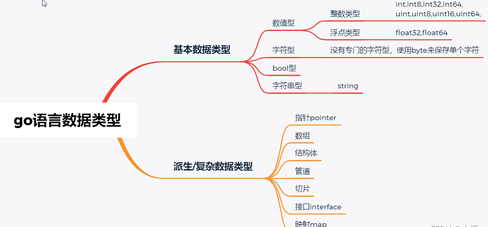
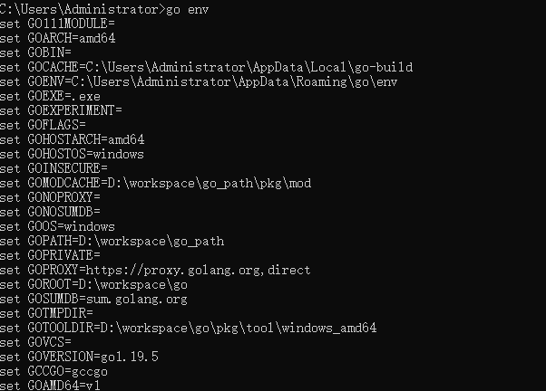
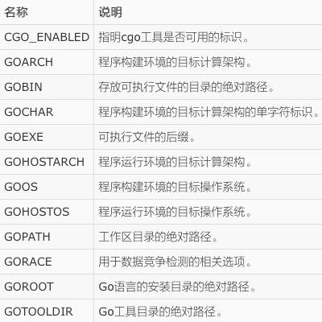

# go 语言速成系列（1）-go 基本特性

## 前言

这个系列文章计划是速通go语言，通过上手gin框架和go-zero 框架来掌握go语言，对于大家而言，已经有了语法基础，而且大部分人不会愿意去花大量的时间去学基础的if else 。以我的经验来说学完go的基础不去实践，很难把go学好。我的博客的计划是在学习框架同时学习语法，这样理论上来说节省时间而且比较能看到成果。

本节主要讲解做web项目必要掌握的基本语法、指令和知识点，下一节直接进入go的web项目开发

## go 的安装

Go官网下载地址：https://golang.org/dl/

Go官方镜像站：https://golang.google.cn/dl/

下载对应版本安装完成后需要配置`GOROOT`和`GOPATH`环境变量，其中GOROOT是我们安装go开发包的路径，GOPATH是执行`go get`指令拉取三方依赖的时候的存储路径，相当于本地maven仓库地址。
`GOPROXY`是拉取依赖的代理地址，由于国内网络的特点需要将这个代理地址替换成国内镜像：
```
go env -w GOPROXY=https://goproxy.cn,direct
```

## go 数据类型


先记住这张图，后续做项目中遇到相关知识点在学习

## go 指令

- go env 用于打印Go语言的环境信息




- go build: 用于编译我们指定的源码文件或代码包以及它们的依赖包
- go clean: 命令会删除掉执行其它命令时产生的一些文件和目录
- go get: 用于下载或更新指定的代码包及其依赖包，并对它们进行编译和安装
- go install： 用于编译并安装指定的代码包及它们的依赖包
- go list： 列出指定的代码包的信息
- go mod： 操作 go module 的指令

## go module

Go modules 是 Go 语言的依赖解决方案，相当于java 中的maven，使用 go module 管理依赖后会在项目根目录下生成两个文件 go.mod 和 go.sum。
go.mod 中会记录当前项目的所依赖的包的信息，文件格式如下所示：
```xml
module muggle.com

go 1.18

require (
    github.com/alibaba/sentinel-golang v1.0.4
)
```

go.sum记录每个依赖库的版本和哈希值，用来校验本地包的真实性。

go module 的操作指令

- go mod init： 生成 go.mod 文件，此命令会在当前目录中初始化并创建一个新的go.mod文件
- go mod tidy： 整理现有的依赖，使用此命令来下载指定的模块，并删除已经不用的模块
- go mod graph： 查看现有的依赖结构，生成项目所有依赖的报告；
- go mod edit： 编辑 go.mod 文件，之后通过 download进行下载
- go mod vendor： vendor 是早期的依赖管理工具，该指令是导出项目所有的依赖到vendor目录。

掌握这些基本的go 开发知识后我们直接开始写go web 项目，语法相关的知识在后续的开发中在做介绍。