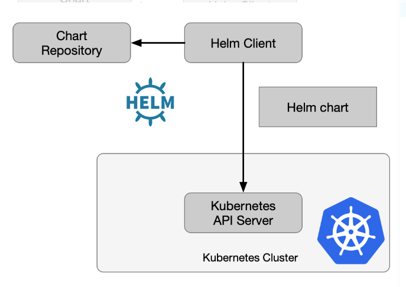

## helm2 与 helm3

之前介绍过helm相关的知识，其中给出的架构图为：

这个是helm2的架构，其中helm client指的是 Tiller 在helm2中，helm是通过Tiller对 k8s 的 api-server 进行请求的。

helm2的主要问题就是需要在k8s集群内运行一个服务端，而这就需要把tiller的端口暴露给外界，容易产生安全隐患；在helm2中引入的tiller主要是当时k8s还没有RBAC机制，之后K8S加入了RBAC和CRD等，都使得tiller这个东西显得多余。

在helm3 已经移除了Tiller，由 helm 直接请求 api-server 进行pod的调度。

与helm2相比，helm3的优势如下：

- 安装更简便；
- helm3中release可以实现不同的namespace空间中复用；
- 可以将charts推到docker仓库中。

反思：1. 知识面有待扩展；2. 写文章不够严谨 