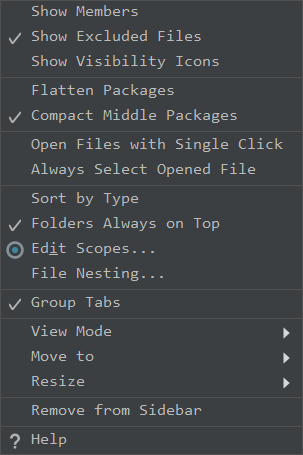
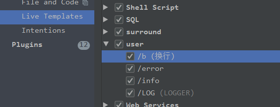
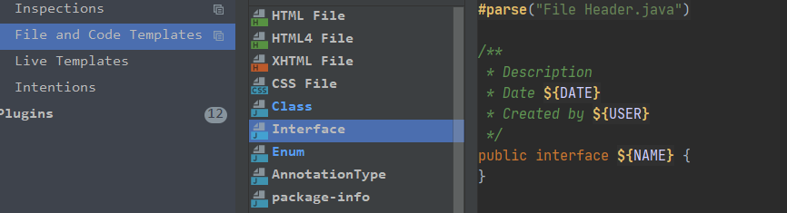
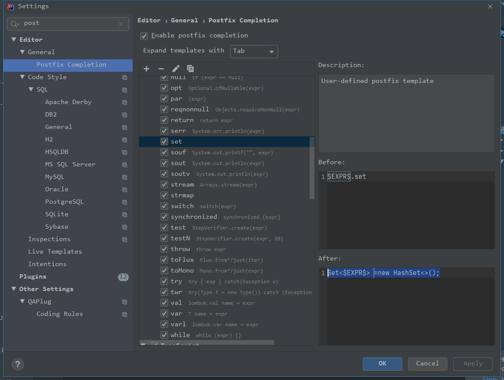
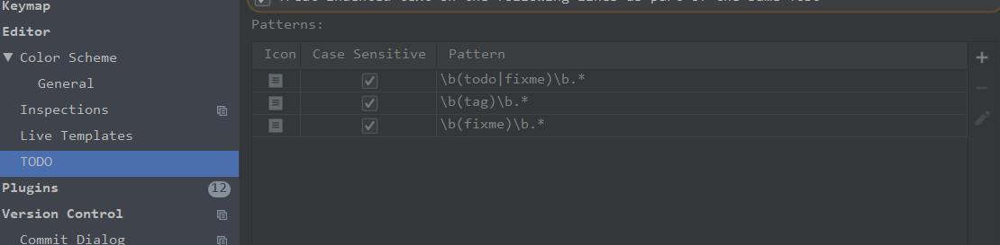

### 设置（个人喜好）
settings-> system settings 
reopen project... 不勾选

setting->editor tabs 
tab limit 20
show tabs in: 去掉 hide 选项

搜索font
appear... 设置 14 或16 字体是consolas 这个是界面设置
editor   设置 14 字体 jetbrains mono 这个是编辑区的字体  

exit 后设置mvn 属性

 
LOGGER.error("==========> [$END$]");
LOGGER.info("==========> [$END$]");
private static final Logger LOGGER = LoggerFactory.getLogger($classname$.class);

/**
 * Description 
 * Date ${DATE} 
 * Created by ${USER}
 */

 Set<$EXPR$> =new HashSet<>();

 

$EXPR$.set
 Set<$EXPR$> =new HashSet<>();
 List<$EXPR$>  =new ArrayList<>();
 Map<String,$EXPR$> =new HashMap<>();

 

 \b(fixme)\b.*

plugins

 arthas
 camelcase
 checkstyle
 cmdsupport
 git commit template
 gson format
 key px 
 mybatis log plugin
 save action
 visualvm
 sonar
 translation
 websocket
 flowable
 .ignore
 
