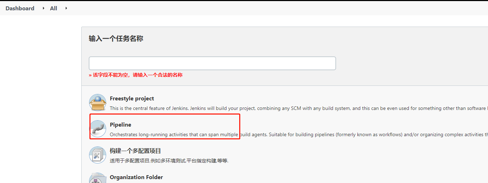
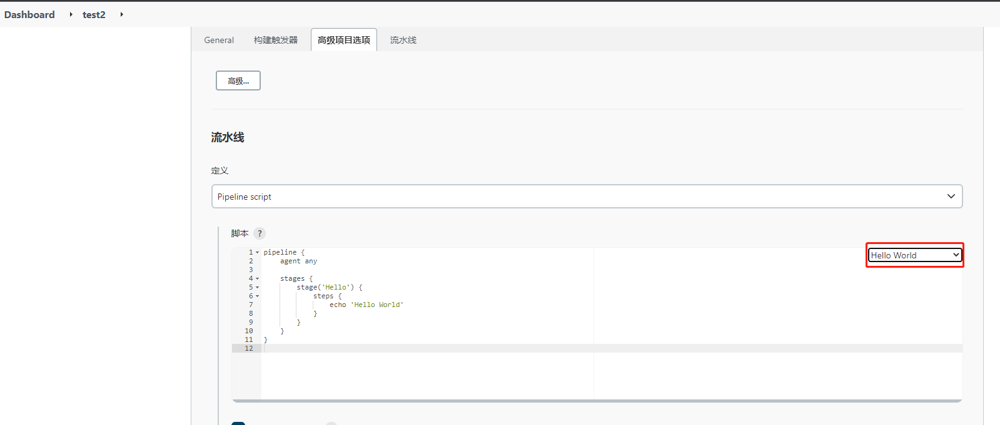
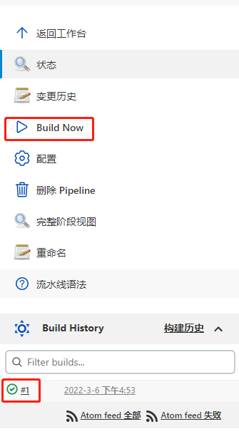
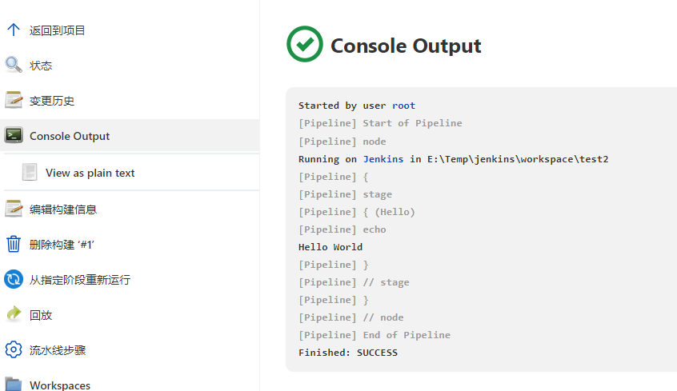
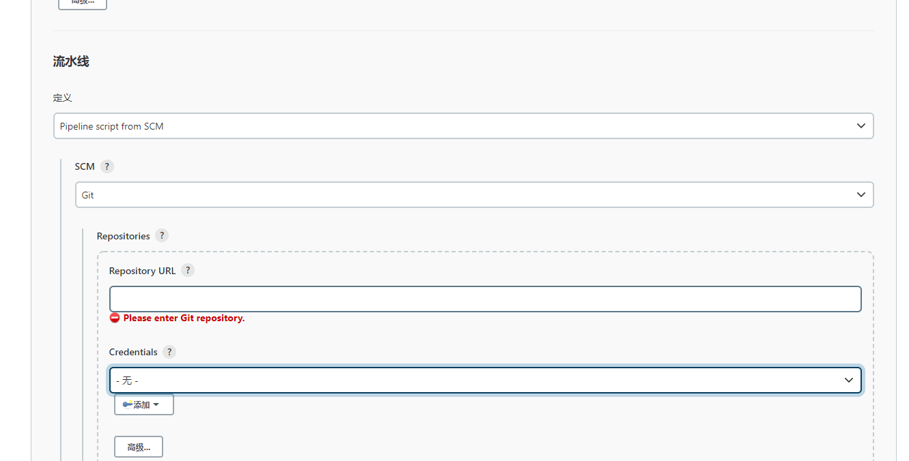
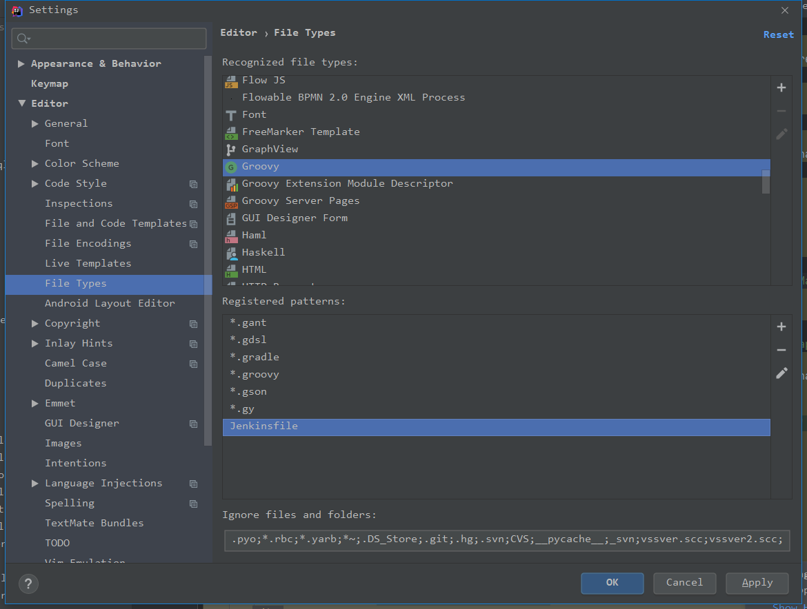
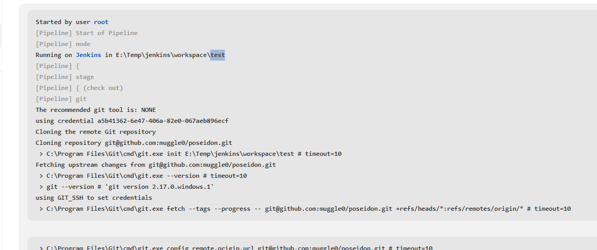
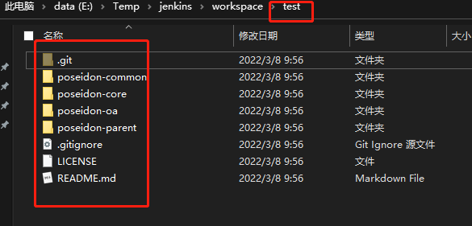

## Jenkins 介绍

Jenkins是一款开源 CI&CD 软件，用于自动化各种任务，包括构建、测试和部署软件，CI&CD:

- 持续集成：持续集成可以帮助开发人员更加频繁地将代码更改合并到目标分支
- 持续交付：持续交付的目标是拥有一个可随时部署到生产环境的代码库
- 持续部署：可以自动将应用发布到生产环境

## Jenkins 安装与demo
jenkins 有2种部署方式，war包直接启动和tomcat方式启动。推荐采用tomcat方式启动，方便进行日志查看和管理。启动jenkins并访问 `http://127.0.0.1:8080/jenkins

`，初始密码保持在initialAdminPassword 文件中，初始化过程会要求安装插件，选择推荐插件，若安装失败可在左上角/右上角找到跳过，进行跳过。因为Jenkins插件默认下载地址是国外，会很容易出错，后续可以更换为国内镜像仓库再进行插件安装。完成初始化过程后，进入界面修改插件代理，manage plugins——>高级页签：


URL填：`https://mirrors.tuna.tsinghua.edu.cn/jenkins/updates/update-center.json` 然后保存，在重试装插件，插件就能装成功了。接下来，我们配置凭据，git等通用配置。

manage jenkins -> global tool configuration ：


如图所示，你可以选择让jenkins为你安装git,也可以配置机器上已安装好的git，jdk和maven同理。

manage jenkins -> manage Credentials 配置凭证：


这个凭据就是你的ssh私钥，我们拉取github或者gitlab上的代码的时候都会在自己账号上配置一个公钥，然后我们就能通过ssh拉取代码了，这个私钥就是用来拉取远程代码用的。

jenkins会有一个workspace文件夹，这个文件夹下会根据流水线创建对应的文件夹并在对应的文件夹下进行编译运行脚本。我们可以修改它的默认路径，重启jenkins生效，首先找到jenkins配置文件路径，manage jenkins->configure System:


然后在该文件夹下找到对应的配置文件 config.xml：


最后修改配置项workspaceDir并重启：


到此，Jenkins的基本安装配置已经完成，下一章节我们会介绍pipeline，并用pipe编译一个项目，感谢阅读

## pipeline 的hello world

pipeline是部署流水线，它支持脚本和声明式语法，能够比较高自由度的构建jenkins任务.个人推荐使用这种方式去构建jenkins。

Jenkins 1.x只能通过界面手动配置来配置描述过程，想要配置一些复杂度高的任务，只能选择自由风格的项目，通过选项等操作进行配置，让jenkins可以下载代码、编译构建、然后部署到远程服务器上，这样显然是不方便管理和移植的。

pipeline的功能由pipeline插件提供，我们可以创建一个jenkinsfile来申明一个任务。接下来我们创建一个最简单的pipeline。登录jenkins,点击创建item:


在流水线中选择hello world 生成代码：

以上便是一个最简单的流水线。点击build now，jenkins任务开始执行，运行完成后点击查看执行记录：

在console output 中可以看到运行记录：

为了提高流水线的复用性以及便于流水线代码的管理，更多的是将pipeline的脚本在远程仓库，当我们修改了远程仓库的流水线脚本，jenkins就会加载到最新的脚本执行。
在流水线配置中选择pipeline script from SCM:

按照提示配置好脚本仓库地址，访问仓库的凭证，流水线脚本文件的名称（默认是Jenkinsfile），分支（默认是master）等。配置完成后在仓库中添加文件`Jenkinsfile`把脚本粘贴过去并push，
最后执行任务，发现执行成功。通过这个特性，我们可以把我们的流水线脚本和项目代码本身放到一个仓库中管理，达到多版本控制并和代码版本统一的效果。
如果我们编写jenkinsfile需要语法提示相关的编辑器，可以使用jenkins官方提供的vscode插件`Jenkins Pipeline Linter Connector `。使用idea  Groovy 也能提示部分语法。
idea 设置jenkinsfile 语法提示方法 settings > editor > File Types > Groovy 新增一列Jenkinsfile:


## pipeline 语法介绍

jenkins pipeline有2种语法：脚本式（Scripted）语法和声明式（Declar-ative）语法。pipeline插件从2.5版本开始同时支持两种语法，官方推荐的是使用申明式语法，在这里也只对申明式语法进行介绍。
申明式语法demo:
```groovy
pipeline {
    agent any

    stages {
        stage('pull') {
            steps {
                echo '拉取代码'
            }
        }
		
		stage('build') {
            steps {
                echo '构建代码'
            }
        }
    }
}
```

声明式语法中，以下结构是必须的，缺少就会报错：

- pipeline：固定语法，代表整条流水线
- agent：指定流水线在哪执行，默认any即可，也可以指定在docker、虚拟机等等里执行
- stages：流水线阶段集合节点，该节点中至少有一个stage
- stage：流水线的阶段节点，每个阶段中至少包含一个steps
- steps：执行步骤集合，每个集合至少包含一个step。
- step: 执行步骤。

接下来我们编译一个本地项目，流水线脚本示例：

```groovy
pipeline {
    agent any
    stages {
        
        stage('Build') {
            steps {
                bat 'mvn -Dmaven.repo.local=E:/data/maven -Dmaven.multiModuleProjectDirectory=E:/Temp/git_jenkins/xxx -f E:/Temp/git_jenkins/xxx/pom.xml -Dmaven.test.skip=true  package'
                
            }
        }
    }
}
```

前文提到过，jenkins会给每个任务在workspacedir下创建文件夹作为运行环境，接下来我们验证通过git将代码下载到这个文件夹下然后打包。流水线脚本：
```
pipeline {
    agent any
    
    stages {
        
        stage("check out"){
             steps {
                git  credentialsId: 'a5b41362-6e47-406a-82e0-067aeb896ecf', url: 'git@github.com:muggle0/poseidon.git',branch: "master"
            }
        }
        
        stage('Build') {
            steps {
                bat 'mvn -Dmaven.repo.local=E:/data/maven  -f ./poseidon-parent/pom.xml -Dmaven.test.skip=true  package'
                
            }
        }
    }
}
```
我配置的workspace 路径是'E:\Temp\jenkins\workspace'，任务名称是 test，看Jenkins 执行指令就能看到相关信息：


打开这个文件夹看看是什么情况：


步骤`check out`把我github上的项目拉到这个工作目录下了，而`Build`则是对项目进行了编译，然后我们可以在target目录找到编译好的jar包，在实际项目中我们可以通过指令将这个jar推到远程服务器上去，或者可以做成docker镜像，推到docker仓库，在远程执行docker指令把这个镜像跑起来，maven插件`dockerfile-maven-plugin` 是可以直接通过一个dockerfile 文件将项目打成一个镜像的。而jenkins 插件`SSH Pipeline Steps`可以远程执行shell 脚本，这样整个流程就串通起来了。这个插件的github地址： https://github.com/jenkinsci/ssh-steps-plugin#pipeline-steps。

插件脚本示例：

```
stage('部署镜像') {
    ansiColor('xterm') {
        def sshServer = [:]
        sshServer.name = "server-1"
        sshServer.host = "127.0.0.1"
        sshServer.port = 22
        sshServer.allowAnyHosts = true
        withCredentials([usernamePassword(credentialsId: 'ServiceServer', passwordVariable: 'password', usernameVariable: 'userName')]) {
            remote.user = "${userName}"
            remote.password = "${password}"
        }
        docker.withRegistry(REGISTRY_URL, REGISTRY_CREDENTIALS_ID) {
            def imgName = "${REGISTRY_DOMAIN}/${DOCKER_NAMESPACE}/${project_name}:${tagName}";

            for (item in ipList.tokenize(',')) {
                // 更新或下载镜像
                sshCommand remote: sshServer, command: "docker pull ${imgName}"
                try {
                    // 停止容器
                    sshCommand remote: sshServer, command: "docker stop ${project_name}"
                    // 删除容器
                    sshCommand remote: sshServer, command: "docker rm -f ${project_name}"
                } catch (ex) {
                }
                // 启动容器
                sshCommand remote: sshServer, command: "docker run -d --name ${project_name} -e TZ=Asia/Shanghai ${imgName}"
            }
        }
    }
}
```
到这里，我们基本上已经掌握了jenkins的基本使用，可以完成将项目下载，编译部署等功能。接下来文章我们会学习一些jenkins的更复杂用法。