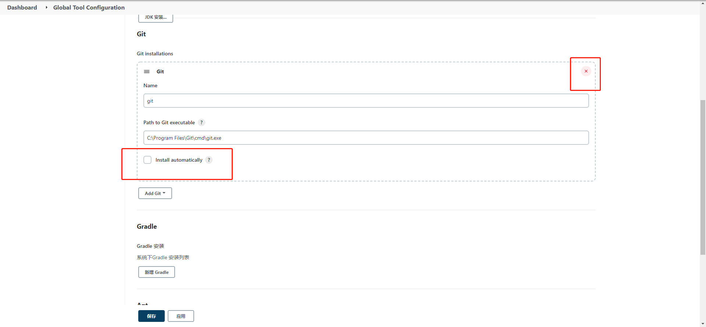

## Jenkins 介绍

Jenkins是一款开源 CI&CD 软件，用于自动化各种任务，包括构建、测试和部署软件，CI&CD:

- 持续集成：持续集成可以帮助开发人员更加频繁地将代码更改合并到目标分支
- 持续交付：持续交付的目标是拥有一个可随时部署到生产环境的代码库
- 持续部署：可以自动将应用发布到生产环境

## Jenkins 安装与demo
jenkins 有2种部署方式，war包直接启动和tomcat方式启动。推荐采用tomcat方式启动，方便进行日志查看和管理。启动jenkins并访问 `http://127.0.0.1:8080/jenkins

`，初始密码保持在initialAdminPassword 文件中，初始化过程会要求安装插件，选择推荐插件，若安装失败可在左上角/右上角找到跳过，进行跳过。因为Jenkins插件默认下载地址是国外，会很容易出错，后续可以更换为国内镜像仓库再进行插件安装。完成初始化过程后，进入界面修改插件代理，manage plugins——>高级页签：

URL填：`https://mirrors.tuna.tsinghua.edu.cn/jenkins/updates/update-center.json` 然后保存，在重试装插件，插件就能装成功了。接下来，我们配置凭据，git等通用配置。

manage jenkins -> global tool configuration ：

如图所示，你可以选择让jenkins为你安装git,也可以配置机器上已安装好的git，jdk和maven同理。

manage jenkins -> manage Credentials 配置凭证：

这个凭据就是你的ssh私钥，我们拉取github或者gitlab上的代码的时候都会在自己账号上配置一个公钥，然后我们就能通过ssh拉取代码了，这个私钥就是用来拉取远程代码用的。

jenkins会有一个workspace文件夹，这个文件夹下会根据流水线创建对应的文件夹并在对应的文件夹下进行编译运行脚本。我们可以修改它的默认路径，重启jenkins生效，首先找到jenkins配置文件路径，manage jenkins->configure System:

然后在该文件夹下找到对应的配置文件 config.xml：

最后修改配置项workspaceDir并重启：

到此，Jenkins的基本安装配置已经完成，下一章节我们会介绍pipeline，并用pipe编译一个项目，感谢阅读

