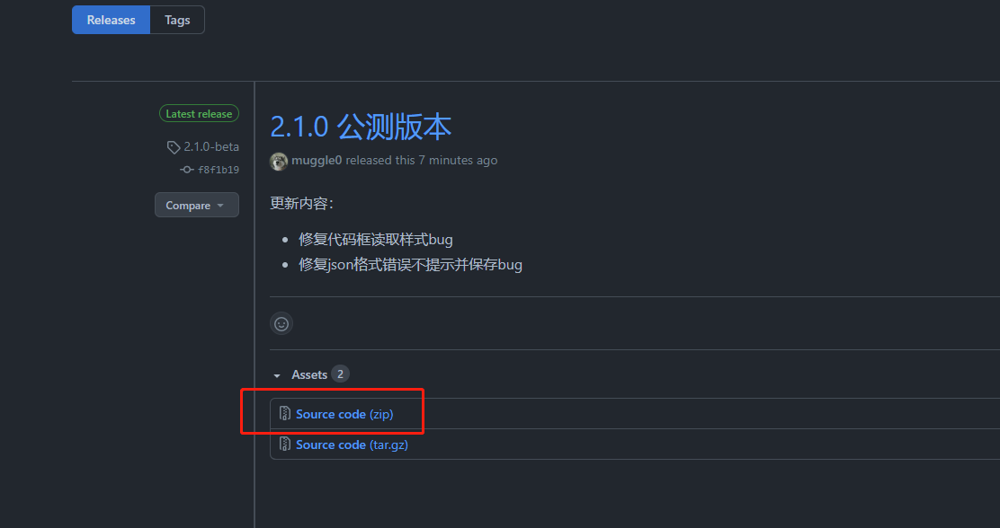
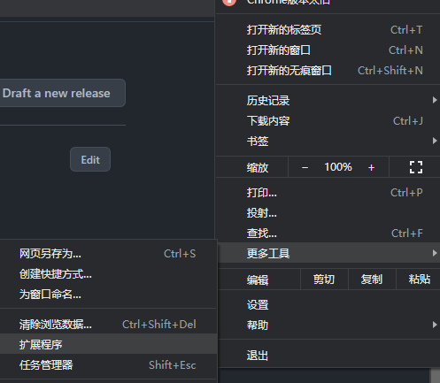
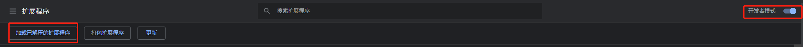
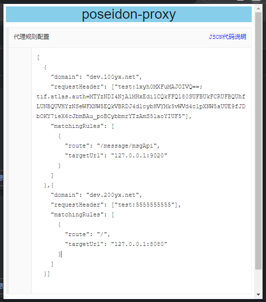

## 插件介绍

`poseidon-chrome-proxy`是一款浏览器请求代理插件；它能把向服务器发起的请求代理到本地，并且可以修改其请求头。
通过这个插件我们可以降低前后端联调的成本，以及帮助我们快速定位线上bug。插件作者：joyful与muggle，这个插件我们会长期维护下去，
小伙伴们如果有想加进去的功能可以联系我们哟。

## 插件使用说明

插件下载地址：https://github.com/Poseidon-Service-Framework/poseidon-chrome-proxy/releases 


目前最新版本是 2.1.0-beta，下载后解压并打开谷歌浏览器 更多工具-> 扩展程序：

然后打开开发者模式选择解压的插件：


插件安装好后，点击图标弹出配置页面，可以在该页面上配置我们的请求头信息与代理规则，配置使用的是json格式：


点击右上角角的 `Json代码说明` 可以看到json中每个字段的含义，编辑完json后直接退出即可保存编辑内容。
点击最下方的停用/启用按钮，停用/启用代理功能；

## 插件json内容说明

插件的json内容是一个数组，每个json代表一个代理规则，json中字段说明

- domain: 需要代理的域名，如 www.qqq.com
- requestHeader： 请求头设置数组， 请以 name:value 的形式填写请求头信息
- matchingRules：拦截规则数组。
- route：请求拦截前缀
- targetUrl：请求处理代理服务器的ip:端口

配置示例：

```json
[
  {
    "domain": "xxx.10yx.net",
    "requestHeader": ["test:xxxxxxxxxx"],
    "matchingRules": [
      {
        "route": "/a/b",
        "targetUrl": "127.0.0.1:9020"
      }
    ]
  },  {
    "domain": "xx.20yx.net",
    "requestHeader": ["test:8888"],
    "matchingRules": [
      {
        "route": "/",
        "targetUrl": "127.0.0.1:8080"
      }
    ]
  }
]

```
如上配置会将 https://xxx.10yx.net/a/b/xxxx 代理到 127.0.0.1:9020/a/b/xxxx 并携带请求头test:xxxxxxxxxx，
将 https://xxx.20yx.net/ss/ss 代理到 127.0.0.1:8080/ss/ss 并携带请求头test:8888。

插件的原理可在项目的readme 中查看。

## 写在结尾

插件注意事项：

1. 该插件和一些梯子冲突，如果你在使用梯子科学上网的时候请禁用该插件；
2. targetUrl 只能填写 ip:port，形如 127.0.0.1:8080/xxx 这种是不会生效的；
3. 部分代理的网址会失效，如 www.baidu.com 原因未知。

特别鸣谢：

感谢joyful大佬参与开发，joyful大佬是这个插件的主要开发，为本插件提供了很多想法并贡献了很多代码；
joyful大佬的博客地址：，感兴趣的可以关注哦。
感谢参与插件测试的各位小伙伴。

如果小伙伴们对这个有好的想法，或者需要参与开发的请联系本人，感兴趣大佬给个star，撸码不易。