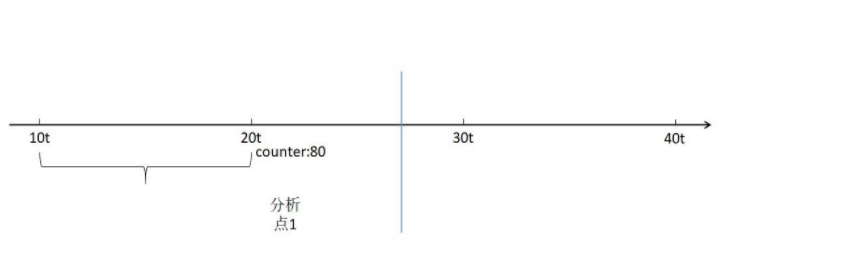
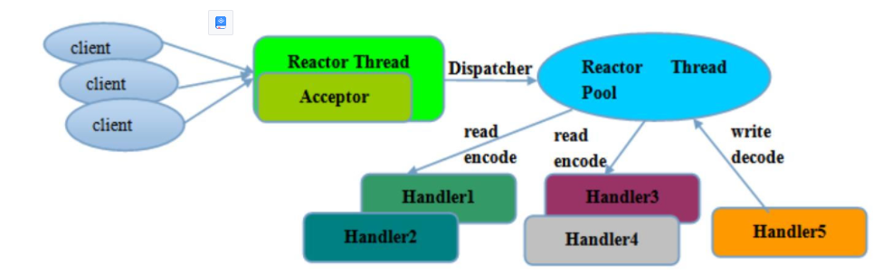
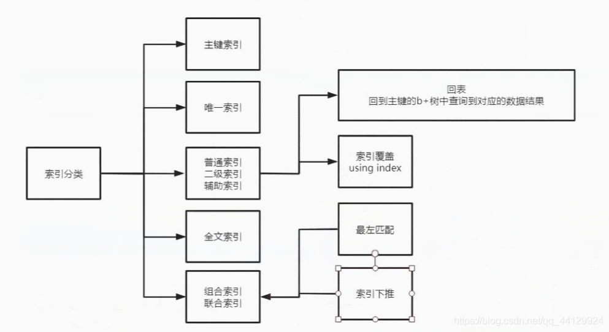

作者：muggle 公众号：六个核弹 wx：muggle_wx

[toc]

# 开篇语

建议：

1. 作为候选人一定要复习好技术点，要带着自信去面试，不要露怯。

2. 项目经历要写好，项目经历从一定程度上对面试官的提问起到引导作用。

3. 八股文可以背，但是要有自己的理解，把八股文的答案理解下来，而不是就纯粹的背答案。

4. 没事可以多逛逛技术论坛，其实技术论坛上有不少程序员分享了他们生产实际中遇到的问题和自己的解决方案，他山之石可以攻玉。

# java Se

## 集合 


| 类名称                   | 作用  |
|-----------------------| ----  |
| HashSet               | 为优化査询速度而设计的 Set。它是基于 HashMap 实现的，HashSet 底层使用 HashMap 来保存所有元素，实现比较简单 |
| TreeSet               | 实现了 Set 接口，是一个有序的 Set，这样就能从 Set 里面提取一个有序序列 |
| ArrayList             | 一个用数组实现的 List，能进行快速的随机访问，效率高而且实现了可变大小的数组 |
| ArrayDueue            | 是一个基于数组实现的双端队列，按“先进先出”的方式操作集合元素 |
| LinkedList            | 链表+Deque |
| HsahMap               | 按哈希算法来存取键对象 |
| TreeMap               | 可以对键对象进行排序 |
| Hashtable             | 不允许键或值为 null,线程安全的Map |
| ConcurrentLinkedQueue |  单向链表结构的无界并发队列, 非阻塞队列，由CAS实现线程安全，内部基于节点实现 |
| ConcurrentLinkedDeque |  双向向链表结构的无界并发队列, 非阻塞队列，由CAS实现线程安全，内部基于节点实现 |
| PriorityQueue         |  内部基于数组实现，线程不安全的队列 |
| DelayQueue            |  延时队列，阻塞队列 |
| LinkedTransferQueue   |  一个由链表结构组成的无界阻塞队列 |
| ArrayBlockingQueue    |  有界队列，阻塞式,初始化时必须指定队列大小，且不可改变；，底层由数组实现； |
| 有                     |  最多只能存储一个元素，每一个put操作必须等待一个take操作，否则不能继续添加元素 |一个带优先级的队列，而不是先进先出队列。 |
| Vector                |  线程安全的list |
| Stack                 |  栈，继承Vector，底层为数组 |

老生常谈，hashmap扩容机制与哈希冲突算法：

在jdk1.8之前创建该对象，会创建一个长度为16的Entry[] table用来存储键值对数据。jdk1.8之后不是在构造方法创建了，而是在第一次调用put方法时才进行创建，创建Node[] table。

Java7在多线程操作HashMap时可能引起死循环，原因是扩容转移后前后链表顺序倒置，在转移过程中修改了原来链表中节点的引用关系。Java8在同样的前提下并不会引起死循环，原因是扩容转移后前后链表顺序不变，保持之前节点的引用关系。

通常解决hash冲突的方法有4种：

- 开放定址法，也称为线性探测法，就是从发生冲突的那个位置开始，按照一定的次序从hash表中找到一个空闲的位置，然后把发生冲突的元素存入到这个空闲位置中。ThreadLocal就用到了线性探测法来解决hash冲突的。
- 链式寻址法，这是一种非常常见的方法，简单理解就是把存在hash冲突的key，以单向链表的方式来存储，比如HashMap就是采用链式寻址法来实现的。
- 再hash法，就是当通过某个hash函数计算的key存在冲突时，再用另外一个hash函数对这个key做hash，一直运算直到不再产生冲突。
- 建立公共溢出区， 就是把hash表分为基本表和溢出表两个部分，凡是存在冲突的元素，一律放入到溢出表中。


## JUC

JUC是java.util.concurrent包的简称。 AQS（AbstractQueuedSynchronizer）是多线程同步器，它是JUC（java.util.concurrent）包中多个组件的底层实现，比如像Lock、CountDownLatch、Semaphore等都是用到了AQS。
AQS采用了一个int类型的互斥变量state，0表示没有任务线程使用该资源，而大于等于1表示已经有线程正在持有锁资源。一个线程获取锁资源的时候，会判断state是否等于0（无锁状态），如果是，则把这个state更新为1，表示占用到锁，而这个过程中，如果多个线程同时做这样的操作，就会导致线程的安全性问题。因此AQS采用了CAS机制，来保证互斥变量state更新的原子性。

未获得到锁的线程通过Unsafe类中的park方法去进行阻塞，把阻塞的线程封装到Node节点中，按照先进先出的原则去放到一个双向链表的结构中，这个双向链表等同于一个CLH队列。当获得所得线程释放锁之后，会从这个双向链表的头部去唤醒下一个等待的线程再去竞争锁。在Node 节点中 包含了上一个节点，下一个节点 和线程状态（waitStatus），当前线程等信息。 


JUC 中的集合类：

- ConcurrentHashMap：支持多线程的分段哈希表，它通过将整个哈希表分成多段的方式减小锁粒度
- ConcurrentSkipListMap：ConcurrentSkipListMap的底层是通过跳表来实现的。跳表是一个链表，但是通过使用“跳跃式”查找的方式使得插入、读取数据时复杂度变成了O（logn）;
- ConCurrentSkipListSet：参考ConcurrentSkipListMap；
- CopyOnWriteArrayList：是ArrayList 的一个线程安全的变形，其中所有可变操作（添加、设置，等等）都是通过对基础数组进行一次新的复制来实现的;
- CopyOnWriteArraySet：参考CopyOnWriteArrayList;
- ConcurrentLinkedQueue：cas实现的非阻塞并发队列;

JUC 中的锁：

- ReentrantLock：ReentrantLock重入锁，是实现Lock接口的一个类，它对公平锁和非公平锁都支持；它是 AQS实现的一个锁
- Semaphore：Semaphore(信号量)是对锁的扩展，锁每次只允许一个线程访问一个资源，而信号量却可以指定多个线程访问某个资源；
- ReadWriteLock：读写分离锁， 读写分离锁可以有效的减少锁竞争，读锁是共享锁，可以被多个线程同时获取，写锁是互斥只能被一个线程占有，ReadWriteLock是一个接口，其中readLock()获得读锁，writeLock()获得写锁 其实现类ReentrantReadWriteLock是一个可重入得的读写锁，它支持锁的降级(在获得写锁的情况下可以再持有读锁)，不支持锁的升级（在获得读锁的情况下不能再获得写锁）；读锁和写锁也是互斥的，也就是一个资源要么被上了一个写锁，要么被上了多个读锁，不会发生这个资即被上写锁又被上读锁的情况。
- CountDownLatch（闭锁）：一个同步辅助类，在完成一组正在其他线程中执行的操作之前，它允许一个或多个线程一直等待。即，一组线程等待某一事件发生，事件没有发生前，所有线程将阻塞等待；而事件发生后，所有线程将开始执行；闭锁最初处于封闭状态，当事件发生后闭锁将被打开，一旦打开，闭锁将永远处于打开状态。
- CyclicBarrier（栅栏）：一个同步辅助类，它允许一组线程互相等待，直到到达某个公共屏障点。利用栅栏，可以使线程相互等待，直到所有线程都到达某一点，然后栅栏将打开，所有线程将通过栅栏继续执行。

JUC 中的原子类：

- AtomicBoolean:原子更新布尔类型.
- AtomicInteger:原子更新整型.
- AtomicLong:原子更新长整型.
- AtomicIntegerArray:原子更新整型数组.
- AtomicLongArray:原子更新长整型数组.
- AtomicReferenceArray:原子更新引用类型数组.
- AtomicReference:原子更新引用类型.
- AtomicStampedReference:原子更新引用类型,使用Pair存储元素值和版本号.
- AtomicMarkableReference:原子更新带有标记的引用类型.
- AtomicIntegerFieldUpdater:原子更新整型的字段的更新器.
- AtomicLongFieldUpdater:原子更新长整型的字段的更新器.
- AtomicReferenceFieldUpdater:原子更新引用类型字段的更新器.


## Runtime 类

Runtime类包括：查看系统内存、终止JVM虚拟机、运行系统程序、使用关闭钩子。
API列表：


## unsafe 类
Unsafe是位于sun.misc包下的一个类，主要提供一些用于执行低级别、不安全操作的方法，如直接访问系统内存资源、自主管理内存资源等，这些方法在提升Java运行效率、增强Java语言底层资源操作能力方面起到了很大的作用。但由于Unsafe类使Java语言拥有了类似C语言指针一样操作内存空间的能力，这无疑也增加了程序发生相关指针问题的风险。

Unsafe 对象不能直接通过 new Unsafe() 或调用 Unsafe.getUnsafe() 获取。getUnsafe 被设计成只能从引导类加载器（bootstrap class loader）加载。直接调用 Unsafe.getUnsafe() 方法会抛出 SecurityException 异常。想要通过Unsafe.getUnsafe()方式获需要取通过Java命令行命令-Xbootclasspath/a把调用Unsafe相关方法的类A所在jar包路径追加到默认的bootstrap路径中，使得A被引导类加载器加载，从而通过Unsafe.getUnsafe方法安全的获取Unsafe实例。
```
java -Xbootclasspath/a: ${path}   // 其中path为调用Unsafe相关方法的类所在jar包路径 
```
还可以通过反射获取：
```
private static Unsafe reflectGetUnsafe() {
    try {
      Field field = Unsafe.class.getDeclaredField("theUnsafe");
      field.setAccessible(true);
      return (Unsafe) field.get(null);
    } catch (Exception e) {
      log.error(e.getMessage(), e);
      return null;
    }
}
```
unsafe 功能：


```
//分配内存, 相当于C++的malloc函数
public native long allocateMemory(long bytes);
//扩充内存
public native long reallocateMemory(long address, long bytes);
//释放内存
public native void freeMemory(long address);
//在给定的内存块中设置值
public native void setMemory(Object o, long offset, long bytes, byte value);
//内存拷贝
public native void copyMemory(Object srcBase, long srcOffset, Object destBase, long destOffset, long bytes);
//获取给定地址值，忽略修饰限定符的访问限制。与此类似操作还有: getInt，getDouble，getLong，getChar等
public native Object getObject(Object o, long offset);
//为给定地址设置值，忽略修饰限定符的访问限制，与此类似操作还有: putInt,putDouble，putLong，putChar等
public native void putObject(Object o, long offset, Object x);
//获取给定地址的byte类型的值（当且仅当该内存地址为allocateMemory分配时，此方法结果为确定的）
public native byte getByte(long address);
//为给定地址设置byte类型的值（当且仅当该内存地址为allocateMemory分配时，此方法结果才是确定的）
public native void putByte(long address, byte x);

/**
	*  CAS
  * @param o         包含要修改field的对象
  * @param offset    对象中某field的偏移量
  * @param expected  期望值
  * @param update    更新值
  * @return          true | false
  */
public final native boolean compareAndSwapObject(Object o, long offset,  Object expected, Object update);

public final native boolean compareAndSwapInt(Object o, long offset, int expected,int update);
  
public final native boolean compareAndSwapLong(Object o, long offset, long expected, long update);

//取消阻塞线程
public native void unpark(Object thread);
//阻塞线程
public native void park(boolean isAbsolute, long time);
//获得对象锁（可重入锁）
@Deprecated
public native void monitorEnter(Object o);
//释放对象锁
@Deprecated
public native void monitorExit(Object o);
//尝试获取对象锁
@Deprecated
public native boolean tryMonitorEnter(Object o);

//获取给定静态字段的内存地址偏移量，这个值对于给定的字段是唯一且固定不变的
public native long staticFieldOffset(Field f);
//获取一个静态类中给定字段的对象指针
public native Object staticFieldBase(Field f);
//判断是否需要初始化一个类，通常在获取一个类的静态属性的时候（因为一个类如果没初始化，它的静态属性也不会初始化）使用。 当且仅当ensureClassInitialized方法不生效时返回false。
public native boolean shouldBeInitialized(Class<?> c);
//检测给定的类是否已经初始化。通常在获取一个类的静态属性的时候（因为一个类如果没初始化，它的静态属性也不会初始化）使用。
public native void ensureClassInitialized(Class<?> c);
//定义一个类，此方法会跳过JVM的所有安全检查，默认情况下，ClassLoader（类加载器）和ProtectionDomain（保护域）实例来源于调用者
public native Class<?> defineClass(String name, byte[] b, int off, int len, ClassLoader loader, ProtectionDomain protectionDomain);
//定义一个匿名类
public native Class<?> defineAnonymousClass(Class<?> hostClass, byte[] data, Object[] cpPatches);

//返回对象成员属性在内存地址相对于此对象的内存地址的偏移量
public native long objectFieldOffset(Field f);
//获得给定对象的指定地址偏移量的值，与此类似操作还有：getInt，getDouble，getLong，getChar等
public native Object getObject(Object o, long offset);
//给定对象的指定地址偏移量设值，与此类似操作还有：putInt，putDouble，putLong，putChar等
public native void putObject(Object o, long offset, Object x);
//从对象的指定偏移量处获取变量的引用，使用volatile的加载语义
public native Object getObjectVolatile(Object o, long offset);
//存储变量的引用到对象的指定的偏移量处，使用volatile的存储语义
public native void putObjectVolatile(Object o, long offset, Object x);
//有序、延迟版本的putObjectVolatile方法，不保证值的改变被其他线程立即看到。只有在field被volatile修饰符修饰时有效
public native void putOrderedObject(Object o, long offset, Object x);
//绕过构造方法、初始化代码来创建对象
public native Object allocateInstance(Class<?> cls) throws InstantiationException;
```
## io


nio有四个很重要的类：Selector，Channel，Buffer，Charset。
- Channel通过节点流的getChannel()方法来获得，成员map()用来将其部分或全部数据映射为Buffer，成员read()、write()方法来读写数据，而且只能通过Buffer作为缓冲来读写Channel关联的数据。
- Buffer是一个缓冲区，它是一个抽象类，常用的子类:ByteBuffer,MappedByteBuffer,CharBuffer,DoubleBuffer,FloatBuffer,IntBuffer,LongBuffer,ShortBuffer等，通过它可以用来装入数据和输出数据。当向Buffer写入数据后，在读取Buffer中数据之前应该调用flip()方法来设置Buffer中的数据位置信息，读取Buffer中数据之后应该调用clear()方法来清空原来的数据位置信息。compact()方法只会清除已经读过的数据。任何未读的数据都被移到缓冲区的起始处，新写入的数据将放到缓冲区未读数据的后面。
- Charset可以将Unicode字符串（CharBuffer）和字节序列（ByteBuffer）相互转化。
- Selector允许单线程处理多个 Channel。如果你的应用打开了多个连接（通道），但每个连接的流量都很低，使用Selector就会很方便。Selector（选择器）是Java NIO中能够检测一到多个NIO通道，并能够知晓通道是否为诸如读写事件做好准备的组件。这样，一个单独的线程可以管理多个channel。通过调用Selector.open()方法创建一个Selector，将Channel注册到Selector上。

buffer 原理详解：

缓冲区本质上是一块可以写入数据，然后可以从中读取数据的内存。这块内存被包装成NIO Buffer对象，并提供了一组方法，用来方便的访问该块内存。它的三个属性capacity,position和limit就是描述这块内存的了。capacity可以简单理解为这块内存的大小；写数据到Buffer中时，position表示当前的位置。初始的position值为0。当一个byte、long等数据写到Buffer后， position会向前移动到下一个可插入数据的Buffer单元。position最大可为capacity – 1. 当读取数据时，也是从某个特定位置读。当将Buffer从写模式切换到读模式，position会被重置为0. 当从Buffer的position处读取数据时，position向前移动到下一个可读的位置。limit表示你最多能读（写）多少数据。

NIO 零拷贝：
正常io会将操作的io数据复制到jvm虚拟机中然后操作。而零拷贝则是直接操作堆外内存。从操作系统层面的体现就是一个数据如果不采用零拷贝则数据需要从磁盘拷贝到内核空间，再从内核空间拷到用户空间（JVM），然后对数据处理，再将数据拷贝到内核空间(操作系统)，内核空间再拷贝到磁盘或者网卡内存，通过网络发送出去。

NIO多路复用机制

NIO的选择器将多个不同的channel统一交给selector选择器进行管理；Linux中选择器是epoll通过注册事件回调通知获取信息; 客户端操作服务器时会产生这三种文件描述符(简称fd)：writefds(写)、readfds(读)、和exceptfds(异常)。select会阻塞住监视3类文件描述符，等有数据、可读、可写、出异常 或超时、就会返回，返回后通过遍历fdset整个集合来找到就绪的描述符fd，然后进行对应的IO操作。


## 多线程

1）同步和异步

同步和异步通常来形容一次方法的调用。同步方法一旦开始，调用者必须等到方法结束才能执行后续动作；异步方法则是在调用该方法后不必等到该方法执行完就能执行后面的代码，该方法会在另一个线程异步执行，异步方法总是伴随着回调，通过回调来获得异步方法的执行结果；

2） 并发和并行

很多人都将并发与并行混淆在一起，它们虽然都可以表示两个或者多个任务一起执行，但执行过程上是有区别的。并发是多个任务交替执行，多任务之间还是串行的；而并行是多个任务同时执行，和并发有本质区别。 对计算机而言，如果系统内只有一个cpu，而使用多进程或者多线程执行任务，那么这种情况下多线程或者多进程就是并行执行，并行只可能出现在多核系统中。当然，对java程序而言，我们不必去关心程序是并行还是并发。

3） 临界区

临界区表示的是多个线程共享但同时只能有一个线程使用它的资源。在并行程序中临界区资源是受保护的，必须确保同一时刻只有一个线程能使用它。

4） 阻塞

如果一个线程占有了临界区的资源，其他需要使用这个临界区资源的线程必须在这个临界区进行等待——线程被挂起，这种情况就是发生了阻塞——线程停滞不前。

5） 死锁\饥饿\活锁

死锁就是多个线程需要其他线程的资源才能释放它所拥有的资源，而其他线程释放这个线程需要的资源必须先获得这个线程所拥有的资源，这样造成了矛盾无法解开；

活锁就是两个线程互相谦让资源，结果就是谁也拿不到资源导致活锁；就好比过马路，行人给车让道，车又给行人让道，结果就是车和行人都停在那不走。

饥饿就是，某个线程优先级特别低老是拿不到资源，导致这个线程一直无法执行

6） 并发级别

并发级别分为阻塞，无饥饿，无障碍，无锁，无等待几个级别；根据名字我们也能大概猜出这几个级别对应的什么情形；阻塞，无饥饿和无锁都好理解；我们说一下无障碍和无等待；

无障碍：无障碍级别默认各个线程不会发生冲突，不会互相抢占资源，一旦抢占资源就认为线程发生错误，进行回滚。

无等待：无等待是在无锁上的进一步优化，限制每个线程完成任务的步数；

7） 并行的两个定理

加速比：加速比=优化前系统耗时/优化后系统耗时

Amdahl定理： 加速比=1/[F+(1-F)/n] 其中 n表示处理器个数 ，F是程序中只能串行执行的比例——串行率；由公式可知，想要以最小投入，得到最高加速比即 F+(1-F)/n取到最小值，F和n都对结果有很大影响，在深入研究就是数学问题了；

Gustafson定律： 加速比=n-F(n-1)，这两定律区别不大，都体现了单纯的减少串行率，或者单纯的加CPU都无法得到最优解。

8）volatile关键字

volatile保证可见性的意义： 

CPU中存在一个高速缓存以提高cpu对数据的计算速度。将运算需要使用的数据复制到缓存中，让运算能快速进行，当运算结束后再从缓存同步到内存之中。cpu一般书多核的，意味着在多线程的环境下，cpu内核之间的高速缓存可能存在不一致的情况，从而导致运算错误。为了高速缓存的一致性，就有了缓存一致性的协议，主流的缓存一致性协议就是MESI 协议（写入失效协议）。M——Modified 修改状态，E——Exclusive 独享状态，S——Shared共享状态，I——Invalid 失效状态。 

大体上来说就是当CPU写数据时，如果发现操作的变量是共享变量，即在其他CPU中也存在该变量的副本，会发出信号通知其他CPU将该变量的缓存行置为无效状态，因此当其他CPU需要读取这个变量时，发现自己缓存中缓存该变量的缓存行是无效的，那么它就会从内存重新读取。

volatile 关键字就是强制让cpu 保证当前数据的缓存一致。

volatile禁止指令重排的意义：

对一个操作而言指令是按一定顺序执行的，但编译器为了提高程序执行的速度，会重排程序指令；cpu在执行指令的时候采用的是流水线的形式，上一个指令和下一个指令差一个工步。比如A指令分三个工步：1. 操作内存a，2.操作内存b，3.操作内存c；现假设有个指令B操作流程和A一样，那么先执行指令A在执行指令B时间全利用上了，中间没有停顿等待；但如果有三个这样的指令在流水线上执行：a>b>c，b>e>c，c>e>a；这样的指令顺序就会发生等待降低了CPU的效率，编译器为了避免这种事情发生，会适当优化指令的顺序进行重排。

指令重排序可能会导致程序执行步骤错误，java编译器会在生成指令系列时在适当的位置会插入内存屏障指令来禁止特定类型的处理器重排序。

内存屏障就是一类同步屏障指令，是CPU或者编译器在对内存随机访问的操作中的一个同步点，只有在此点之前的所有读写操作都执行后才可以执行此点之后的操作。

9）happen-before

为了明确定义多线程场景下重排序的问题，Java引入了JMM(Java Memory Model)，也就是Java内存模型。如果有了重排序就会出现原子性，可见性，有序性的问题，但是性能会提升。所以Java内存模型不是真实存在的，而是一套规范，可以方便的使开发者在运行效率和程序开发的方便性之间找到一个平衡点。

一方面要让CPU和编译器可以灵活的进行重排序，另一方面也要告诉开发者，在什么情况下什么样的重排序不需要感知，需要感知什么样的重排序并作出处理。

为了描述这个规范，JMM引入了happen-before，使用happen-before描述两个操作之间的内存可见性。

简单来说，happen-before的意思就是，如果 操作A happen-before 操作B，那么操作A的执行结果必须对操作B可见。

happen-before的七条原则:

- 单线程规则：同一个线程中的每个操作都happens-before于出现在其后的任何一个操作。
- 对一个监视器的解锁操作happens-before于每一个后续对同一个监视器的加锁操作。
- 对volatile字段的写入操作happens-before于每一个后续的对同一个volatile字段的读操作。
- Thread.start()的调用操作会happens-before于启动线程里面的操作。
- 一个线程中的所有操作都happens-before于其他线程成功返回在该线程上的join()调用后的所有操作。
- 一个对象构造函数的结束操作happens-before与该对象的finalizer的开始操作。
- 传递性规则：如果A操作happens-before于B操作，而B操作happens-before与C操作，那么A动作happens-before于C操作。

10）线程池

线程的生命周期五个阶段：创建、就绪、运行、阻塞、终止。
Executors 下的线程池:
- newFixedThreadPool(int nThreads) ：创建固定数目线程的线程池；
- newCachedThreadPool：创建一个可缓存的线程池，调用execute将重用以前构造的线程（如果线程可用）。如果现有线程没有可用的，则创建一个新线 程并添加到池中；
- newSingleThreadExecutor：创建一个单线程化的Executor；
- newScheduledThreadPool：创建一个支持定时及周期性的任务执行的线程池。

```
public class Test implements Runnable{
	int i=0;
	public Test(int i){
		this.i=i;
	}
	public void run() {
		System.out.println(Thread.currentThread().getName()+"====="+i);
	}
    public static void main(String[] args) throws InterruptedException {
		ExecutorService cachedThreadPool = Executors.newCachedThreadPool();
		for(int i=0;i<10;i++){
			cachedThreadPool.execute(new Test(i));
			Thread.sleep(1000);
		}
	}
}
```

ThreadPoolExecutor中参数详解:

- corePoolSize：核心线程数，也是线程池中常驻的线程数，线程池初始化时默认是没有线程的，当任务来临时才开始创建线程去执行任务
- maximumPoolSize：最大线程数，在核心线程数的基础上可能会额外增加一些非核心线程，需要注意的是只有当workQueue队列填满时才会创建多于corePoolSize的线程(线程池总线程数不超过maxPoolSize)
- keepAliveTime：非核心线程的空闲时间超过keepAliveTime就会被自动终止回收掉，注意当corePoolSize=maxPoolSize时，keepAliveTime参数也就不起作用了(因为不存在非核心线程)；
- unit：keepAliveTime的时间单位
- workQueue：用于保存任务的队列，可以为无界、有界、同步移交三种队列类型之一，当池子里的工作线程数大于corePoolSize时，这时新进来的任务会被放到队列中
- threadFactory：创建线程的工厂类，默认使用Executors.defaultThreadFactory()，也可以使用guava库的ThreadFactoryBuilder来创建
- handler：线程池无法继续接收任务(队列已满且线程数达到maximunPoolSize)时的饱和策略，取值有AbortPolicy、CallerRunsPolicy、DiscardOldestPolicy、DiscardPolicy

11）锁相关概念

- 阻塞锁：当一个线程获得锁，其他线程就会被阻塞挂起，直到抢占到锁才继续执行，这样会导致CPU切换上下文，切换上下文对CPU而言是很耗费时间的
- 非阻塞锁：当一个线程获得锁，其他线程直接跳过锁资源相关的代码继续执行，就是非阻塞锁
- 自旋锁：当一个线程获得锁，其他线程则在不停进行空循环，直到抢到锁，这样做的好处是避免了上下文切换
- 可重入锁：也叫做递归锁，当一个线程外层函数获得锁之后 ，内层递归函数仍然可以该锁的相关代码，不受影响。
- 互斥锁：互斥锁保证了某一时刻只能有一个线程占有该资源。
- 读写锁：将代码功能分为读和写，读不互斥，写互斥；
- 公平锁/非公平锁：公平锁就是在等待队列里排最前面的的先获得锁，非公平锁就是谁抢到谁用；
- 重量级锁/轻量级锁/偏向锁：使用操作系统“Mutex Lock”功能来实现锁机制的叫重量级锁，因为这种锁成本高；轻量级锁是对重量级锁的优化，提高性能；偏向锁是对轻量级锁的优化，在无多线程竞争的情况下尽量减少不必要的轻量级锁执行路径。
- 乐观锁
- 悲观锁

锁优化的常用方法：
- 控制锁的粒度
- 控制锁的持有时间
- 锁分离

synchronized 原理：

Synchronized是通过对象内部的一个叫做监视器锁（monitor）来实现的。但是监视器锁本质又是依赖于底层的操作系统的互斥锁（Mutex Lock）来实现的，这种依赖于操作系统互斥锁（Mutex Lock）所实现的锁我们称之为“重量级锁”。JDK 1.6之后对 synchronized 进行了优化，并不是直接对，共享资源进行上锁而是有一个锁膨胀的过程。

单线程的时候是偏向锁，如果有两个线程，会升级成轻量级锁（自旋锁、cas），如果线程很多的情况下，就会再次升级为重量级锁；

偏向锁的时候只有一个线程，当有别的线程进行竞争的时候，首先会在每个线程里都生成自己独立的一个LockRecord（锁记录，简称LR），抢线程的时候使用cas的方式将LR的指针更新到markword里面，成功刷进去了则表示抢到了锁，没抢到的会一直在那自旋，直到抢到锁为止。当轻量级锁自旋到达一定条件就会升级成重量级锁，这个自旋次数是jvm自己决定的。

cas ：
cas(比较替换)：无锁策略的一种实现方式，过程为获取到变量旧值（每个线程都有一份变量值的副本），和变量目前的新值做比较，如果一样证明变量没被其他线程修改过，这个线程就可以更新这个变量，否则不能更新；通俗的说就是通过不加锁的方式来修改共享资源并同时保证安全性。

cas 的aba 问题：
一个线程把数据A变成了B，然后又重新变成了A，此时另一个线程读取该数据的时候，发现A没有变化，就误认为是原来的那个A，但是此时A的一些属性或状态已经发生过变化，另外一个线程应该获取锁失败的，结果却成功了。解决方案为添加版本号，`AtomicStampedReference` 使用的就是带版本号的cas,它这里的版本号叫stamp：
```
/**
     * Atomically sets the value of both the reference and stamp
     * to the given update values if the
     * current reference is {@code ==} to the expected reference
     * and the current stamp is equal to the expected stamp.
     *
     * @param expectedReference the expected value of the reference
     * @param newReference the new value for the reference
     * @param expectedStamp the expected value of the stamp
     * @param newStamp the new value for the stamp
     * @return {@code true} if successful
     */
    public boolean compareAndSet(V   expectedReference,
                                 V   newReference,
                                 int expectedStamp,
                                 int newStamp) {
        Pair<V> current = pair;
        return
            expectedReference == current.reference &&
            expectedStamp == current.stamp &&
            ((newReference == current.reference &&
              newStamp == current.stamp) ||
             casPair(current, Pair.of(newReference, newStamp)));
    }
```

## 对象

对象都由对象头(header)、对象的实例数据区(InstanceData)和对齐填充字节(Padding)这三部分组成。

对象头的组成：
- Mark Word：记录对象和锁的有关信息。MarkWord通常都是 32 bit位大小。会保存一些分代年龄、无锁状态下对象的HashCode、偏向锁的线程ID、轻量级锁指向栈中锁记录的指针、指向重量级锁的指针、锁的标志位等内容。
- 指向类的指针：大小也通常为32bit，它主要指向类的数据，也就是指向方法区中的位置。
- 数组长度：只有数组对象才有，在32位或者64位JVM中，长度都是32bit。

逃逸分析：

当一个对象在方法中被定义后，它可以能被外部方法所引用。作为调用参数传递到其它地方种，称为方法逃逸。赋值给类变量或者可以在其它线程中访问的实例变量，称为线程逃逸。

一般在java程序中，new的对象是分配在堆空间中的，但是实际的情况是，大部分的new对象会进入堆空间中，而并非是全部的对象，有部分对象是可以分配在栈上以提高效率。

逃逸分析的目的：

- 栈上分配：一个方法中的对象，若该对象没有发生逃逸，则可以将这个对象分配在栈上
- 消除同步：线程同步的代价是相当高的，同步带来的后果是降低了并发性和程序性能。逃逸分析以判断某个对象是否始终只被一个线程访问，如果只被一个线程访问，那么该对象的同步操作就可以转化为没有同步的操作，这样可以大大提高并发性能。
- 标量替换：java虚拟机中的原始数据类型(int,long等)都不能在进一步分解，他们就可以成为标量。相对的，如果一个数据可以继续分解，那么他成为聚合量，java中最典型的聚合量就是对象。如果逃逸分析证明一个对象不会被外部访问，并且这个这个对象是可以分解的，那么程序真正执行的时候可能不创建这个对象，而改为直接创建它的若干个被这个方法能够使用到的成员变量来代替。拆散后的变量便可以被单独的分析与优化，可以分别分配在栈帧或者寄存器上，原来的对象就不需要整体被分配在堆中。

## spi

SPI是service provider interface的简写，是基于接口的编程＋策略模式＋配置文件组合实现的动态加载类机制，目的是解耦，增加可扩展性。
spi机制是这样的：读取META-INF/services/目录下的元信息，然后ServiceLoader根据信息加载对应的类，你可以在自己的代码中使用这个被加载的类。要使用Java SPI，需要遵循如下约定：

- 当服务提供者提供了接口的一种具体实现后，在jar包的META-INF/services目录下创建一个以“接口全限定名”为命名的文件，内容为实现类的全限定名；
- 接口实现类所在的jar包放在主程序的classpath中，主程序通过java.util.ServiceLoder动态装载实现模块，它通过扫描META-INF/services目录下的配置文件找到实现类的全限定名，把类加载到JVM；
- SPI的实现类必须携带一个不带参数的构造方法；

spi 在框架中的使用包括 spring、dubbo、slf4j、jdbc。

## jdk tool 

1）jar

jar 指令是对jar包进行操作的指令，包括打包、拆包、替换等操作：
```
/* 1. 默认打包 */
// 生成的test.jar中就含test目录和jar自动生成的META-INF目录（内含MAINFEST.MF清单文件）
jar -cvf test.jar test

/* 2. 查看包内容 */
jar -tvf test.jar

/* 3. 解压jar包 */
jar -xvf test.jar

/* 4. 提取jar包部分内容 */
jar -xvf test.jar test\test.class

/* 5. 追加内容到jar包 */
//追加MAINFEST.MF清单文件以外的文件，会追加整个目录结构
jar -uvf test.jar other\ss.class

//追加清单文件，会追加整个目录结构(test.jar会包含META-INF目录)
jar -uMvf test.jar META-INF\MAINFEST.MF

/* 6. 创建自定义MAINFEST.MF的jar包 */
jar -cMvf test.jar test META-INF

// 通过-m选项配置自定义MAINFEST.MF文件时，自定义MAINFEST.MF文件必须在位于工作目录下才可以
jar -cmvf MAINFEST.MF test.jar test
```

2）javap

javap 指令可以将我们的字节码文件转汇编和转操作码。实际上很多代码想真正的搞懂其底层原理都需要通过阅读操作码或者汇编才能明白，比如volitail,this等这些关键字底层原理。

执行指令解析 class 文件：
```
javap -v -l -p -s -sysinfo  -constants Test.class
```
解析出的class 文件由以下几部分构成：

- `Constant pool`：编译时常量池
- ()V 表示无参的无返回值的方法描述符
- aload_0 从本地变量表中加载索引为0的变量的值，也即this的引用，压入栈
- invokestatic invokespecial invokeinterface 分别指调用静态方法 私有方法 接口方法。
- 当代码中使用到 `sychornized` 关键字，会看到被解析的操作码内容中包含 `monitorenter` 和 `monitorexit` 两个指令，分别表示获取对象监听器，释放对象监听器。

3）jps

jps是一个可以列出正在运行的Java虚拟机的进程信息的命令行工具，它可以显示Java虚拟机进程的执行主类名称、本地虚拟机唯一ID等信息。另外，jps命令只能显示它有访问权限的Java进程的信息。


4）jstack

jstack 是获取线程快照的指令:
```
jstack pid |grep tid -A 30
```
一般我们会关注当前线程的运行状态以判断是否发生死锁或者其他异常情况，线程快照中线程有以下几种状态：
- NEW,未启动的。不会出现在Dump中。
- RUNNABLE,在虚拟机内执行的。
- BLOCKED,受阻塞并等待监视器锁。
- WATING,无限期等待另一个线程执行特定操作。
- TIMED_WATING,有时限的等待另一个线程的特定操作。
- TERMINATED,已退出的。

在 jvm 发生异常，如内存溢出等情况时会自动生成Javacore文件，这个文件也是线程快照文件，也可以通过该指令进行分析：
```
jstack /usr/bin/java core.xxx
```

在实战调优篇具体介绍。

5) jmap
jmap是获取内存快照的指令。
```
// option：jmap命令的可选参数。如果没有指定这个参数，jinfo命令会显示Java虚拟机进程的内存映像信息
jmap [options] pid
```

option 参数：

- -heap：被指定的垃圾回收算法的信息，堆的配置信息，堆的内存空间使用信息
- -histo：显示Java堆中对象的统计信息，包括：对象数量、占用内存大小(单位：字节)和类的完全限定名
- -clstats：显示Java堆中元空间的类加载器的统计信息
- -finalizerinfo：显示在F-Queue中等待Finalizer线程执行finalize方法的对象。
- -dump：生成Java虚拟机的堆转储快照dump文件

如果我们希望在jvm 发生oom的时候生成内存快照，需要在jar启动参数上加上指令：
```
-XX:+HeapDumpOnOutOfMemoryError
```
## 异常

在编译生成的字节码中，每个方法都附带一个异常表。异常表中的每个条目代表一个异常处理器，且构成如下：

from指针
to指针
target指针
所捕获的异常类型
这些指针的值是字节码索引（bytecode index，bci），用以定位字节码：

from指针和to指针标示该异常处理器所监控的范围，如try代码块所覆盖的范围
target指针指向异常处理器的起始位置，如catch代码块的起始位置

当程序异常，JVM会从上至下遍历异常表中所有条目。当触发异常的字节码的索引值在某异常表条目的监控范围内，JVM会判断所抛异常和该条目想捕获的异常是否匹配：

若匹配，JVM会将控制流转移至该条目target指针指向的字节码
若遍历完所有异常表条目，JVM仍未匹配到异常处理器，则会弹出当前方法对应的Java栈帧且在调用者重复上述操作。最坏情况下，JVM需遍历当前线程Java栈上所有方法的异常表。

finally代码块的编译：当前版本Java编译器的做法，复制finally代码块内容，分别放在try-catch代码块所有正常执行路径及异常执行路径出口。

## 泛型

pecs

PECS 即 producer extends, Consumer super

如果想要获取, 那么推荐使用 ? extends T
如果想要存放, 那么推荐使用 ? super T


# jvm

## JMM
 JMM定义了Java 虚拟机(JVM)在计算机内存(RAM)中的工作方式。 JMM可以理解为是一个规范，一个抽象概念，并不真实存在。

 

 前文我们提到过的 volatile 关键字保证变量的可见性的问题，也可以在JMM 中找到答案，这里的本地内存就可以看做是高速缓存，通过MESI保证数据可见性。

## JVM 组成


1）java堆区

java堆是虚拟机所管理的内存中最大的一块，它是被所有线程共享的一块内存区域，该区域在虚拟机启动的时候创建。这个区域的唯一目的就是存放对象实例。java堆是垃圾收集器工作的主要区域，由于垃圾收集器基本都采用分代收集的算法，所以java堆从垃圾收集器的角度来划分可以细分为新生代和老年代；从内存分配的角度来看，线程共享的java堆可能划分出多个线程私有的分配缓冲区。
   
java堆区可以是物理上不连续的内存空间，只要逻辑上是连续的即可；一般而言我们的虚拟机java堆内存不是固定大小的，是可以扩展的。如果在堆中没有足够内存分配给对象实例，并且堆内存无法再扩展时，虚拟机将会抛出OutOfMemoryError异常。

2） 方法区

 方法区与java堆区一样是各个线程共享的内存区域，这个区域存储了类信息、常量、静态变量等数据。java虚拟机规范中把方法区描述为堆得一部分逻辑，它又有一个名字——非堆，目的是与普通java堆进行区分。相对而言垃圾收集器在这个区域很少活动，因此一部分人把这个区域叫做“永久代”。这个区域的内存回收目标主要是针对常量池的回收和类型的卸载，然而类型卸载的条件是很苛刻的。该区域和和java堆区一样，当内存不够分配时会抛出OutOfMemoryError.

3）运行时常量池

运行时常量池是方法区的一部分；一个Class文件中除了有类的版本、字段、方法、接口等描述信息外，还有一项信息是编译时常量池，用于存放编译期生成的常量。编译时常量池在类被加载后会放入方法区的运行时常量池中。与编译期常量池不同的是，运运行时常量池是动态的，运行期间产生的新的常量也会被放入这个区域，如：String类的intern()方法。

4）本地方法栈(线程私有)

登记native方法，在Execution Engine执行时加载本地方法库

5）程序计数器(线程私有)

就是一个指针，指向方法区中的方法字节码（用来存储指向下一条指令的地址,也即将要执行的指令代码），由执行引擎读取下一条指令，是一个非常小的内存空间，几乎可以忽略不记。

6）Java栈（线程私有）

Java线程执行方法的内存模型，一个线程对应一个栈，每个方法在执行的同时都会创建一个栈帧（用于存储局部变量表，操作数栈，动态链接，方法出口等信息）不存在垃圾回收问题，只要线程一结束该栈就释放，生命周期和线程一致。

## 对象

1）对象的创建

在语言层面上，创建一个对象通常是通过new关键字来创建，在虚拟机中遇到一条new指令时，首先将去检查这个指令的参数是否能在常量池中定位到一个类的符号引用，并且检查这个符号引用代表的类是否已被加载、解析和初始化过；如果没有的话就会先加载这个类；类加载检查完后，虚拟机将会为新生对象分配内存。对象所需内存的大小在类加载完成后便可完全确定，在堆中为对象划分一块内存出来。

   虚拟机给对象分配内存的方式有两种——“指针碰撞”的方式和“空闲列表”的方式。如果java堆内存是绝对规整的，所有用过的内存放在一边，未使用的内存放在另一边，中间放一个指针作为指示器，那分配内存就只是把指针向未使用区域挪一段与对象大小相等的距离；这种分配方式叫指针碰撞式：


我们知道，堆内存随时都可能被垃圾收集器回收的，当内存被回收后堆内存就可能不是连续的了，所以当采用指针碰撞的方式时，垃圾收集器必须有内存整理的功能，能对垃圾回收后的零散内存进行整理。而空闲列表的方式则不需要垃圾收集有这个功能，采用这种方式时虚拟机会维护一张表，用于记录那些内存是可用的，当需要分配内存时就从表中找出一块足够的内存进行分配，并记录在表上。

   内存分配完成后，虚拟机需要将分配到的内存空间都初始化；接下来虚拟机会对对象进行必要的设置，例如这个对象是哪个类的实例，如何才能找到类的元数据信息、对象的哈希值、对象的GC的分代年龄等信息。这些信息存在对象的对象头之中。完成这些工作后，从虚拟机的角度来看一个新的对象就产生了，但从程序的角度来看对象创建才刚刚开始，对象尚未执行初始化方法，各个字段都还未赋值，接下来会执行初始化方法，只有在执行初始化方法后，一个真正可用的对象才算是被创建。

2）对象的内存

参考 javase 部分的 对象 章节

3）对象的访问定位

 建立对象是为了使用对象，我们的java程序需要通过栈上的reference来操作堆上的对象。通过reference来访问对象的方法有两种——使用句柄和直接指针。在虚拟机执行一个方法时，虚拟机栈 中会为方法分配一个 局部变量表，一个操作数栈；局部变量表是用于保存函数的参数以及局部变量的，其保存的类型有boolean、byte、char、short、int、float、reference和returnAddress八种；方法在执行的过程中，会有各种各样的字节码指令往操作数栈中执行入栈和出栈操作，完成数据的运算。基本数据类型直接存储到变量表中。那reference是如何找到引用的对象的呢？

   如果使用句柄的话，那么会在java堆中划分一块内存来作为句柄池，reference中存储的是句柄的地址，而句柄中包含了对象的具体地址信息：


 如果使用直接指针访问，那么java堆对象的布局则：


## 垃圾收集器

java内存在运行时被分为多个区域，其中程序计数器、虚拟机栈、本地方法栈三个区域随线程生成和销毁；每一个栈帧中分配多少内存基本上是在类结构确定下来时就已知的，在这几个区域内就不需要过多考虑回收问题，因为方法结束或者线程结束时，内存自然就跟着回收了。而堆区就不一样了，我们只有在程序运行的时候才能知道哪些对象会被创建，这部分内存是动态分配的，垃圾收集器主要关注的也就是这部分内存。

** 垃圾收集算法 **：

1）引用计数算法

引用计数算法是最初垃圾收集器采用的算法，也是相对简单的一种算法，其原理是：给对象中添加一个引用计数器，每当有一个地方引用它的时候这个计数器就加一；当引用失效，计数器就减一；任何时刻计数器为0则该对象就会被垃圾收集器回收。这种算法的缺点是当对象之间相互循环引用的时候，对象将永远不会被回收。

2）可达性分析算法

可达性分析算法是使用比较广泛的算法。这个算法的基本思路是通过一系列的称为“GC Roots”的对象作为起点，从这些节点向下搜索，搜索所走过的路径称作引用链；当一个对象和GC oots之间不存在引用链的时候，这个对象将被回收；也就是说一个存活的对象向上追溯它的引用链，其头部必然是GC Roots,如果不是将被回收。在虚拟机中可以作为GC Roots的可以是：虚拟机栈中引用的对象、方法区中类静态属性引用的对象、方法区中常量引用的对象，本地方法栈中Native方法引用的对象；在堆区一个存活的对象被这些对象所直接引用或间接引用(引用又分为强引用、软引用、弱引用、、虚引用，引用强调依次降低，感兴趣的可以详细了解一下)。    当一个对象的引用链中没有GC Roots的时候并不会被马上回收，第一次他会被标记并筛选，当对象没有覆盖finalize()方法或该方法已经被虚拟机调用过，那么它会被放入一个叫做F-Queue的队列中等待被虚拟机自动回收；否则虚拟机会执行finalize()方法，对象内存自然被回收掉。

** 垃圾收集器算法 **：

1）标记-清除算法

标记-清除算法是最基础的算法，算法分为标记和清除两个阶段，首先标记出要清除的对象，在标记完后统一回收所有被标记的对象，标记方式为j《jvm系列之垃圾收集器》里面所提到的。这种算法标记和清除两个过程效率都不高；并且在标记清除后，内存空间变得很零散，产生大量内存碎片。当需要分配一个比较大的对象时有可能会导致找不到足够大的内存。

2）清除-复制算法

为了解决标记清除效率低的问题，出现了复制算法；这种算法将内存划分为大小相等的两块内存，只使用其中一块。当这一块内存使用完了就将存活的对象复制到另一块上面去，然后把已使用的内存空间一次性清理掉，这种方法不必考虑内存碎片的情况，运行高效，实现简单。缺点是浪费了一半的内存。

3）标记-整理算法

复制收集算法在对象存活率较高的时候就要进行较多的复制操作，导致效率变低。而且老年代很少会有内存回收，对老年代而言，复制算法做了大量的无用功。针对复制算法存在的的问题，有人提出了标记-整理算法。标记过程和标记-清除算法过程一样，但后续不是直接对可回收对象进行清理，而是让所有存活对象都向一方移动，整理内存，然后再进行清理。

4）分代收集算法

分代收集算法思路是根据对象存活周期不同将内存划分为几块。一般是分为新生代和老年代，这样就可以根据各个年代的特点采用最适当的收集算法。在新生代中每次收集时都会回收很多内存，选用高效率的复制算法，并且只需要预留少量的复制空间，用于复制存活对象。老年代中因为对象存活率高，采用标记-整理或标记清理算法节省内存空间提高清理效率。

** 各版本垃圾收集器一览 **：

| 收集器名称        | 区  域  | 说明  |
| ----------------- | :----------------: | -----------------------------------------------------------: |
| Serial            |    新生代     | 单线程，GC时必须停止其它线程直到收集结束；JVM运行在client模式下新生代的默认收集器，简单有效；采用复制算法 |
| ParNew            |    新生代     | Serial收集的多线程版，保留Serial的参数控制，算法等，暂停所有用户线程，采用复制算法；JVM运行在server的首先的新生代收集器；只有它能和CMS配合工作 |
| Parallel Scavenge |    新生代     | 采用复制算法，并行的多线程收集器，与ParNew不同的是，关注点不是停顿时间，而是可控制的吞吐量，即运行用户代码的时间/（运行用户代码的时间+垃圾收集的时间）。可设置最大GC时间和吞吐量大小等参数，也可以让JVM自适应调整策略 |
| CMS               |    新生代     | concurrent Mark Sweep，已获取最短回收停顿为目标，大部分的互联网站及服务端采用的方式，标记-清除算法 |
| G1                | 新生代/老年代 |                   收集器最前沿版本，JDK 1.7，代替CMS的新产品 |
| Serial Old（MSC） |    老年代     | Serial的老年版，单线程收集器，采用标记-整理算法，主要是client模式的JVM使用 |
| Parallel Old      |    老年代     |              Parallel Scavenge的老年版，多线程，标记整理算法 |

** Stop The World **

我们看到新生代的垃圾收集器都要必须停止其它线程，新一代的垃圾收集器也只是尽量减少这个停顿时间，这个停顿时间被称之为 Stop The World，而作为单线程的Serial 垃圾收集器这一点最为明显。

5）gc 过程概述

jvm 堆内存划为 年轻代（Eden区+两个Survivor，两个s去是为了算法的交替使用） 老年代 和持久代，新创建的的对象活在Eden区，当Eden区满触发 Minor GC，将Eden区 和一个Survivor活下来的对象放到另外一个Survivor区，然后清空这两个区。当一个对象年龄大于15岁（经历了15次gc,默认值，可配置）移入老年代。Eden区大对象会直接移入老年代，空间分配担保机制也会将对象移入老年代（一下过来太多对象，Eden内存不够用，直接就将对象放入老年代腾出空间了），老年代满发生full GC .full gc之后如果内存不够，内存溢出。


## 类和类加载

类加载机制包括全盘负责和双亲委派机制两种：
- 全盘负责：全盘负责是指当一个ClassLoader加载一个类时，除非显示地使用另一个ClassLoader，则该类所依赖与引用的类也由这个ClassLoader加载。
- 双亲委派：双亲委派机制是指子类加载器如果没有加载过该目标类，就先委托父类加载器加载该目标类，只有在父类加载器找不到字节码文件的情况下才从自己的类路径中查找并装载目标类。

类从被加载到虚拟机内存中内存中开始，到卸载出内存为止，它的整个生命周期包括：加载（loading）、验证（verification）、准备（preparation）、解析（resolution）、初始化（initialization）、使用（using）卸载（unloading）七个阶段。其中验证、准备、解析三个阶段统称为连接（linking）。

1）加载

加载是类加载机制的第一个阶段，在这个阶段，虚拟机做了三件事情：

- 通过类的全限定名来获取定义此类的二进制字节流；
- 将这个字节流所代表的静态存储结构转换为方法区的运行时数据结构
- 在内存中生成一个代表这个类的Class对象，作为方法区这个类的各种数据的访问入口

2）验证

加载阶段完成后，虚拟机外部的二进制字节流就按照虚拟机所需的格式存储在方法区之中，方法区中的数据存储格式由虚拟机实现自行定义；然后在内存中实例化一个Class类的对象，加载阶段和连接阶段的部分内容是交叉进行的，加载阶段尚未完成，连接阶段可能已经开始了。

验证是连接阶段的第一步，这一阶段目的是为了确保Class文件的字节流中包含的信息符合当前虚拟机的要求，并且不会危害虚拟机自身的安全。从整体上来看，验证阶段包括以下四个动作：文件格式验证、元数据验证、字节码验证、符号引用验证。

3）准备

 准备阶段是正式为类变量分配内存并设置类变量初始值得阶段，这些变量所使用的内存都将在方法区中进行分配。这个阶段中有两个容易产生混淆的概念——1.这个时候进行内存分配的仅包括类变量（被static修饰的变量），而不包括实例变量，2.这里初始值是数据类型的零值。

4）解析

解析阶段是虚拟机将常量池内的符号引用替换为直接引用的过程

5）初始化

 类初始化阶段是类加载过程的最后一步，前面的类加载过程中，除了在加载阶段可以通过自定义类加载器参与之外，其余动作都是虚拟机控制的。到了初始化阶段，才真正的执行java代码。初始化阶段是执行类构造器<clinit>()方法的过程。

   想要使用一个类，必须对其进行初始化，但初始化过程不是必然执行的；jvm规范中规定有且只有以下五种情况必须对类进行初始化：

- 遇到new、getstatic、putstatic、invokestatic这四个字节码指令的时候，如果类没有进行初始化，则需要先触发其初始化。生成这四条指令最常见的java代码场景是：使用new创建对象、读取或者设置一个类的静态字段（不包括值已在常量池中的情况）、调用一个类的静态方法的时候；
- 使用java反射机制的时候，如果类没初始化需要先初始化；
- 当初始化一个类的时候，如果发现其父类还未初始化，则需要先初始化父类。
- 当虚拟机启动时，用户需要指定一个要执行的主类，虚拟机会先初始化那个类。
- 当使用jdk 1.7的动态语言支持时，如果一个java.lang.invoke.MethodHandle实例最后的解析结果REF_getStatic、REF_putStatic、REF_invokeStatic的方法句柄，并且这个方法句柄所对应的类没有进行过初始化，则需要先触发其初始化

以上五种情况称为对一个类进行主动引用；其他引用类的方式都不会触发初始化，称为被动引用。

典型的例子：

```
public class TestClassloading {
    static {
        System.out.println("父类被初始化");
    }
    public static int number=111;
}

public class SubClass extends TestClassloading {
    static {
        System.out.println("子类被初始化");
    }
}

public class Main {
    public static void main(String[] args) {
        System.out.println(SubClass.number);
    }
}

## 输出
父类被初始化
111
## 子类的静态代码块内容未被执行
```

6）类加载器

通过一个类的全限定名来获取描述此类的二进制字节流这个动作被放到虚拟机外部区实现，以便让应用程序自己决定如何去获取所需的类，实现这个动作的代码模块称为类加载器。对于任意一个类，都需要由加载它的类加载器和这个类本身一同确立其在java虚拟机中的唯一性，每一个类加载器都拥有一个独立的类名称空间。也就是说比较两个类是否相等必须要类加载器和类都相等。    

从java虚拟机的角度来讲，只存在两种不同的类加载器：一种是启动类加载器，这个类加载器是虚拟机的一部分；另一种就是java代码实现的独立于虚拟机外部的类加载器，这种类加载器继承类抽象类java.lang.TestClassloader。

双亲委派模型：


双亲委派模型的工作流程是如果一个类加载器收到了类加载的请求，它首先不会自己去尝试加载这个类，而是把这个请求交给父类加载器去完成，每一个层次的类加载器都是如此，因此所有的加载请求最终都会被交给启动类加载器，当父类反馈无法加载这个类的时候，子类才会进行加载：

- BootstrapClassLoader负责加载${JAVA_HOME}/jre/lib部分jar包
- ExtClassLoader加载${JAVA_HOME}/jre/lib/ext下面的jar包
- AppClassLoader加载用户自定义-classpath或者Jar包的Class-Path定义的第三方包

BootstrapClassLoader 为C语言编写的加载器，它会负责加载包括 ExtClassLoader 和 AppClassLoader 等的 java.* 和 sun.* 包下的类。而 ExtClassLoader 和 AppClassLoader 在内的类加载器， 实质性的类加载也需要依托于 JNI 机制

打破双亲委派机制的方法：
spi 是破坏双亲委派机制的方法之一，目的就是为了灵活的加载类提高扩展性。

spi 原理：

spi 加载外部类是通过`ServiceLoader` 类加载器加载的。ServiceLoader.class又加载在BootrapLoader中。如果按照双亲委派机制，则只能委派BootrapLoader去加载外部类，但BootrapLoader是必然加载不了的，想要加载外部类必然只能是应用程序加载器或自定义类加载器。那么这个时候就只能打破双亲委派机制，下面看 `ServiceLoader.load` 的源码

```
public static <S> ServiceLoader<S> load(Class<S> service) {
    ClassLoader cl = Thread.currentThread().getContextClassLoader();
    return ServiceLoader.load(service, cl);
}
```
这里使用了线程上下文类加载器（ThreadContextClassLoader TCCL），线程上下文类加载器破坏了“双亲委派模型”，可以在执行线程中抛弃双亲委派加载链模式。使程序可以逆向使用类加载器——⽗Classloader可以使⽤当前线程Thread.currentthread().getContextLoader()中指定的classloader。这个classload 可以是子类加载器 可以让上层的加载器逆向加载，在spi中就是直接在ServiceLoader中获取类应用程序加载器。


7）tomcat的类加载机制

tomcat 通过其特有的类加载机制破坏了双亲委派


- Common ClassLoader：加载 common.loader 属性下的 jar，一般是 CATALINA_HOME/lib 目录下，主要是 tomcat 使用以及应用通用的一些类
- Catalina ClassLoader：加载 server.loader 属性下的 jar，默认未配置路径，返回其父加载器即 Common ClassLoader，主要是加载服务器内部可⻅类，这些类应⽤程序不能访问；
- Shared Classloader：加载 share.loader 属性下的jar，默认未配置路径，返回其父加载器即 Common ClassLoader，主要是加载应⽤程序共享类，这些类对 Tomcat 自己不可见；
- WebApp ClassLoader：Tomcat 可以存在多个 WebApp ClassLoader 实例，每个应⽤程序都会有⼀个独⼀⽆⼆的 WebApp ClassLoader，⽤来加载本应⽤程序 /WEB-INF/classes 和 /WEB-INF/lib 下的类。

在tomcat 中有多少个应用就会创建多少个WebAppClassLoader，每个WebAppClassLoader加载各自应用下的类，不会交给父加载器去处理。最主要原因是保证部署在同一个 Web 容器上的不同 Web 应用程序所使用的类库可以实现相互隔离，避免不同项目的相互影响。如不采用隔离，应用A 用的 A.class 和应用B用的A.class 可能存在差异，而由于类加载机制的问题只能存在一个A类从而导致程序错误。

8）springboot 类加载机制

首先我们看springboot的jar包结构：

```
run.jar
|——org
|  |——springframework
|     |——boot
|        |——loader
|           |——JarLauncher.class
|           |——Launcher.class
|——META-INF
|  |——MANIFEST.MF  
|——BOOT-INF
|  |——class
|     |——Main.class
|     |——Begin.class
|  |——lib
|     |——commons.jar
|     |——plugin.jar
|  |——resource
|     |——a.jpg

|     |——b.jpg

```

`classpath`可加载的类只有`JarLauncher.class`，`Launcher.class`，`Main.class`，`Begin.class`。在`BOOT-INF/lib`和`BOOT-INF/class`里面的文件不属于classloader搜素对象直接访问的话会报`NoClassDefDoundErr`异常。

看看 jar包中的元数据信息 MANIFEST.MF
```
Manifest-Version: 1.0
Implementation-Title: run
Implementation-Version: 1.1.6-0
Built-By: muggle
Implementation-Vendor-Id: com.muggle
Spring-Boot-Version: 2.1.2.RELEASE
Main-Class: org.springframework.boot.loader.JarLauncher
Start-Class: com.muggle.TestApplication
Spring-Boot-Classes: BOOT-INF/classes/
Spring-Boot-Lib: BOOT-INF/lib/
Created-By: Apache Maven 3.6.1
Build-Jdk: 1.8.0_151
Implementation-URL: https://projects.spring.io/spring-boot/#/spring-bo
 ot-starter-parent/rum

```

通过 java -jar 启动应用时，根据 Main-Class 配置会调用 org.springframework.boot.loader.JarLauncher 的main(String[]) 方法；其中会先创建一个自定义的 ClassLoader 类加载器，可从BOOT-INF目录下加载出我们 Spring Boot 应用的 Class 类对象，包括依赖的第三方 jar 包中的 Class 类对象；然后根据 Start-Class 配置调用我们 Spring Boot 应用启动类的 main(String[]) 方法（反射）。也就是说我们应用代码真正的类加载器是`JarLauncher`

9） 引用类型

对象的引用被划分为4种级别，从而使程序能更加灵活地控制对象的生命周期，引用的强度由高到低为：强、软、弱、虚引用。

对象生命周期：在JVM运行空间中，对象的整个生命周期大致可以分为7个阶段：创建阶段（Creation）、应用阶段（Using）、不可视阶段（Invisible）、不可到达阶段（Unreachable）、可收集阶段（Collected）、终结阶段（Finalized）与释放阶段（Free）。上面的这7个阶段，构成了 JVM中对象的完整的生命周期。

- 强引用(StrongReference)：强引用是使用最普遍的引用。如果一个对象具有强引用，那垃圾回收器绝不会回收它，我们使用new关键字就是创建了一个强引用。被强引用引用的内存是无法被GC回收的，想要回收这一块的内存得等这个引用从栈内存中出来，对应的内存无引用了才能被回收。
- 软引用(SoftReference)：如果一个对象只具有软引用，则内存空间充足时，GC不会回收这块内存；单如果内存不足的时候它就会被回收，只要垃圾回收器没有回收它，该对象就可以被程序使用。软引用可用来实现内存敏感的高速缓存。
- 弱引用(WeakReference)：弱引用比软引用有更短暂的生命周期。在GC扫描内存区域的时候，一旦发现弱引用就会马上回收它。
- 虚引用(PhantomReference)：虚引用可以理解为形同虚设的引用，不管你这个引用指向的内存有没有在用，它都随时可能被回收掉。虚引用必须和引用队列(ReferenceQueue)联合使用。当垃圾回收器准备回收一个对象时，如果发现它还有虚引用，就会在回收对象的内存之前，把这个虚引用加入到与之关联的引用队列中。

```
    String str = new String("xxx");
    // 软引用
    SoftReference<String> softReference = new SoftReference<String>(str);

    String str = new String("xxx");
    WeakReference<String> weakReference = new WeakReference<>(str);
    // 弱引用转强引用
    String strongReference = weakReference.get();

    String str = new String("xxx");
    ReferenceQueue queue = new ReferenceQueue();
    // 创建虚引用，要求必须与一个引用队列关联
    PhantomReference pr = new PhantomReference(str, queue);

```


## jar 的结构及其运行原理
在jdk tool 章节中我们介绍了 jar 工具，我们使用jar工具打出来的包有两种，一种是可执行带有main方法的jar，，一种是不可执行的jar。

在我们执行 java -jar 这个指令的时候，jar包会被jvm读取成二进制加载到内存中（注意，不是进入jvm）,被称作stream。在每个jar中都会有一个`META-INF\MAINFEST.MF`文件，这个文件存储了jar 包的元数据信息，包括：
- Manifest-Version：用来定义manifest文件的版本
- Created-By：声明该文件的生成者
- Signature-Version：定义jar文件的签名版本
- Class-Path： 应用程序或者类装载器使用该值来构建内部的类搜索路径
- Main-Class：定义jar文件的入口类，该类必须是一个可执行的类。
......

jvm 会首先读取这个文件获取jar信息，在通过`Main-Class` 属性让类加载器去加载启动类，再通过启动类利用双亲委派加载需要的类。所以我们的jar包中的类并不是一股脑的加载到jvm中，有的类可能永远不会被加载，类具体的加载时机前文有提到过可以翻回去查看。

## JVM 参数

```
java -Xmx3550m -Xms3550m -Xmn2g -Xss128k

-Xmx3550m：设置JVM最大可用内存为3550M。

-Xms3550m：设置JVM促使内存为3550m。此值可以设置与-Xmx相同，以避免每次垃圾回收完成后JVM重新分配内存。

-Xmn2g：设置年轻代大小为2G。整个JVM内存大小=年轻代大小 + 年老代大小 + 持久代大小。持久代一般固定大小为64m，所以增大年轻代后，将会减小年老代大小。此值对系统性能影响较大，Sun官方推荐配置为整个堆的3/8。

-Xss128k：设置每个线程的堆栈大小。JDK5.0以后每个线程堆栈大小为1M，以前每个线程堆栈大小为256K。更具应用的线程所需内存大小进行调整。在相同物理内存下，减小这个值能生成更多的线程。但是操作系统对一个进程内的线程数还是有限制的，不能无限生成，经验值在3000~5000左右。

java -Xmx3550m -Xms3550m -Xss128k -XX:NewRatio=4 -XX:SurvivorRatio=4 -XX:MaxPermSize=16m -XX:MaxTenuringThreshold=0

-XX:NewRatio=4:设置年轻代（包括Eden和两个Survivor区）与年老代的比值（除去持久代）。设置为4，则年轻代与年老代所占比值为1：4，年轻代占整个堆栈的1/5
-XX:SurvivorRatio=4：设置年轻代中Eden区与Survivor区的大小比值。设置为4，则两个Survivor区与一个Eden区的比值为2:4，一个Survivor区占整个年轻代的1/6

-XX:MaxPermSize=16m:设置持久代大小为16m。

-XX:MaxTenuringThreshold=0：设置垃圾最大年龄。如果设置为0的话，则年轻代对象不经过Survivor区，直接进入年老代。对于年老代比较多的应用，可以提高效率。如果将此值设置为一个较大值，则年轻代对象会在Survivor区进行多次复制，这样可以增加对象再年轻代的存活时间，增加在年轻代即被回收的概论。

JVM提供了大量命令行参数，打印信息，供调试使用。主要有以下一些：
-XX:+PrintGC
输出形式：[GC 118250K->113543K(130112K), 0.0094143 secs]
[Full GC 121376K->10414K(130112K), 0.0650971 secs]

-XX:+PrintGCDetails

-XX:+PrintGCTimeStamps -XX:+PrintGC：PrintGCTimeStamps可与上面两个混合使用

-XX:+PrintGCApplicationConcurrentTime:打印每次垃圾回收前，程序未中断的执行时间。可与上面混合使用

-XX:+PrintGCApplicationStoppedTime：打印垃圾回收期间程序暂停的时间。可与上面混合使用

-XX:PrintHeapAtGC:打印GC前后的详细堆栈信息
```


## byteKit

# spring

## ioc

1） `BeanFactory`

spring IOC的顶级接口是`BeanFactory`，`ApplicationContext`接口继承于它，`AnnotationConfigApplicationContext`,`ClassPathXmlApplicationContext`,`FileSystemXmlApplicationContext` 实现接口`ApplicationContext`。

- BeanFactory负责读取bean配置文档,管理bean的加载,实例化,维护bean之间的依赖关系,负责bean的声明周期
- ApplicationContext接口扩展了BeanFactory接口职能
- AnnotationConfigApplicationContext用于读取注解创建容器。
- ClassPathXmlApplicationContext：可以加载类路径下的配置文件，要求配置文件必须在类路径之下
- FileSystemXmlApplicationContext：可以加载磁盘中任意路径下的配置文件，要求具有访问权限。

2）BeanDefinition

BeanDefinition 是定义 Bean 的配置元信息接口，包含：
- Bean 的类名
- 设置父 bean 名称、是否为 primary
- Bean 行为配置信息，作用域、自动绑定模式、生命周期回调、延迟加载、初始方法、销毁方法等
- Bean 之间的依赖设置，dependencies
- 构造参数、属性设置

可以理解为bean的描述类。其对应的类`BeanDefinitionRegistry`，是定义保存BeanDefinition的接口。

3）BeanPostProcessor

后置处理器，作用是在Bean对象在实例化和依赖注入完毕后，调用初始化方法的前面和后面添加我们自己的逻辑。

- postProcessBeforeInitialization 初始化之前执行
- postProcessAfterInitialization 初始化之后执行

4）BeanFactoryPostProcessor

BeanFactoryPostProcessor 为spring在容器初始化时对外对外暴露的扩展点，Spring IoC容器允许BeanFactoryPostProcessor在容器加载注册BeanDefinition完成之后读取BeanDefinition，并可以修改它。

5）InstantiationAwareBeanPostProcessor

继承了BeanPostProcessor ，主要负责 bean 初始化前后的处理。

- postProcessBeforeInstantiation方法是最先执行的方法，它在目标对象实例化之前调用，该方法的返回值类型是Object，我们可以返回任何类型的值。由于这个时候目标对象还未实例化，所以这个返回值可以用来代替原本该生成的目标对象的实例
- postProcessAfterInstantiation	 BeanPostProcessor接口中的方法
在Bean的自定义初始化方法执行完成之后执行

6）finishBeanFactoryInitialization

AbstractApplicationContext 中的方法。该方法会实例化所有剩余的非懒加载单例 bean。除了一些内部的 bean、实现了 BeanFactoryPostProcessor 接口的 bean、实现了 BeanPostProcessor 接口的 bean，其他的非懒加载单例 bean 都会在这个方法中被实例化，并且 BeanPostProcessor 的触发也是在这个方法中。

7）BeanNameAware，BeanFactoryAware

- BeanNameAware作用：让Bean获取自己在BeanFactory配置中的名字
- BeanFactoryAware：作用：让Bean获取配置他们的BeanFactory的引用。

8）InitializingBean 

InitializingBean接口为bean提供了初始化方法的方式，它只包括afterPropertiesSet方法，凡是继承该接口的类，在初始化bean的时候都会执行该方法

9）SingletonBeanRegistry

SingletonBeanRegistry是单例Bean的注册中心。DefaultSingletonBeanRegistry类继承了SimpleAlasRegistry类，实现了SingletonBeanRegistry接口，是SingletonBeanRegistry接口的直接实现类。

在DefaultSingletonBeanRegistry 中存在三级缓存，是spring的bean缓存池：

```
//第1级缓存 用于存放 已经属性赋值、完成初始化的 单列BEAN
private final Map<String, Object> singletonObjects = new ConcurrentHashMap<>(256);
//第2级缓存 用于存在已经实例化，还未做代理属性赋值操作的 单例BEAN
private final Map<String, Object> earlySingletonObjects = new HashMap<>(16);
//第3级缓存 存储创建单例BEAN的工厂
private final Map<String, ObjectFactory<?>> singletonFactories = new HashMap<>(16);

```

10）spring 流程图。

spring bean 注册过程可以概括成7步：

1. 容器启动
2. Spring 扫描 class 得到 BeanDefinition；
3. 根据得到的 BeanDefinition 去生成 bean；
4. 根据 class 推断构造方法，根据推断出来的构造方法，通过反射实例化对象；
5. 如果有AOP则获取代理对象,填充原始对象中的属性（依赖注入）；
6. 初始化
7. 把最终生成的代理对象放入单例池（源码中叫做 singletonObjects）中，下次 getBean 时就直接从单例池拿即可；


11）spring三级缓存以及循环依赖

Spring 在实例化对象之后，将 Bean 包装为ObjectFactory，并将此工厂加入到三级缓存中。这样做是因为 AOP和循环依赖的存在——如果创建的 Bean 是有代理的，那么注入的就应该是代理 Bean，而不是原始的 Bean。但是，Spring一开始并不知道 Bean是否会有循环依赖。如果有循环依赖，那么spring 应该先创建代理对象，然后解决代理对象的循环依赖（因为循环依赖的bean 依赖的应该是对方的代理对象，而不是原生对象）。ObjectFactory 就是为了创建代理对象而存在的。

三级缓存的使用流程为：

1. 创建单例A，将A的工厂加入三级缓存，发现A依赖于B
2. spring会调用getBean("B")(递归操作)去一级，二级，三级缓存里获取B
3. B没有被注册，注册B
4. 创建B的ObjectFactory 到三级缓存
5. 发现B又是依赖于A的，spring就会从一级、二级缓存取A，发现没有，就去三级缓存中找A的ObjectFactory
6. 将A的ObjectFactory返回的对象放入二级缓存(可能是代理对象，取决于有没有AOP)并将三级缓存中A的工厂删掉
7. B取得A完成创建后，B加入一级缓存，在将B自身返回给A
8. A得到B创建成功，将A加入一级缓存，删除二级缓存earlySingletonObjects中的A

- 为什么懒加载可以解决循环依赖 在A的ObjectFactory中不去依赖注入B 直接生成代理对象放入一级缓存，自然不会造成循环依赖问题
- 为什么构造器的循环依赖没法解决：构造器循环依赖 无法对bean 进行实例化，更别说生成ObjectFactory 了。


## AOP


AOP 中有以下基础概念：
- Join point（连接点）：程序执行期间的某一个点，例如执行方法或处理异常时候的点。
- Advice（通知/增强）：通知是指一个切面在特定的连接点要做的事情。通知分为方法执行前通知，方法执行后通知，环绕通知等。
- Pointcut（切点）:指定一个通知将被引发的一系列连接点的集合。
- Aspect（切面）：（Advice）和切点（Pointcut）合起来的抽象。
- Weaving（织入）：是将切面应用到目标对象的过程，这个过程可以是在编译时（例如使用 AspectJ 编译器），类加载时，运行时完成。

spring AOP 的的原理是动态代理。动态代理实现方式有 JDK动态代理，CGLIB动态代理

- JDK动态代理：java动态代理是利用反射机制生成一个实现代理接口的匿名类，在调用具体方法前调用InvokeHandler（代码增强处理器）来处理。
- CGLIB动态代理：cglib动态代理是利用asm开源包，对代理对象类的class文件加载进来，通过修改其字节码生成子类来处理。

在Spring中：
- 如果目标对象实现了接口，默认情况下会采用JDK的动态代理实现AOP
- 如果目标对象实现了接口，可以强制使用CGLIB实现AOP
- 如果目标对象没有实现了接口，必须采用CGLIB库，spring会自动在JDK动态代理和CGLIB之间转换

结合spring bean的注入过程理解AOP的原理：

1. 通过 AspectJAutoProxyBeanDefinitionParser 类将AnnotationAwareAspectJAutoProxyCreator 注册到 spring 容器中
2. AnnotationAwareAspectJAutoProxyCreator 类实现了BeanPostProcessor，它的 postProcessAfterInitialization() 方法将所有有 advice 的 bean 重新包装成 proxy
3. postProcessAfterInitialization 方法调用 createProxy 创建Advisor 类，然后添加到ProxyFactory 。


## spring mvc

略


## jsr

1） JavaBean
一个Java类满足以下2点 ，就可以称为JavaBean：
1. public 修饰的类 ,public 无参构造
2. 所有属性(如果有) 都是private，并且提供set/get (如果boolean 则get 可以替换成is)

javaBean分两种，第一种是封装数据的JavaBean（称作有状态的bean）, 第二种封装逻辑的JavaBean（称作无状态的bean），无状态的bean 是线程安全的。

2）JSR-303


3）JSR-250


4）JSR-343
参考JMS


# springboot

## springboot Fatjar

Fatjar 结构:


```
run.jar
|——org
|  |——springframework
|     |——boot
|        |——loader
|           |——JarLauncher.class
|           |——Launcher.class
|——META-INF
|  |——MANIFEST.MF  
|——BOOT-INF
|  |——class
|     |——Main.class
|     |——Begin.class
|  |——lib
|     |——commons.jar
|     |——plugin.jar
|  |——resource
|     |——a.jpg

|     |——b.jpg

```

看看 jar包中的元数据信息 MANIFEST.MF
```
Manifest-Version: 1.0
Implementation-Title: run
Implementation-Version: 1.1.6-0
Built-By: muggle
Implementation-Vendor-Id: com.muggle
Spring-Boot-Version: 2.1.2.RELEASE
Main-Class: org.springframework.boot.loader.JarLauncher
Start-Class: com.muggle.TestApplication
Spring-Boot-Classes: BOOT-INF/classes/
Spring-Boot-Lib: BOOT-INF/lib/
Created-By: Apache Maven 3.6.1
Build-Jdk: 1.8.0_151
Implementation-URL: https://projects.spring.io/spring-boot/#/spring-bo
 ot-starter-parent/rum
 
```

前文 **类加载** 章节 以及 **jar运行原理** 章节介绍过 springboot 类加载与启动的流程：

通过 java -jar 启动应用时，根据 Main-Class 配置会调用 org.springframework.boot.loader.JarLauncher 的main(String[]) 方法；其中会先创建一个自定义的 ClassLoader 类加载器，可从BOOT-INF目录下加载出我们 Spring Boot 应用的 Class 类对象，包括依赖的第三方 jar 包中的 Class 类对象；然后根据 Start-Class 配置调用我们 Spring Boot 应用启动类的 main(String[]) 方法（反射）。

注意看MANIFEST.MF的`Main-Class` 指向的 `JarLauncher` 也就是说真正的启动类是`JarLauncher`，而不是应用里面的。这里结合类加载机制及jar运行原理来理解。springboot 的fatjar 结构也解释了为什么用springboot maven 插件打出来的可执行jar 不能作为一个普通的jar包被其他应用引用---它类文件不在classpath根路径下。

JarLauncher 的原理：
- JarLauncher中包含一个main 函数作为程序入口。
- 在启动方法中 通过父类`Launcher` 获得一个类加载器，这个类加载器属于`URLClassLoader`
- 构建一个 MainMethodRunner 实例对象，把获得的类加载器传递给该对象。 然后通过反射的方式调用 BootStrap 类中的 main 方法，完成项目启动与类加载。

## 自动装配

springboot的自动装配实际上就是为了从spring.factories文件中获取到对应的需要进行自动装配的类，并生成相应的Bean对象，然后将它们交给spring容器来帮我们进行管理。

注解说明：

 @SpringBootApplication 

这个注解是springboot启动类上的一个注解，是一个组合注解，包括：
- @SpringBootConfiguration
- @EnableAutoConfiguration
- @ComponentScan

@SpringBootConfiguration

这个注解包含了@Configuration，@Configuration里面又包含了一个@Component注解，也就是说，这个注解标注在哪个类上，就表示当前这个类是一个配置类。

@EnableAutoConfiguration

这个注解是开启自动配置的功能，里面包含了两个注解：
- @AutoConfigurationPackage
- @Import（AutoConfigurationImportSelector.class）

@AutoConfigurationPackage

这个注解的作用就是将主配置类（@SpringBootApplication标注的类）所在包以及子包里面的所有组件扫描并加载到spring的容器中

@Import(AutoConfigurationImportSelector.class)

它是XML配置中的`<import>`的替代 可以导入配置文件和配置类。

这个注解在这里指定的是`AutoConfigurationImportSelector` 这个类会根据 `META-INF/spring.factories` 文件注入bean

@ComponentScan

这个注解的作用就是扫描当前包及子包的注解

原理说明：


springboot 自动装配主要是依靠 @EnableAutoConfiguration 注解，这个注解包含`@Import(AutoConfigurationImportSelector.class)` 。 而 `AutoConfigurationImportSelector`会在`selectImports`通过`SpringFactoriesLoader`读取`META-INF/spring.factories`下的配置信息（参考 jar执行原理章节），并且`AutoConfigurationImportSelector` 在项目启动时会传入一个类加载器`class sun.misc.Launcher$AppClassLoader`（应用类加载器）。将这个类加载器教给`SpringFactoriesLoader`去加载对应的类并进行后续步骤（参考 类加载 章节）。


# springcloud

## springcloud 父子容器


spring cloud 容器大致分为三层，分别对应上面的三类：
- BootStrap上下文：由SpringCloud 监听器创建，用来初始化 SpringCloud 上下文，也是祖先容器。
- SpringBoot 上下文：由SpringBoot创建，也是项目中常用的Spring容器。
- 微服务配置上下文：Feign和Ribbon配置类对应的上下文，由配置容器抽象工厂 NamedContextFactory 创建，用于容器隔离。

BootstrapContext 默认读取配置文件`bootStrap.properties`进行创建容器，ApplicationContext 默认读取`application.porperties`。在进行容器创建的时候，BootstrapContext 比ApplicationContext先创建出来，然后调用ApplicationContext.setParent方法设置父子关系。子容器可以读取父容器的内容，父容器读取不到子容器的内容。

## nacos
架构图：


1）nacos 一致性协议

Distro协议是Nacos社区自研的一种AP分布式协议，是面向临时实例设计的一种分布式协议，其保证了在某些Nacos节点宕机后，整个临时实例处理系统依旧可以正常工作：
- Nacos每个节点是平等的都可以处理写请求，同时把新数据同步到其他节点
- 每个节点只负责部分数据，定时发送自己负责数据的校验值到其他节点来保持数据一致性
- 每个节点独立处理读请求，及时从本地发出响应

Distro协议工作原理：

- 数据初始化：新加入的Distro节点会进行全量数据拉取 具体操作是轮询所有的Distro节点，通过向其他的机器发送请求拉取全量数据。在全量拉取操作完成之后，Nacos的每台机器上都维护了当前的所有注册上来的非持久化实例数据
- 数据校验：在Distro集群启动之后，各台机器之间会定期的发送心跳。心跳信息主要为各个机器上的所有数据的元信息（之所以使用元信息，是因为需要保证网络中数据传输的量级维持在一个较低水平）每台机器在固定时间间隔会向其他机器发起一次数据校验请求。一旦在数据校验过程中，某台机器发现其他机器上的数据与本地数据不一致，则会发起一次全量拉取请求，将数据补齐
- 写操作：拦截请求并根据请求的ip:port信息计算其所属的Distro责任节点,并将该请求转发到所属的Distro责任节点上，责任节点上的Controller将写请求进行解析。定期执行Sync任务，将本机所负责的所有的实例信息同步到其他节点上。
- 读操作：由于每台机器上都存放了全量数据，因此在每一次读操作中，Distro机器会直接从本地拉取数据。

2）nacos 通讯


nacos 阈值保护，nacos负载均衡，

ribbon 负载均衡策略：
轮询，权重，随机，最小连接数，重试策略（按照轮询策略来获取服务，如果获取的服务实例为null或已经失效，则在指定的时间之内不断地进行重试来获取服务，如果超过指定时间依然没获取到服务实例则返回null）

dubbo 负载均衡策略：

加权随机 权重轮循 最少活跃调用数 hash 最短响应时间

## consul

consul 的核心是agent组件，以守护进程的方式注册在consul节点上，每个agent各自维护自己的服务集合节点。Agent 分为 client和server两个角色，client将ip dns信息转发给server，server记录了ip、dns信息。每个节点的server数目推荐是3个或者5个，通过raft算法保证数据一致性。（Raft算法：我们不可能要求所有服务器100%都达成一致状态，只要超过半数的大多数服务器达成一致就可以了，假设有N台服务器，N/2 +1 就超过半数，代表大多数了。）

consul 通讯方式：

- rpc：Gossip流言协议
- http api：用于服务发现、健康检测
- dns查询：用于服务查询，可以cosul提供的DNS接口来获取当前的服务“web”对应的可用节点


## eureka

Eurka 工作流程：

1. Eureka Server 启动成功，等待服务端注册。在启动过程中如果配置了集群，集群之间定时通过 Replicate 同步注册表，每个 Eureka Server 都存在独立完整的服务注册表信息
2. Eureka Client 启动时根据配置的 Eureka Server 地址去注册中心注册服务
3. Eureka Client 会每 30s 向 Eureka Server 发送一次心跳请求，证明客户端服务正常
4. 当 Eureka Server 90s 内没有收到 Eureka Client 的心跳，注册中心则认为该节点失效，会注销该实例
5. 单位时间内 Eureka Server 统计到有大量的 Eureka Client 没有上送心跳，则认为可能为网络异常，进入自我保护机制，不再剔除没有上送心跳的客户端
6. 当 Eureka Client 心跳请求恢复正常之后，Eureka Server 自动退出自我保护模式
7. Eureka Client 定时全量或者增量从注册中心获取服务注册表，并且将获取到的信息缓存到本地
8. 服务调用时，Eureka Client 会先从本地缓存找寻调取的服务。如果获取不到，先从注册中心刷新注册表，再同步到本地缓存
9. Eureka Client 获取到目标服务器信息，发起服务调用
10. Eureka Client 程序关闭时向 Eureka Server 发送取消请求，Eureka Server 将实例从注册表中删除

eureka 自我保护机制：

默认情况下，如果 Eureka Server 在一定的 90s 内没有接收到某个微服务实例的心跳，会注销该实例。但是在微服务架构下服务之间通常都是跨进程调用，网络通信往往会面临着各种问题，比如微服务状态正常，网络分区故障，导致此实例被注销。固定时间内大量实例被注销，可能会严重威胁整个微服务架构的可用性。为了解决这个问题，Eureka 开发了自我保护机制。

Eureka Server 在运行期间会去统计心跳失败比例在 15 分钟之内是否低于 85%，如果低于 85%，Eureka Server 即会进入自我保护机制：
- Eureka 不再从注册列表中移除因为长时间没收到心跳而应该过期的服务
- Eureka 仍然能够接受新服务的注册和查询请求，但是不会被同步到其它节点上(即保证当前节点依然可用)
-  当网络稳定时，当前实例新的注册信息会被同步到其它节点中

eureka 三级缓存：

Eureka Server为了避免同时读写内存数据结构造成的并发冲突问题，采用了多级缓存机制来进一步提升服务请求的响应速度。

Eureka Server存在三个变量：（registry、readWriteCacheMap、readOnlyCacheMap）保存服务注册信息，默认情况下定时任务每30s将readWriteCacheMap同步至readOnlyCacheMap，每60s清理超过90s未续约的节点，Eureka Client每30s从readOnlyCacheMap更新服务注册信息，而UI则从registry更新服务注册信息。这样设计目的是为了做读写分离，使写操作不阻塞读操作。二级缓存又称读写缓存、三级缓存又称只读缓存。


## sentinel

流控规则

1）流量控制

流量控制是通过监控应用流量的qps或者并发线程数是否达到阈值来保护应用的一种手段，避免应用被瞬时的流量高峰冲垮，从而保障系统的高可用。流控策略：

- 并发线程数流控：通过控制并发线程数来保证访问资源的流量不超过某个阈值
- qps流控：通过控制资源的qps来达到流控的目的，qps相比较于并发线程数流控效果更为直观。

2） 熔断降级

熔断降级会在调用链路中当某个资源指数超出阈值时对这个资源的调用进行熔断，在熔断时间窗口内所有调用都快速失败调用降级方法，直到熔断恢复；降级熔断和流控规则的区别是在超出阈值后的时间窗内所有的调用都会被降级，直到熔断恢复。降级策略：

- 秒级RT（默认）：在1秒内进入的n个响应中，如果最终的平均响应时间超过了阈值，那么在接下来的timeWindow 时间内会自动熔断降级接下来的响应。
- 秒级异常比例：当每秒请求数超过n个，且异常请求的比例超过阈值，那么在接下来的timeWindow 时间内会自动熔断降级接下来的响应。
- 分钟级异常数：当一分钟内请求的数量超过阈值后会熔断，因为统计时长是一分钟，当timeWindow降级熔断时间小于一分钟，当降级熔断结束后可能仍超过异常阈值继续进入熔断降级状态

3）热点规则

热点规则是对热点数据进行限流，支持对特定参数和参数的值限流。热点限流会统计参数中的热点参数，并根据配置的限流阈值与模式对包含热点参数的资源进行限流。
Sentinel利用LRU策略统计最近最常访问的热点参数，结合令牌桶算法来进行参数级别的流控。

4）系统规则

系统规则限流是从整体维度上去进行流控，结合应用的load,cpu使用率,总体平均RT,入口QPS和并发线程数等几个维度的监控指标来对总体的流量进行限流，在系统稳定的前提下保证系统的吞吐量，系统规则模式：

- load 自适应: 当系统负载高于某个阈值，就禁止或者减少流量的进入，当load 开始好转，则恢复流量的进入，通过读取操作系统参数 load1 来判断，仅对类unix系统生效。
- cpu 使用率: 当cpu 使用率超过阈值开始限流
- 平均RT: 当系统平均响应时间超过阈值开始限流
- 并发线程数: 当并发线程数超过阈值开始限流
- 入口qps: 当系统入口qps超过阈值开始限流

5）授权规则

授权规则的作用是根据调用来源来拦截调用资源的请求，当不符合放行规则的请求过来就会被拒绝掉。

流控算法

1）计数器（固定窗口）限流算法

在指定周期内累加访问次数，当访问次数达到设定的阈值时，触发限流策略，当进入下一个时间周期时进行访问次数的清零。这种算法存在一个临界问题，这种算法针对的是固定周期的累加访问次数，但是如果服务器需要做到的是限制每个一分钟内的访问量，这种算法显然就不适用了，因为计数器算法无法限制每隔一段时间内的访问量均不超过阈值。


2）时间窗限流法

滑动时间窗限流算法没有划分固定的时间窗起点与终点，而是将每一次请求的到来时间点作为统计时间窗的终点，起点则是终点向前推时间窗长度的时间点。这种时间窗称为“滑动时间窗”



3）令牌桶算法

令牌桶算法的原理是系统会以一个恒定的速度往桶里放入令牌，而如果请求需要被处理，则需要先从桶里获取一个令牌，当桶里没有令牌可取时，则拒绝服务。

4）漏桶算法

漏桶算法思路很简单，请求先进入到漏桶里，漏桶以固定的速度出水，也就是处理请求，当水加的过快，则会直接溢出，也就是拒绝请求，可以看出漏桶算法能强行限制数据的传输速率。

Sentinel提供了四种流量控制行为: 直接拒绝 Warm Up 匀速排队

## 分布式事务

1）XA

两阶段提交（2PC）的事务协议
- 第一阶段为 准备（prepare）阶段。即所有的参与者准备执行事务并锁住需要的资源。参与者ready时，向transaction manager报告已准备就绪。 
- 第二阶段为提交阶段（commit）。当transaction manager确认所有参与者都ready后，向所有参与者发送commit命令。 

2）TCC

TCC 虽然分为三个阶段但它不是三阶段提交（3PC），它是事务补偿机制。Hmily框架(黑米粒)

TCC的核心思想是：针对每个操作，都要注册一个与其对应的确认和补偿（撤销）操作，分为三个阶段：
- Try：这个阶段对各个服务的资源做检测以及对资源进行锁定或者预留；
- Confirm ：执行真正的业务操作，不作任何业务检查，只使用Try阶段预留的业务资源，Confirm操作要求具备幂等设计，Confirm失败后需要进行重试；
- Cancel：如果任何一个服务的业务方法执行出错，那么这里就需要进行补偿，即执行回滚操作，释放Try阶段预留的业务资源 ，Cancel操作要求具备幂等设计，Cancel失败后需要进行重试

3）saga

每个Saga由一系列sub-transaction Ti 组成，每个Ti 都有对应的补偿动作Ci，补偿动作用于撤销Ti造成的结果。可以看到，和TCC相比，Saga没有“预留”动作，它的Ti就是直接提交到库（可以理解为 将 try 和  Confirm 并做了一步），同样的它也是事务补偿机制。

Saga定义了两种恢复策略：

- backward recovery，向后恢复，补偿所有已完成的事务，子事务执行失败；
- forward recovery，向前恢复，重试失败的事务，假设每个子事务最终都会成功。

4）lcn

lcn 是通过事务协调机制达到一致性。LCN中各个字母依次代表:锁定事务单元（lock）、确认事务模块状态(confirm)、通知事务(notify)。假如有A,B,C 三个事务，分别执行ABC后不提交，如果它们成功执行则发出 commit 指令一起提交，否则发出发出rollback 指令一起回滚。不难看出该方案会阻塞数据库，降低系统性能。

## gateway

## 链路追踪

### skywalking

Trace: 一整个操作链路内为一个trace （全局唯一）
Segment: 一个jvm进程内的一个线程中的所有操作的集合
span: 每个具体的操作
http调用时trace的信息是如何传输的：通过header进行传递，只不过这里不是通过拦截器的方式，而是在LoadBalancerFeignClient调用execute的方法时，通过ByteBuddy字节码重写来达到将trace信息存入header的目的。

雪花算法生成traceId,时间回拨，这个问题可能会导致生成的 id 重复，每生成一个 id，都会记录一下生成 id 的时间(lastTimestamp)，如果发现当前时间比上一次生成 id 的时间(lastTimestamp)还小，那说明发生了时间回拨，此时会生成一个随机数来作为 traceId。


### zipKin


# netty

## netty线程模型

netty 使用 Reactor 线程模型：



netty 多线程模型核心在于"服务端监听线程"和"IO线程"分离。Netty 通过 Reactor 模型基于多路复用器接收并处理用户请求，程序启动时，配置了两个线程组，boss 线程组和 work 线程组，其中boss线程组的线程负责处理请求的 accept 事件，当接收到 accept 事件的请求时，把对应的 socket 封装到一个 NioSocketChannel 中，并交给 work线程池，其中 work 线程池负责请求的 read 和 write 事件，由对应的 Handler 处理。

## netty 事件

- inbound 上行事件： 通道注册 解除注册 通道活跃事件 通道非活跃事件 异常事件 用户事件 读事件 读完成事件 写状态变化事件
- outbound 下行事件：端口绑定事件 连接事件 断开连接事件 关闭事件 解除注册事件 刷新事件 读事件 写事件 写出数据刷新事件

## netty 的组件

- channel：Channel 接口是 Netty 对网络操作抽象类，它除了包括基本的 I/O 操作，如 bind()、connect()、read()、write() 等。
- eventloop：EventLoop（事件循环）
- bootstrap：在 Netty 中 EventLoop 可以理解为 Reactor 线程模型的事件处理引擎，每个 EventLoop 线程都维护一个 Selector 选择器和任务队列 taskQueue。它主要负责处理 I/O 事件、普通任务和定时任务。
- ChannelFuture：Netty 是异步非阻塞的，所有的 I/O 操作都为异步的，可以通过 ChannelFuture 接口的 addListener() 方法注册一个 ChannelFutureListener，当操作执行成功或者失败时，监听就会自动触发返回结果。
- channelhandle：ChannelHandler 是消息的具体处理器。他负责处理读写操作、客户端连接等事情。
- ChannelPipeline 为 ChannelHandler 的链，提供了一个容器并定义了用于沿着链传播入站和出站事件流的 API 。当 Channel 被创建时，它会被自动地分配到它专属的 ChannelPipeline。
- buffer：数据缓冲区，用来传递接收数据。


## netty 零拷贝

Netty 的接收和发送 ByteBuffer 采用 DIRECT BUFFERS ，使用堆外直接内存进 行 Socket 读写，不需要进行字节缓冲区的二次拷贝。如果使用传统的堆内存 （ HEAP BUFFERS）进行 Socket 读写， JVM 会将堆内存 Buffer 拷贝一份到直接内 存中，然后才写入 Socket 中。相比于堆外直接内存，消息在发送过程中多了一次缓 冲区的内存拷贝。


## netty 粘拆包处理

 一个完整的包，可能会被TCP拆分成多个包进行发送，也有可能把多个小的包封装成一个大的数据包发送，为了获取完整正确的数据就需要进行 粘拆包

 粘包问题的解决策略，netty 内置的解码器可以进行粘拆包：

- FixedLengthFrameDecoder 定长拆包器
- LineBasedFrameDecoder 换行符拆包器
- DelimiterBasedFrameDecoder 分隔符拆包器
- LengthFieldBasedFrameDecoder 消息头拆包器

## tcp/ip协议

iso 网络分层 链路层 网络层 传输层 应用层 TCP 协议是 传输层 ip协议是网络层。

三次握手：三次握手是为了确保双方都能接收和发送消息，第一次握手验证客户端有向服务端发消息的能力；第二次握手确认服务端可以收到客户端的消息，并验证服务端有向客户端返回消息的能力；第三次握手确认客户端能收到服务端的消息并确认这个连接建立。要保证连接的双向可用，至少要进行三次通讯。

四次挥手：四次挥手是为了保证数据的完整传输和双方都能确认对方关闭了连接。第一次挥手是客户端向服务端发起关闭请求，表示自己没有数据发送，因为服务端可能还会有数据传回来，所以不能直接关闭，得经过服务端确认；第二次挥手表示服务端接收到客户端关闭请求，但它不能马上关闭，因为此时可能还有要传输的数据，所以必须要再有一次挥手确认服务端的数据发送完毕，处于可以关闭的状态；第三次挥手表服务端的数据都发完了，向客户端发出确认关闭的请求。第四次挥手是客户端确认服务端关闭连接并告诉服务端自己也关闭了，并且自己也关闭


tcp传输的可靠性保证：

- 校验和：由发送端计算待发送 TCP 报文段的校验和，然后接收端对接收到的 TCP 报文段验证其校验和。其目的是为了发现 TCP 的协议头和数据在发送端到接收端之间是否发生了变动。如果接收方检测到校验和有差错，则该 TCP 报文段会被直接丢弃。默认没有收到数据，返回一个延时ack，告诉对端重发数据。
- 确认应答机制：接收方收到 TCP 报文段后就会返回一个确认应答消息。
- 超时重传：当发送端发送一个报文的时候会启动一个超时重传的定时器，当收到接收端返回这个数据报文的ack数据时候，定时器会被刷新，当定时器事件 超过RTO时候，会重新发送这一条数据报文。
- 流量控制： 双方在通信的时候，发送方的速率与接收方的速率是不一定相等，如果发送方的发送速率太快，会导致接收方处理不过来，这时候接收方只能把处理不过，的数据存在缓存区里（失序的数据包也会被存放在缓存区里）。如果缓存区满了发送方还在疯狂着发送数据，接收方只能把收到的数据包丢掉，大量的丢包会极大着浪费网络资源。接收方每次收到数据包，可以在发送确定报文的时候，同时告诉发送方自己的缓存区还剩余多少是空闲的，我们也把缓存区的剩余大小称之为接收窗口大小，用变量win来表示接收窗口的大小。发送方收到之后，便会调整自己的发送速率，也就是调整自己发送窗口的大小，当发送方收到接收窗口的大小为0时，发送方就会停止发送数据，防止出现大量丢包情况的发生。
- 拥塞控制：通过拥塞窗口来控制数据传输的速率


# dubbo

## dubbo 架构


dubbo每层的职能：
- Business：业务代码的接口和实现。我们实际使用的Dubbo的业务层级。该层是与实际业务逻辑相关的，根据服务提供方和服务消费方的业务设计对应的接口和实现
- Config配置层： 对外的配置接口，以ServiceConfig和ReferenceConfig为中心，可以直接new配置类，也可以通过spring解析配置生成配置类。主要是dubbo的一些配置。
- Proxy服务代理层：服务接口透明代理，生成服务的客户端 Stub 和服务器端 Skeleton, 扩展接口为ProxyFactory 。不论是Consumer还是Provider，Dubbo都会对其生成代理，在代理之间进行通信。
- Registry注册中心层：封装服务地址的注册与发现，以服务 URL 为中心，扩展接口为 RegistryFactory, Registry, RegistryService。进行服务的注册与发现。
- Cluster路由层：封装多个Provider的路由以及负载均衡，并桥接注册中心，以 Invoker 为中心，扩展接口为 Cluster, Directory, Router, LoadBalance。就是将多个服务组合起来形成一个大服务。
- Monitor监控层：RPC 调用次数和调用时间监控，以 Statistics 为中心，扩展接口为 MonitorFactory, Monitor, MonitorService。
- protocol 远程调用层：封装 RPC 调用，以 Invocation, Result 为中心，扩展接口为 Protocol, Invoker, Exporter。
- exchange 信息交换层：封装请求响应模式，同步转异步，以 Request, Response 为中心，扩展接口为 Exchanger, ExchangeChannel, ExchangeClient, ExchangeServer。
- transport 网络传输层：抽象 mina 和 netty 为统一接口，以 Message 为中心，扩展接口为 Channel, Transporter, Client, Server, Codec。
- serialize 数据序列化层：可复用的一些工具，扩展接口为 Serialization, ObjectInput, ObjectOutput, ThreadPool。

## dubbo 特性

- 启动时检查：检查消费者是否已经在注册中心里面 启动失败 dubbo.reference check=false dubbo.consumer 注册中心启动时检查
- 超时设置：@reference timeout属性 超时默认值1000 粒度可控制到方法级别 高精度优先 消费者优先
- 重试：@reference  重试服务，配置重试次数。
- 多版本控制：@service version @reference version 属性对版本进行控制（version=“*” 任意版本）
- 本地存根：在服务消费方提供存根实现，提供有参构造器 属性为远程接口调用远程方法失败调用本地存根相当于Hystrix 服务降级
- 高可用：消费者缓存服务提供者信息和dubbo直连
- 负载均衡策略：基于权重的随机负载均衡、基于权重的轮训负载均衡、最少活跃数负载均衡、一致性哈希负载均衡

## 其他

dubbo 支持的协议：
- http：基于 http 表单的远程调用协议，短连接，json 序列化
- dubbo：Dubbo协议采用单一长连接和异步通讯，适合于小数据量大并发的服务调用，以及服务消费者机器数远大于服务提供者机器数的情况。
- hessian：Hessian 底层采用 Http 通讯，采用 Servlet 暴露服务
- rmi：采用 JDK 标准的 RMI 协议实现，传输参数和返回参数对象需要实现 Serializable 接口，使用 Java 标准序列化机制，使用阻塞式短连接，传输数据包大小混合，消费者和提供者个数差不多，可传文件，传输协议 TCP。
- 其他：webservice、- redis、thrift 

dubbo 配置的优先级：

启动时配置 > xml配置> properties配置

# zookeeper

## 数据结构

zookeeper的数据结构整体上一棵树，每个节点被称作ZNode，每个ZNode默认存储1MB的数据，每个ZNode 都可以通过路径唯一标识。ZNode共有四种类型：
- 持久节点：指在节点创建后，就一直存在，直到有删除操作来主动清除这个节点。不会因为客户端会话失效而清除；
- 持久顺序节点：在持久节点基础上增加了有序性，其每创建一个子节点都会自动为给节点名加上一个数字后缀作为新的节点名。
- 临时节点：临时节点的生命周期和客户端会话绑定。也就是说，如果客户端会话失效，那么这个节点就会自动被清除掉。
- 临时顺序节点：在临时节点基础上增加了有序性；参考持久顺序节点。

## zab协议

Zab协议 的全称是 Zookeeper Atomic Broadcast （Zookeeper原子广播）。ZAB协议定义了 选举（election）、发现（discovery）、同步（sync）、广播(Broadcast) 四个阶段；
选举阶段就是选举出leader。发现阶段follower节点向准leader推送自己的信息，接受准leader的newEpoch指令，检查newEpoch有效性,如果校验没有问题则正式进入一个新的leader统治时期（epoch）。同步阶段将Follower与Leader的数据进行同步，由Leader发起同步指令，最终保持集群数据的一致性；广播阶段，leader发起广播，Follower开始提交事务。

为了保证事务的顺序一致性，zookeeper采用了递增的事务id号（zxid）来标识事务。所有的提议（proposal）都在被提出的时候加上了zxid。zxid是一个64位的数字，它高32位用来标识leader关系是否改变（epoch 被称作朝代，指当前版本被那个leader 统治），每次一个leader被选出来，它都会有一个新的标识，代表当前leader（原来的 epoch+1），低32位用于递增计数。
在ZK集群中，Server有三种状态：

- LOOKING：当前Server不知道leader是谁，正在搜寻
- LEADING：当前Server即为选举出来的leader
- FOLLOWING：leader已经选举出来，当前Server与之同步


当ZK的server挂掉半数以上，leader就认为集群不能再正常工作了；所以ZK集群一般为奇数个。

ZK选主流程：

ZK集群中每个Server启动，首先会投自己一票，然后向外对其他ZK发送报文，如果有响应则互相交换投票结果，如果结果无法确定leader是谁则继续投票。投票规则是优先投票给id最大的server，且不能重复投某个server。因此一个server若想做leader，它的id要足够大（通过配置文件配置），而且还有尽快和其他server建立通讯。

Broadcast(广播)：

当客户端提交事务请求时Leader节点为每一个请求生成一个Proposal(提案)，将其发送给集群中所有的Follower节点，收到过半Follower的反馈后开始对事务进行提交；只需要得到过半的Follower节点反馈Ack（同意）就可以对事务进行提交；过半的Follower节点反馈Ack 后，leader发送commit消息同时自身也会完成事务提交，Follower 接收到 commit 消息后，会将事务提交。

Follower必须保证事务的顺序一致性的，也就是说先被发送的Proposal必须先被；消息广播使用了TCP协议进行通讯所有保证了接受和发送事务的顺序性。广播消息时Leader节点为每个Proposal分配一个全局递增的ZXID（事务ID），每个Proposal都按照ZXID顺序来处理。

如果我们连接上某个zk发送一个写请求，如果这个zk不是Leader，那么它会把接受到的请求进一步转发给Leader，然后leader就会执行上面的广播过程。而其他的zk就能同步写数据，保证数据一致。

## 脑裂

脑裂：由于心跳超时（网络原因导致的）认为master死了，但其实master还存活着（假死），假死会发起新的master选举，选举出一个新的master。但是客户端还能和旧的master通信，导致一部分客户端连接旧master（直连）,一部分客户端连接新的master

## 惊群

“惊群”就是在一个节点删除的时候，大量对这个节点的删除动作有订阅Watcher的线程会进行回调，如同在羊群中一只羊叫了起来其他的羊都跟着叫。这对Zk集群是十分不利的，所以需要避免这种现象的发生，为了解决“惊群“问题，我们需要放弃订阅一个节点的策略。

# kafka

## kafka 运行流程


kafka 总体流程可以粗略的归纳为：

1. Producer 生产一个消息并指定消息的主题Topic 
2. producer 将生产的消息投递给 kafka cluster 
3. kafka cluster将消息根据 Topic 拆分成多个partition 存储到各个 broker 中 
4. 消费者组订阅主题，负载均衡的消费消息。

## partition(分区)

kafka 对于 topic 有一个分区的默认值，通过config/server.properties中通过配置项num.partitions来指定新建Topic的默认Partition数量，
同时也可在创建Topic时通过参数指定或者在Topic创建之后通过Kafka提供的工具修改。生产者将数据写入到kafka主题后，
kafka通过不同的策略将数据分配到不同分区中，常见的有三种策略，轮询策略，随机策略，和按键保存策略。

在消费者这一端，一个consumer可以消费一个或多个partition，1个partition只能被同组的一个consumer消费，
但是可以被不同组的多个 consumer 消费。如果一个consumer group中的consumer个数多于topic中的partition的个数，
多出来的consumer会闲置。

分区本身会有多个副本，这多个副本中只有一个是leader，而其他的都是follower。仅有leader副本可以对外提供服务。
通常follower不和leader在同一个broker中，这样当leader 挂掉 follower 不会跟着挂，
而是从众多follower中选一个出来作为leader继续提供服务。

## offset

每个分区中还会维护一个 offset (偏移量)，这是一个很重要的数据，消息的存取都依赖它。
现在我们可以先简单的理解为往每个分区中写一条数据就会加一个偏移量，而消费一条数据就会减一个偏移量，就好像队列的游标一样：


## partition 文件存储机制

一个topic是分成多个partition 存储的；topic是逻辑上的概念，partition是物理上的概念：


- 虽然每个partition内部是有序的，但对于整个topic而言它是无法保证有序性的。
- partition 的数据会以 日志文件的形式存储到磁盘中，在配置文件 server.properties 中通过属性 log.dirs 指定。
- 在该文件夹下会根据topic和序号来创建文件夹，在该 partition 文件夹中以 .log 结尾的文件是实际存储数据的文件。
- 以 .index 结尾的文件是索引文件，index 和log 组成一个 segment。 
- .log 文件默认只会保持7天内的数据，通过 log.retention.hours 配置项指定数据保持时长。
- 当.log 文件超出最大值时会创建新的 .log文件和.index文件，也就是一个新的segment；其中文件的名称以消息起始偏移量命名。
- log.segment.bytes 指定log文件的最大值。当我们去寻找一条消息的时候，会先根据偏移量来定位到属于哪一个 segment，
再通过二分查找从index文件中寻找该偏移量对应的索引，再通过索引去log文件中找到真正的消息。

## 数据可靠性保证

为保证producer 发送的数据不丢失，broker 接收到数据后都需要对producer发送ack(确认接收) ，如果producer 未收到ack则会重新发送该条消息。producer 的 ack 策略又分为三种：

- ack=0 producer不等待broker同步完成的确认，继续发送下一条(批)信息
- ack=1 producer要等待leader成功收到数据并得到确认，才发送下一条message。
- ack=-1 producer得到follwer确认(全副本同步完成)，才发送下一条数据

## isr（同步副本表）

采用全副本同步完成再ack会有一个问题：
当leader 接收完数据，所有的follower开始同步数据，但一旦有一个follower不能与leader进行同步，那leader会一直等下去，这样会非常的浪费时间。
为此kafka引入了 isr 机制——leader会维护一个动态的 isr（in-sync replica set）列表，这个列表维护了和leader保持同步的集合。当ISR中的follower完成数据的同步之后，leader就会发送ack。如果follower 长时间未向leader同步数据，则该follower将会被踢出 isr，当其他满足条件的follower也会被加入到isr。这个同步最大时间配置项为replica.lag.time.max.ms 参数设置。如果leader故障了，也会从isr的follower中选举新的leader。

## 数据一致性问题

因为副本的消息数是存在差异的，可能leader10条，而follower只同步了8条；当leader挂掉，数据就有可能会发生丢失。kafka的数据一致性通过 LEO（每个副本的最后一条offset）和HW（水位线，所有的LEO中最小的那个）来保证。


消费者只能看到offset<=HW 的消息。

## 消费策略

kafka 对消息消费的处理有两种：

- (at least once)至少一次
- (at most once)至多一次
- (exactly once) 有且只有一次

因为ack机制的存在，producer 向kafka发送消息时如果 ack=0，由于producer不等确认消息是否投递成功就不管了 ，可能丢失数据，此时消费者最多消费一次消息；如果ack=1，当producer未收到消息确认投递成功时会再次投递，这个时候可能消息被投递了多次，可能会存在重复消费的情况。当kafka开启数据幂等性且ack=1的时候，此时重复的消息会被去重，因此不会产生重复消费的情况。

启用幂等性的方式是将producer中的参数 enable.idompotence 设置为true。

在消费者组中，有多个消费者，一个topic中有多个partition。那么消息的分配是怎么样的呢，首先前文提到过一个消费者组中的消费者不能同时消费同一个partition，这是基本原则。
然后partiotion的分配机制有两种，一种是range（范围） 一种是 RoundRobin（轮询）。由于consumer也可能会宕机挂掉，当consumer恢复的时候必须要能够从上一次消费的地方重新开始消费。所以consumer需要实时记录自己消费到了哪一个offset，以便能够恢复到宕机前状态。

## kafka的优化

- Broker 收到数据后，写磁盘时只是将数据写入 Page Cache，并不保证数据一定完全写入磁盘。
- Kafka通过 NIO 的transferTo/transferFrom调用操作系统的 sendfile 实现零拷贝。总共发生 2 次内核数据拷贝、2 次上下文切换和一次系统调用，消除了 CPU 数据拷贝。
- Kafka 的客户端和 broker 会在通过网络发送数据之前，在一个批处理中累积多条记录 (包括读和写)。记录的批处理分摊了网络往返的开销，使用了更大的数据包从而提高了带宽利用率。
- Producer 可将数据压缩后发送给 broker，从而减少网络传输代价，目前支持的压缩算法有：Snappy、Gzip、LZ4。

## kafka 选举

在Kafka集群中会有一个或者多个broker，其中有一个broker会被选举为控制器（Kafka Controller），它负责管理整个集群中所有分区和副本的状态

在kafka集群启动的时候，会自动选举一台broker作为controller来管理整个集群，选举的过程是集群中每个broker都会尝试在zookeeper上创建一个 /controller 临时节点，zookeeper会保证有且仅有一个broker能创建成功，这个broker就会成为集群的总控器controller。 当这个controller角色的broker宕机了，此时zookeeper临时节点会消失，集群里其他broker会一直监听这个临时节点，发现临时节点消失了，就竞争再次创建临时节点，就是我们上面说的选举机制，zookeeper又会保证有一个broker成为新的controller。

controller感知到分区leader所在的broker挂了(controller可以监听zookeeper /brokers/ids)，controller会从ISR列表里挑第一个broker作为leader(第一个broker最先放进ISR列表，可能是同步数据最多的副本)，如果参数unclean.leader.election.enable为true，代表在ISR列表里所有副本都挂了的时候可以在ISR列表以外的副本中选leader，这种设置，可以提高可用性，但是选出的新leader有可能数据少很多。

# rabbitMQ

## 交换机类型

在rabbit中交换机共有四种类型：

- direct exchange(直连交换机)：消息中的routing-key如果和binding-key一致， 交换器就将消息发到对应的队列中,- routing-key要与binding-key完全匹配。
- fanout exchange(扇型交换机):扇型交换机会将交给自己的消息发到所有和自己绑定的队列中去，它不会去匹配routing-key和binding-key。
- topic exchange(主题交换机):主题交换机的routing-key匹配binding-key的方式支持模糊匹配， 以.分割单词，*匹配一个单词，#匹配多个单词，比如如路由键是com.muggle.first 能被com.#和*.muggle.*绑定键匹配。
- headers exchange(头交换机):类似主题交换机，但是头交换机使用多个消息属性来代替路由键建立路由规则。通过判断消息头的值能否与指定的绑定相匹配来确立路由规则。当交换机的x-match属性为any时，消息头的任意一个值被匹配就可以满足条件,当为all的时候，就需要消息头的所有值都匹配成功,这种交换机在实际生产中用的并不多。

## 死信队列

通过参数x-dead-letter-exchange将一个队列设置为死信队列。死信队列的机制是，如果一条消息成为死信 dead message，它不是直接丢弃掉，而是在转发到另外一个交换机，由这个交换机来处理这条死信。利用这一机制可达到消息延时的效果——先注册一个没有消费者且设置了过期时间的队列死信队列，投递给这个队列的消息因为没有消费者过一段时间后就会过期成为死信，过期的死信转发到对应的死信交换机里面去分配给其他队列去处理这些消息。

## TTL
RabbitMQ可以对消息和队列设置TTL(消息的过期时间)，消息在队列的生存时间一旦超过设置的TTL值，就称为dead message， 消费者将无法再收到该消息。
通过参数`x-message-ttl` 可以设置队列的过期时间，设置消息的过期时间可以通过客户端代码设置。


## 持久化

RabbitMQ通过消息持久化来保证消息的可靠性——为了保证RabbitMQ在退出或者发生异常情况下数据不会丢失，需要将 queue ，exchange 和 Message 都持久化。

写入文件前会有一个Buffer,大小为1M,数据在写入文件时，首先会写入到这个Buffer，如果Buffer已满，则会将Buffer写入到文件（未必刷到磁盘）。 有个固定的刷盘时间：25ms,也就是不管Buffer满不满，每个25ms，Buffer里的数据及未刷新到磁盘的文件内容必定会刷到磁盘。 每次消息写入后，如果没有后续写入请求，则会直接将已写入的消息刷到磁盘：使用Erlang的receive x after 0实现，只要进程的信箱里没有消息，则产生一个timeout消息，而timeout会触发刷盘操作。

## 优先级

优先级分为消息优先级和队列优先级，队列优先级高的会先被处理，消息优先级高的会先被消费，队列优先级配置参数为x-max-priority

## 生产者确认机制和消费者确认机制

在spring boot中通过参数：
```
spring.rabbitmq.template.mandatory=true
```
配置生产者确认，这个参数的作用是：如果消息路由不到队列中去则退还给生产者。我们也可以通过另外两个参数来设置，效果一样：
```
spring.rabbitmq.publisher-returns=true
spring.rabbitmq.publisher-confirms=true
```
开启 publisher-confirms 和 publisher-returns 这两个参数或者 mandatory 参数开启的是 生产者的两个监听器 的回调函数 ConfirmCallback 和 ReturnCallback 。ConfirmCallback是在消息发给交换机时被回调，通过这个回调函数我们能知道发送的消息内容，路由键，交换机名称，是否投递成功等内容；而 ReturnCallback 则是在交换机路由不到队列的时候被调用。它通过这个回调函数将你的消息退还给你，让你自行处理。

在拉模式下，消费者主动去一条消息，不存在确认问题；而推模式下消费者是被动接收消息的,如果消费者不想消费这条消息，可以通过消费者确认机制拒绝消费，在 springboot 中消费端确认默认是 NONE 自动确认，我们需要设置成手动确认 manual 或者根据情况确认 AUTO 才能使用这一功能：

```
spring.rabbitmq.listener.direct.acknowledge-mode=auto
```

## 惰性队列

在 rabbit3.6 版本引入了惰性队列的的概念；默认情况下队列的消息会尽可能的存储在内存之中，这样可以更加快速的将消息发送给消费者，就算持久化的消息也会在内存中做备份。当 rabbit 需要释放内存的时候，会将内存中的消息写入磁盘。这个操作不仅耗时还阻塞队列，让队列无法写入消息。于是 rabbit 将队列分为了两中模式——default 模式和 lazy 模式来解决这一问题。lazy 模式即为惰性队列的模式。惰性队列 通过参数 x-queue-mode来配置，代码可参考死信队列，通过 QueueBuilder 的 withArgument 来指定参数。

惰性队列和普通队列相比，只有很小的内存开销。惰性队列会将消息直接写入到磁盘，需要消费的时候再取出来。当消息量级很大，内存完全不够用的时候，普通队列要经历这样的过程——将消息读到内存 —> 内存满了需要给后面的消息腾地方，将消息写入磁盘—>消费到这条消息，将消息又读入内存。所以当消息量级很大的时候，惰性队列性能要好过普通队列，当内存完全够用的时候则不然。

## 事务 

事务特性是针对生产者投递消息而言的，对我们的项目来说 rabbit 的事务是很重要的；假如没有事务特性，在一个方法中，数据库插入数据失败回滚了，而对应的消息却无法回滚，就会产生一条错误的消息。

rabbit 中的事务机制和 callable 机制是互斥的，也就是说只有 spring.rabbitmq.template.mandatory=false 的时候才能使用。rabbit 事务的声明，提交，回滚的方法是channel的 txSelect()，txCoomit() ，txRollback()。但是在 springboot 我们大可不必去手动提交和回滚，可以使用 spring 的声明式事务。

# docker

## docekr 概念


docker有三大核心，包括容器，仓库，镜像

- 镜像（image）：文件的层次结构，以及包含如何运行容器的元数据
- 容器（container）：容器是镜像创建的运行实例，它可以被启动、开始、停止、删除。每个容器都是相互隔离的、保证安全的平台。可以把容器看作是一个简易版的linux环境，Docker利用容器来运行应用
- 仓库（repository）：仓库是集中存放镜像文件的场所，仓库注册服务器上往往存放着多个仓库，每个仓库中又保存了很多镜像文件，每个镜像文件有着不同的标签。

docker容器及镜像结构：


Docker 支持通过扩展现有镜像，创建新的镜像，新镜像是从 base 镜像一层一层叠加生成的，每新增一个应用，就会叠加一层镜像。
镜像分层的好处就是共享资源，比如说有多个镜像都从相同的 base 镜像构建而来，那么 Docker 只需在磁盘上保存一份 base 镜像，
同时内存中也只需加载一份 base 镜像，就可以为所有容器服务了。

当容器启动时，一个新的可写层被加载到镜像的顶部，这一层通常被称作“容器层”，“容器层”之下的都叫“镜像层”。
所有对容器的添加、删除、还是修改文件都只会发生在容器层中。
只有容器层是可写的，容器层下面的所有镜像层都是只读的。

## docker 指令

```
## 运行镜像
docker run imageid

## 查看正在运行的容器
docker ps

## 查看所有容器
docker ps -a 

## 查看镜像
docker images

## 删除镜像

docker rm 容器id

## 删除镜像
docker rmi 镜像id

## 拉取远程仓库镜像
docker pull nginx

## 进入容器
docker exec -it 镜像id /bin/bash

## 登录远程仓库
docker login

```

## docerfile

dockerfile是制作镜像的描述文件。
Dockerfile是一个文本文件，其内包含了一条条的指令(Instruction)，用于构建镜像。每一条指令构建一层镜像，因此每一条指令的内容，就是描述该层镜像应当如何构建。


# k8s

## k8s 中的概念

- Cluster : 集群是指由Kubernetes使用一系列的物理机、虚拟机和其他基础资源来运行你的应用程序。
- Node : 运行着Kubernetes的物理机或虚拟机，并且pod可以在其上面被调度。
- Pod : k8s的最小调度单元，一个pod 可以包含多个容器，k8s无法直接操作容器，只能操作pod
- Label : 一个label是一个被附加到资源上的键/值对，譬如附加到一个Pod上，为它传递一个用户自定的并且可识别的属性.Label还可以被应用来组织和选择子网中的资源
- selector:是一个通过匹配labels来定义资源之间关系得表达式，例如为一个负载均衡的service指定所目标Pod.
- Deployment: 控制pod生命周期的pod控制器
- Service : 一个service定义了访问pod的方式，比如固定的IP地址和与其相对应的DNS名之间的关系。
- Volume: 目录或者文件夹
- Namespace : 命名空间，起到资源分组和隔离的作用

kubernetes集群由master、node构成。其中master包含组件：

- API Server：暴露k8s api 的服务
- Scheduler：调度器，按照预定的调度策略将 Pod 调度到相应的 node 节点上。
- ControllerManager：负责维护集群的状态，比如程序部署安排、故障检测、自动扩展和滚动更新等。
- Etcd：数据库，负责存储集群中各种资源对象的信息。


node 节点包含组件：

- Kubelet：维护容器的生命周期，即通过控制 Docker ，来创建、更新、销毁容器。
- KubeProxy：提供集群内部的服务发现和负载均衡。
- Docker：容器。

## k8s 指令

```

### 查看 
kubectl get ns

### 查看某一个namespace
kubectl get ns default

### 查看详情 namespace
kubectl describe ns default

### 创建namespace
kubectl create ns dev

### 删除 namespace
kubectl delete ns dev

### 运行一个pod 
kubectl run nginx --image=nginx:1.17.1 --port=80 --namespace dev

### 查看
kubectl get pod -n kube-system -o wide
kubectl describe pod nginx-xxxx -n dev

## 删除
kubectl delete pod nginx-xxxx -n dev

## 删除pod 控制器 当pod 绑定pod 控制器的时候，直接删除pod后，pod控制器会重建pod 因此需要删除对应的pod控制器
kubectl get deployment -n dev

### 删除pod 控制器
kubectl delete deployment nginx -n dev

kubectl get pod -n dev --show-labels
kubectl label pod nginx -n dev version=1.0 
kubectl label pod nginx -n dev version=2.0 --overwrite
kubectl label pod -l "version=2.0" -n dev

## 删除标签 
kubectl label pod nginx -n dev version-

# pod 更新 
kubectl apply -f nginx.yaml

# 暴露Service
kubectl expose deploy nginx --name=svc-nginx1 --type=ClusterIP --port=80 

# 查看service
kubectl get svc svc-nginx1 -n dev -o wide

# 查看deployment的信息
kubectl get deploy -n dev
```

## k8s 负载均衡

kube-proxy负责为Service提供cluster内部的服务发现和负载均衡，它运行在每个Node计算节点上，负责Pod网络代理, 它会定时从etcd服务获取到service信息来做相应的策略，维护网络规则和四层负载均衡工作。在K8s集群中微服务的负载均衡是由Kube-proxy实现的，它是K8s集群内部的负载均衡器，也是一个分布式代理服务器，在K8s的每个节点上都有一个，这一设计体现了它的伸缩性优势，需要访问服务的节点越多，提供负载均衡能力的Kube-proxy就越多，高可用节点也随之增多。

service是一组pod的服务抽象，相当于一组pod的LB，负责将请求分发给对应的pod。service会为这个LB提供一个IP，一般称为cluster IP。kube-proxy的作用主要是负责service的实现，具体来说，就是实现了内部从pod到service和外部的从node port向service的访问。

1. 客户端访问节点时通过 iptables实现的
2. iptables规则是通过 kube-proxy写入的
3. apiserver通过监控 kube-proxy去进行对服务和端点的监控
4. kube-proxy通过 pod的标签（ lables）去判断这个断点信息是否写入到 Endpoints里

use_space、[iptables](https://so.csdn.net/so/search?q=iptables&spm=1001.2101.3001.7020)、ipvs

## k8s 污点容忍度

NoSchedule PreferNoShedule NoExecute

## ingress

## kubesphere


## helm


# Promethus

# es


单词词典(Lexicon)：搜索引擎的通常索引单位是单词，单词词典是由文档集合中出现过的所有单词构成的字符串集合，单词词典内每条索引项记载单词本身的一些信息以及指向“倒排列表”的指针。
倒排列表(PostingList)：倒排列表记载了出现过某个单词的所有文档的文档列表及单词在该文档中出现的位置信息，每条记录称为一个倒排项(Posting)。根据倒排列表，即可获知哪些文档包含某个单词。
倒排文件(Inverted File)：所有单词的倒排列表往往顺序地存储在磁盘的某个文件里，这个文件即被称之为倒排文件，倒排文件是存储倒排索引的物理文件

index type document field mapping

es 文档写入

第一步：客户写集群某节点写入数据，发送请求。（如果没有指定路由/协调节点，请求的节点扮演路由节点的角色。）

第二步：节点1接受到请求后，使用文档_id来确定文档属于分片0。请求会被转到另外的节点，假定节点3。因此分片0的主分片分配到节点3上。

第三步：节点3在主分片上执行写操作，如果成功，则将请求并行转发到节点1和节点2的副本分片上，等待结果返回。所有的副本分片都报告成功，节点3将向协调节点（节点1）报告成功，节点1向请求客户端报告写入成功。


es 中Kql语法
```shell
http.request.method: *

http.request.method: GET

http.request.body.content: "null pointer"

http.response.bytes > 10000 and http.response.bytes <= 20000

@timestamp < now-2w

http.response.status_code: 4*

http.request.method: GET OR http.response.status_code: 400

(http.request.method: GET AND http.response.status_code: 200) OR
(http.request.method: POST AND http.response.status_code: 400)

datastream.*: logs

user.names:{ first: "Alice" and last: "White" }
```

es|ql
```
POST /_query?format=txt
{
 "query" : "FROM test | limit 1"
}

  FROM employees
| EVAL hired_year = TO_INTEGER(DATE_FORMAT(hire_date, "YYYY"))
| WHERE hired_year > 1984
| STATS avg_salary = AVG(salary) BY languages
| EVAL avg_salary = ROUND(avg_salary)
| EVAL lang_code = TO_STRING(languages)
| ENRICH languages_policy ON lang_code WITH lang = language_name
| WHERE NOT IS_NULL(lang)
| KEEP avg_salary, lang
| SORT avg_salary ASC
| LIMIT 3


FROM kibana_sample_data_ecommerce
| WHERE   products.product_name LIKE "Basic*" 
| LIMIT 30
| SORT products.created_on DESC

from test | where description like "香蕉*"


from test | where description like "香蕉*"|stats count_distinct(title)

# 支持以下聚合函数：
AVG COUNT COUNT_DISTINCT MAX MEDIAN MEDIAN_ABSOLUTE_DEVIATION MIN PERCENTILE
```

es 查询json

```shell
# 查询所有（match_all）
GET /products/_search
{
  "query": {
    "match_all": {}
  }
}
# 关键词查询（term）
# text 类型默认使用 es 标准分词，中文单字分词，英文单词分词，其他类型不分词

GET /products/_search
{
  "query": {
    "term": {
      "description": {
        "value": "吃"
      }
    }
  }
}

# 范围查询（range）
# 查询价格指定区间内的记录

GET /products/_search
{
  "query": {
    "range": {
      "price": {
        "gte": 3.6,
        "lte": 5
      }
    }
  }
}
# 查询创建时间在指定时间段内的记录 gte：大于等于 lte：小于等于 gt：大于 lt：小于

GET /products/_search
{
  "query": {
    "range": {
      "created_at": {
        "gte": "2022-09-07 16:30:57",
        "lte": "2022-09-07 16:31:08"
      }
    }
  }
}
# 前缀查询（prefix）
GET /products/_search
{
  "query": {
    "prefix": {
      "title": {
        "value": "火龙"
      }
    }
  }
}
# 通配符查询（wildcard）
GET /products/_search
{
  "query": {
    "wildcard": {
      "description": {
        "value": "goo?"
      }
    }
  }
}
# ids 查询（ids）
GET /products/_search
{
  "query": {
    "ids": {
      "values": ["1", "2", "4"]
    }
  }
}
# 模糊查询（fuzzy）

# 搜索关键词长度为 2，不允许存在模糊，无匹配查询结果
GET /products/_search
{
  "query": {
    "fuzzy": {
      "title": "红烧"
    }
  }
}

# 搜索关键词长度为 2，全字匹配，匹配到查询结果
GET /products/_search
{
  "query": {
    "fuzzy": {
      "title": "香蕉"
    }
  }
}

# 关键词长度为 4，允许 1 次模糊，匹配到查询结果
GET /products/_search
{
  "query": {
    "fuzzy": {
      "title": "小鱼豆豆"
    }
  }
}

# 出现两次模糊，无匹配查询结果
GET /products/_search
{
  "query": {
    "fuzzy": {
      "title": "小鱼小豆"
    }
  }
}

# 关键词长度为 6，出现两次模糊，匹配到查询结果
GET /products/_search
{
  "query": {
    "fuzzy": {
      "title": "红烧排骨小小"
    }
  }
}

# 超过两次模糊，无匹配查询结果
GET /products/_search
{
  "query": {
    "fuzzy": {
      "title": "红烧排小小小"
    }
  }
}

# 只能查出苹果
GET /products/_search
{
  "query": {
    "bool": {
      "must": [
        {
          "ids": {
            "values": [1, 2]
          }
        },
        {
          "term": {
            "title": {
              "value": "苹果"
            }
          }
        }
      ]
    }
  }
}

# 不存在 id 为 1 或 2，同时标题为猕猴桃的商品，无匹配查询结果
GET /products/_search
{
  "query": {
    "bool": {
      "must": [
        {
          "ids": {
            "values": [1, 2]
          }
        },
        {
          "term": {
            "title": {
              "value": "猕猴桃"
            }
          }
        }
      ]
    }
  }
}
# 查询出 id 为 1 或 2，以及标题为猕猴桃的所有记录，合计三条
GET /products/_search
{
  "query": {
    "bool": {
      "should": [
        {
          "ids": {
            "values": [1, 2]
          }
        },
        {
          "term": {
            "title": {
              "value": "猕猴桃"
            }
          }
        }
      ]
    }
  }
}

# 查询出 id 不为 1、2，同时标题不为猕猴桃的所有记录
GET /products/_search
{
  "query": {
    "bool": {
      "must_not": [
        {
          "ids": {
            "values": [1, 2]
          }
        },
        {
          "term": {
            "title": {
              "value": "猕猴桃"
            }
          }
        }
      ]
    }
  }
}

# title 字段是 keyword 类型，不分词，description 字段是 text，会做分词，“火果” 被分为 “火” 和 “果” 然后做分词查询，故可以返回苹果和火龙果两条记录
GET /products/_search
{
  "query": {
    "multi_match": {
      "query": "火果",
      "fields": ["title", "description"]
    }
  }
}
```

# jenkins

# jmeter

# mysql

## mysql 架构


server层组成：

- 连接器：管理连接权限验证
- 查询缓存：命中缓存直接换回查询结果
- 分析器：分析语法
- 优化器：生成执行计划，选择索引
- 执行器：操作索引返回结果

存储引擎:

- InnoDB：支持事务，支持外键，InnoDB是聚集索引，数据文件是和索引绑在一起的，必须要有主键，通过主键索引效率很高。但是辅助索引需要两次查询，先查询到主键，然后再通过主键查询到数据，不支持全文索引。
- MyISAM：不支持事物，不支持外键，MyISAM是非聚集索引，数据文件是分离的，索引保存的是数据文件的指针。主键索引和辅助索引是独立的，查询效率上MyISAM要高于InnnDB，因此做读写分离的时候一般选择用InnoDB做主机，MyISAM做从机
- Memory：有比较大的缺陷使用场景很少；文件数据都存储在内存中，如果mysqld进程发生异常，重启或关闭机器这些数据都会消失

## sql的执行过程

第一步客户端连接上mysql数据库的连接器，连接器获取权限，维持管理连接；连接完成后如果你没有后续的指令这个连接就会处于空闲状态，如果太长时间不使用这个连接这个连接就会断开，这个空闲时长默认是8小时，由wait_timeout参数控制。

第二步你往mysql数据库发送了一条sql，这个时候查询缓存开始工作，看看之前有没有执行过这个sql，如果有则直接返回缓存数据到客户端，只要对表执行过更新操作缓存都会失效，因此一些很少更新的数据表可考虑使用数据库缓存，对频繁更新的表使用缓存反而弊大于利。使用缓存的方法通过SQL_CACHE来指定：
```
select  SQL_CACHE * from table where xxx=xxx
```

第三步当未命中缓存的时候，分析器开始工作；分析器判断你是select还是update还是insert，分析你的语法是否正确。

第四步优化器根据你的表的索引和sql语句决定用哪个索引，决定join的顺序。

第五步执行器执行sql，调用存储引擎的接口，扫描遍历表或者插入更新数据。

## mysql log

1）redolog又称作重做日志，用于记录事务操作的变化，记录的是数据修改之后的值，不管事务是否提交都会记录下来。它在数据库重启恢复的时候被使用，innodb利用这个日志恢复到数据库宕机前的状态，以此来保证数据的完整性。redolog是物理日志，记录的是某个表的数据做了哪些修改，redolog是固定大小的，也就是说后面的日志会覆盖前面的日志。redolog 为了保证事务的持久性。

读取对应的数据到内存 buffer pool（ 缓存页）中，在buffer pool中进行修改，那么这个时候 buffer pool的数据页和磁盘上的数据页内容就不一致了，称buffer pool中的数据页为脏页，如果此时mysql宕机，因为这些数据未刷到磁盘中去就会造成数据丢失。为了避免这种情况发生，就有了redolog。当数据库恢复正常的时候，数据库从redolog中读取记录，重新更新之前的数据到磁盘。redolog 记录了哪个数据页哪些偏移量哪些数据发生了什么操作。一旦事务成功提交且数据持久化落盘之后，此时Redo log中的对应事务数据记录就失去了意义，所以Redo log的写入是日志文件循环写入的。

Redo buffer 持久化Redo log的策略：

-  0 每秒提交 Redo buffer --> Redo log OS cache -->flush cache to disk[可能丢失一秒内的事务数据]；
-  1 默认值，每次事务提交执行Redo buffer --> Redo log OS cache -->flush cache to disk[最安全，性能最差的方式]；
-  2 每次事务提交执行Redo buffer --> Redo log OS cache 再每一秒执行 -->flush cache to disk操作 。


2）binlog又称作归档日志，它记录了对MySQL数据库执行更改的所有操作，但是不包括SELECT和SHOW这类操作。binlog是逻辑日志，记录的是某个表执行了哪些操作。binlog是追加形式的写入日志，前面的日志不会被后面的覆盖

3）undo log是回滚日志undo用来回滚行记录到某个版本。undo log一般是逻辑日志，根据每行记录进行记录。在操作任何数据之前,首先将需操作的数据备份到 undo log。事务处理过程中如果出现了错误或者用户执行了 ROLLBACK语句，MySQL可以利用Undo Log中的备份将数据恢复到事务开始之前的状态。undolog 为了保证事务的原子性。

我们执行一个更新操作是这样的：读取对应的数据到内存（）—>更新数据—>写redolog日志—>redolog状态为prepare—>写binlog日志—>提交事务—>redolog状态为commit，数据正式写入日志文件。我们发现redolog的提交方式为“两段式提交”，这样做的目的是为了数据恢复的时候确保数据恢复的准确性，因为数据恢复是通过备份的binlog来完成的，所以要确保redolog要和binlog一致。


## mvcc
快照读和当前读：
快照读就是一个select语句，在Repeatable read事务隔离级别下，快照读的特点是获取当前数据库的快照数据，对于所有未commit的数据都不可见，快照读不会对数据上锁。

当前读是对所读数据上悲观锁使其他当前读无法操作数据。当前读sql包括:
```
select ... lock in share mode

select ... for update

insert

update

delete
```

其中后面三个sql都是给数据库上排他锁（X锁），而第一个sql是给数据库上共享锁（S锁）。X锁是一旦某个当前读到这个锁，其他当前读则没有对这个事务读写的权利，其他当前读会被阻塞住。而S锁是当一个当前读对某条数据上S锁，其他当前读可以对该数据也上S锁但不能上X锁，拿到S锁的当前读可以读数据不能改数据。

innodb实现快照读和当 前读悲观锁的技术就是mvcc。innodb在插入一条数据的时候会在后面跟上两个隐藏的列，这两个列，一个保存了这个行的创建时系统版本号，一个保存的是行的删除的系统版本号。每开始一个新的事务，系统版本号就会自动递增，事务开始时刻的系统版本号会作为事务的ID。innodb更新一条数据是设置旧数据删除版本号，然后插入一条新的数据并设置创建版本号，然后删除旧的数据。那么怎么保证快照读是读取到未commit的数据呢，两个条件：

- InnoDB只查找创建版本早于当前事务版本的数据行，即，行的系统版本号小于或等于事务的系统版本号，这样可以确保事务读取的行，要么是在事务开始前已经存在的，要么是事务自身插入或者修改过的。
- 行的删除版本，要么未定义，要么大于当前事务版本号。这样可以确保事务读取到的行，在事务开始之前未被删除。 只有符合上述两个条件的纪录，才能作为查询结果返回。

从日志的角度分析mvcc则是 innodb 通过undo log 实现了 mvcc:

事务未提交之前，Undo log保存了未提交之前的版本数据，Undo log中的数据可作为数据旧版本快照供其他并发事务进行快照读。

## 索引

1）索引的结构

索引按数据结构分可分为哈希表，有序数组，搜索树，跳表：
- 哈希表适用于只有等值查询的场景
- 有序数组适用于有等值查询和范围查询的场景，但有序数组索引的更新代价很大，所以最好用于静态数据表
- 搜索树的搜索效率稳定，不会出现大幅波动，而且基于索引的顺序扫描时，也可以利用双向指针快速左右移动，效率非常高
- 跳表可以理解为优化的哈希索引

innodb使用了B+树索引模型，而且是多叉树。虽然二叉树是索引效率最高的，但是索引需要写入磁盘，如果使用二叉树磁盘io会变得很频繁。在innodb索引中分为主键索引（聚簇索引）和非主键索引（二级索引）。主键索引保存了该行数据的全部信息，二级索引保存了该行数据的主键；所以使用二级索引的时候会先查出主键值，然后回表查询出数据，而使用主键索引则不需要回表。


在Innodb引擎中，是以页作为磁盘管理的最小单位。每个页默认的大小为16KB（可通过参数innodb_page_size将页的大小设置为4KB、8KB、16KB）。
由于系统中的磁盘块一般都没有那么大，所以Innodb引擎每次申请磁盘空间时都会是若干地址连续磁盘块来达到页的大小16KB。前面B+树图中的每一个节点都可以理解为是一个页，每一个节点中存储的信息即是每一个页中存储的信息。

2）索引的特性



最左匹配原则（联合索引）：最左优先，以最左边的为起点任何连续的索引都能匹配上。同时遇到范围查询(>、<、between、like)就会停止匹配。

索引下推：在联合索引(a,b,c)中，如果查询条件是 where a='xx' and b='xxx' 会根据 a='xx' 过滤联合索引，然后根据 b='xxx' 再次过滤该联合索引。

3）优化器与索引

在 索引建立之后，一条语句可能会命中多个索引，这时，就会交由优化器来选择合适的索引。优化器选择索引的目的，是找到一个最优的执行方案，并用最小的代价去执行语句。那么优化器是怎么去确定索引的呢？优化器会优先选择扫描行数最少的索引，同时还会结合是否使用临时表、是否排序等因素进行综合判断。MySQL 在开始执行sql之前，并不知道满足这个条件的记录有多少条，而只能根据mysql的统计信息来估计，而统计信息是通过数据采样得出来的。


## mysql 查询优化

- 对于count(主键id)来说，InnoDB引擎会遍历整张表，把每一行的id值都取出来，返回给server 层。server层拿到id后，判断是不可能为空的，就按行累加。 对于count(1)来说，InnoDB引擎遍历整张表，但不取值。server层对于返回的每一行，放一个 数字“1”进去，判断是不可能为空的，按行累加。
- 在mysql中，如果对字段做了函数计算，就用不上索引了
- 隐式的类型转换会导致索引失效
- 索引列参与了计算不会走索引
- like %xxx 不会走索引，like xxx% 会走索引
- 在where子句中使用or，在innodb中不会走索引，而MyISAM会
- 反范式的设计 合理反范式的设计可以提高查询效率
- 辅助表的设计 缓存表（设计冗余数据提高查询效率）/汇总表（统计数据作为一行数据）/计数器表（一个数据行作为一个计数器）


## order by

Mysql会给每个线程分配一块内存用于做排序处理，称为sort_buffer,一个包含排序的sql执行过程为：申请排序内存sort_buffer,然后一条条查询出整行数据，然后将需要的字段数据放入到排序内存中，再对排序内存中的数据做一个快速排序，最后返回到客户端。

当数据量过大或者无法通过索引排序的sql，执行计划中会出现"USING TEMPORARY; USING filesort" 触发文件排序，由参数sort_buffer_size和结果集大小确定。排序可分为单路排序和双路排序：

- 单路排序：是一次性取出满足条件行的所有字段，然后在sort buffer中进行排序。
- 双路排序 ：是首先根据相应的条件取出相应的 排序字段 和 可以直接定位行 数据的行 ID，然后在 sort buffer中进行排序，排序完后需要再次取回其它需要的字段。

当双路排序的排序缓存不足以支持数据排序，就会触发文件排序，借用磁盘采用外部排序算法（归并排序）进行排序。

## join

当两表发生关联的时候就会有驱动表和被驱动表之分，驱动表也叫外表（R表），被驱动表也叫做内表（S表）。一般我们将小表当做驱动表（指定了联接条件时，满足查询条件的记录行数少的表为「驱动表」,未指定联接条件时，行数少的表为「驱动表」；MySQL 内部优化器也是这么做的）。Mysql会先把驱动表的数据读入到一个join_buffer的内存空间里面去，然后 依次取出被驱动表的每一行数据，跟join_buffer中的数据做对比，满足join条件的作为结果集的一部分返回。

## 慢查询日志

mysql支持慢查询日志功能——mysql会将查询时间过长的sql相关信息写入日志。这个查询时间阀值由参数long_query_time指定，long_query_time的默认值为10，运行10S以上的查询sql会被记录到慢查询日志中。默认情况下，Mysql数据库并不启动慢查询日志，需要我们手动来设置这个参数。慢查询日志支持将日志记录写入文件，也支持将日志记录写入数据库表。

可通过以下sql查看慢查询日志是否开启：
```
show variables  like '%slow_query_log%';
```
## 主从备份

1）主从复制原理

主从复制是指一台服务器充当主数据库服务器，另一台或多台服务器充当从数据库服务器，主服务器中的数据自动复制到从服务器之中。通过这种手段我们可以做到读写分离，主库写数据，从库读数据，从而提高数据库的可用。 MySQL主从复制涉及到三个线程，一个运行在主节点（log dump thread），其余两个(I/O thread, SQL thread)运行在从节点。

主节点 binary log dump 线程： 当从节点连接主节点时，主节点会创建一个log dump 线程，用于发送binlog的内容。在读取binlog中的操作时，此线程会对主节点上的binlog加锁，当读取完成，甚至在发动给从节点之前，锁会被释放。

从节点I/O线程: 用于从库将主库的binlog复制到本地的relay log中，首先，从库库会先启动一个工作线程，称为IO工作线程，负责和主库建立一个普通的客户端连接。如果该进程追赶上了主库，它将进入睡眠状态，直到主库有新的事件产生通知它，他才会被唤醒，将接收到的事件记录到relay log(中继日志)中。

从节点SQL线程: SQL线程负责读取relay log中的内容，解析成具体的操作并执行，最终保证主从数据的一致性。

2）异步复制、全同步复制与半同步复制

- 异步复制：主库将事务 Binlog 事件写入到 Binlog 文件中，此时主库只会通知一下 Dump 线程发送这些新的 Binlog，然后主库就会继续处理提交操作，而此时不会保证这些 Binlog 传到任何一个从库节点上。
- 全同步复制：当主库提交事务之后，所有的从库节点必须收到、APPLY并且提交这些事务，然后主库线程才能继续做后续操作。但缺点是，主库完成一个事务的时间会被拉长，性能降低。
- 半同步复制：介于异步复制和全同步复制之间，主库在执行完客户端提交的事务后不是立刻返回给客户端，而是等待至少一个从库接收到并写到relay log中才返回给客户端。相对于异步复制，半同步复制提高了数据的安全性，同时它也造成了一定程度的延迟。

## 执行计划

explain中的列：
- id：查询执行顺序，id 值相同时表示从上向下执行，如果是子查询，id 值会递增，id 值越高，优先级越高
- select_type：simple表示查询中不包含子查询或者 union；在未被SEMIJOIN的情况下
如果有子查询，那么最外层的查询被标记为PRIMARY；MATERIALIZED表示被查询优化器SEMIJOIN，生成临时表等等
- table：显示这一行的数据是关于哪张表的
- type：显示连接使用了何种类型。从最好到最差的连接类型为 system > const > eq_reg > ref > range > index > ALL。在阿里规范中要求join 至少是range
- possible_keys：查询条件字段涉及到的索引，可能没有使用
- key：实际使用的索引。如果为 NULL，则没有使用索引

## 其他

间隙锁，锁的就是两个值之间的间隙，间隙锁只跟“向间隙中插入记录”存在冲突关系，间隙锁和行锁合称next-key-lock。每个next-key-lock是左开右闭区间。间隙锁的出现是为了在innodb的可重复读隔离级别下，解决幻读问题产生的。

mdl(元数据锁):当对一个表做增删改查操作的时候，自动加 MDL 读锁；当要对表做结 构变更操作的时候，自动加 MDL 写锁，也就是说当对表进行表结构变更的时候（上写锁）不能进行增删改查（上读锁）。

## shardingJDBC

垂直拆分： 也叫纵向拆分，指的是按照业务将库/表，进行分类，分出来的各个部分结构不同。


水平拆分： 将同一个库/表拆分成多个结构相同的库/表


 核心概念:

- 逻辑表： 水平拆分的数据表的相同逻辑和数据结构表的总称。例如：订单表根据主键拆分为10张表，分别是t_order_0到 t_order_9, 那么他们的逻辑表名为t_order
- 真实表： 在分片的数据库中真实存在的物理表。即上个示例中的t_order_0到t_order_9
- 数据节点：数据分片的最小单元。有数据源名称和数据表组成，例如：ds_0.t_order_0
- 绑定表：指分片规则一致的主表和字表。例如t_order表和t_order_item表，均按照order_id分片，则这两张表为绑定表关系。绑定表之间的多表关联查询不会出现笛卡尔积关联，关联效率将大大提升。
- 广播表：指所有分片数据源中都存在的表，表结构和表中的数据在每个数据库中均完全一致。适用于数据量不大且需要与海量数据的表进相关联查询的场景，例如：字典表

四种分片算法:

- 标准分片策略
- 复合分片策略
- 行表达式分片 （取模分片可用该方式）
- Hint分片策略

sql 执行过程：

1. sql 解析: 过程分为 词法解析和语法解析 词法解析器将sql拆解为不可再分的原子符号 称为token。并根据不同的数据库方言所提供的数据库字典将其归类为 表达式 字面量 操作符。在使用语法解析器将sql转换为抽象树
2. sql 路由: 将逻辑表映射到对应的拆分的表中。根据分片键的不同可以分为单片路由 多片路由 范围路由。如果查询不携带分片键则是广播路由。根据分片键的场景可以分为直接路由 标准路由 笛卡尔路由。
3. sql改写: sql 拆分成多个sql 根据路由情况去改写sql，补充结果归并所需要的列
4. sql执行: sql 执行引擎执行sql（并发执行）,自动平衡数据源连接资源和内存资源。它有两个模式 内存限制模式和连接限制模式。
5. 结果归并: 将查询结果归并为一个结果集，由归并引擎来完成。结果归并从功能上划分为遍历 排序 分组 分页 聚合，结果归并的方式有 内存归并 流式归并 装饰者归并；

归并


排序归并过程，它采用流式归并方式，同时也是外部排序算法：

先将三个表分别排序，然后再每次从三个表中取最大的数放入优先级队列，最终队列中就是排好序的数据。

# redis

## redis 底层数据结构

1） SDS

简单动态字符串

- len 表示字符串长度
- alloc 表示实际分配的空间
- flags 低三位表示类型，高五位未使用
- buf 存储的字符
  

2） 链表

链表由三个结构体来维护，`list` \ `listNode` \ `listIter` 。list结构为链表提供了表头指针 head，表尾指针 tail，链表长度 len。redis 链表有以下特点：
- 双端：listNode 带有prev和next属性，它们分别指向前置节点和后置节点，从而构成双端队列；
- 有表头表尾指针：表头指针head，表尾指针tail，降低程序获得表头指针表尾指针的复杂度；
- 有链表长度：list中属性len记录了链表长度，使其降低了获得链表长度的复杂度。


3）字典

字典即map，redis字典使用哈希表作为底层的实现，每个哈希表节点中保存字典中的一个键值对。有`dictType`,`dictEntry`,`dict`,`dictIterator`,`dictht`这几个结构体来维护字典结构，其中`dictIterator`为字典的迭代器，`dictEntry`结构保存着一个键值对，`dictEntry`属性说明：

- key保存键值对中的键；
- v 保存键值对中的值；
- next指向另一个哈希节点的指针。

4） 跳跃表

跳跃表是一种有序数据结构，它通过在每个节点中维持多个指针指向其他节点从而实现跳跃访问其他节点，zset的底层便是跳跃表。
属性：
- header表头节点
- tail表尾节点
- length跳跃表中节点数量
- level 层数最大的节点的层数

5） redisObect

redis 使用对象来表示数据库中的键值，当我们在redis数据库中创建一个键值对时，至少会生成两个对象，用于表示key和value。属性说明：
- type：对象的类型，包括string，list，hash，set,zset
- encoding：编码，表示该对象使用了什么结构作为底层实现，包括 skiplist,linklist,ht等
- refcount：引用计数。它允许robj对象在某些情况下被共享
- lru: 做LRU替换算法用
- ptr: 数据指针。指向真正的数据。

redis 命令的多态，内存回收，内存共享，内存淘汰策略等特性都涉及到 redisObject。

## key的特性

1）key 的属性维护

当使用Redis命令对数据库进行读写时，服务器不仅会对键空间执行指定的读写操作，还会执行一些额外的维护操作：

1. 在读取一个键之后（读操作和写操作都要对键进行读取），服务器会根据键是否存在来更新服务器的键空间命中（hit）次数或键空间不命中（miss）次数，这两个值可以在INFO stats命令的keyspace_hits属性和keyspace_misses属性中查看。
2. 在读取一个键之后，服务器会更新键的LRU值，关于这个值我们在上一章节已经介绍过了；
3. 如果有客户端使用WATCH命令监视了某个键，那么服务器在对被监视的键进行修改之后，会将这个键标记为脏（dirty），从而让事务程序注意到这个键已经被修改过
4. 如果服务器开启了数据库通知功能，那么在对键进行修改之后，服务器将按配置发送相应的数据库通知

2）key 的过期

redisDb（redis数据库结构体）结构体中有一个字典属性`expires`便是用来保存键的过期时间的。我们称这个字典为过期字典。过期字典的键是一个指针，指向键空间中的键；过期字典的值是一个long类型的数，记录了过期时间的时间戳。当客户端执行PEXPIREAT命令，服务器会在数据库的过期字典中关联给定的数据库键和过期时间。

Redis 中提供了三种过期删除的策略:
- 定时删除：在设置某个 key 的过期时间同时，我们创建一个定时器，让定时器在该过期时间到来时，立即执行对其进行删除的操作；
- 惰性删除：当一个键值对过期的时候，只有再次用到这个键值对的时候才去检查删除这个键值对；
- 定期删除：采样一定个数的key 判断过期比例，并删除过期键，当过期比例不达标则重新采样删除，直到达标。

Redis 中实际采用的策略是惰性删除加定期删除的组合方式，服务器会定期清除掉一部分过期的key，对于那些未清除到的过期key，会在获取这个key的时候进行判断是否过期，过期则删除。
惰性删除会带来一个问题就是当从从库获取一个过期key的时候从库是否应该删除这个key呢？如果一个主库创建的过期键值对，已经过期了，主库在进行定期删除的时候，没有及时的删除掉，这时候从库请求了这个键值对，当执行惰性删除的时候，因为是主库创建的键值对，这时候是不能在从库中删除的。从库会通过惰性删除来判断键值对的是否过期，如果过期则读不到这个键，真正的删除是当主节点触发键过期时，主节点会同步一个del命令给所有的从节点。

我们知道redis 持久化策略中包括RDB持久化功能、AOF持久化，这两种持久化对过期未删除的键处理也是有区别的。RDB持久话不会保存过期未删除的键，而AOF持久化当过期键被惰性删除或者定期删除之后，程序会向AOF文件追加一条DEL命令，来显式地记录该键已被删除。


## TYPE与命令多态

redisObejct 源码：
```
typedef struct redisObject {
    unsigned type:4;
    unsigned encoding:4;
    unsigned lru:LRU_BITS; /* LRU time (relative to global lru_clock) or
                            * LFU data (least significant 8 bits frequency
                            * and most significant 16 bits access time). */
    int refcount;
    void *ptr;
} robj;
```
redis的键和值都是以redisObject的形式保存的，而键总是一个字符串对象，而值则可以是字符串对象、列表对象、哈希对象、集合对象或者有序集合对象的其中一种。
redis指令如del、expire、remane、type等命令是可以使用在各种类型的redisObject上的，而类似lpush、llen等指令就只能用在对应的type上。为了确保只有指定类型的键可以执行某些特定的命令，在执行一个类型特定的命令之前，Redis会先检查输入键的类型是否正确，然后再决定是否执行给定的命令。
在执行一个类型特定命令之前，服务器会先检查输入数据库键的值redisObecj的type属性是否为执行命令所需的类型，如果是的话服务器就对键执行指定的命令，否则就抛出警告。

## refcount

为了实现类似jvm的内存回收机制，Redis在自己的对象中添加了一个引用计数属性--refcount，通过这个值程序可以在适当的时候自动释放对象并进行内存回收。
对象的引用计数值随着redisObject生命周期的变化：
- 在创建一个新对象时，引用计数的值会被初始化为1；
- 当对象被一个新程序使用时，它的引用计数值会被增一；
- 当对象不再被一个程序使用时，它的引用计数值会被减一；
- 当对象的引用计数值变为0时，对象所占用的内存会被释放。

对象的整个生命周期可以划分为创建对象、操作对象、释放对象三个阶段。

## lru

redisObject的lru属性，该属性记录了对象最后一次被命令程序访问的时间。如果redis服务器打开了maxmemory选项，并且服务器用于回收内存的算法为volatile-lru或者allkeys-lru，那么当服务器占用的内存数超过了maxmemory选项所设置的上限值时，空转时长较高的那部分键会优先被服务器释放，从而回收内存。

每次按key获取一个值的时候，都会调用lookupKey函数,如果配置使用了lru模式,该函数会更新value中的lru字段为当前秒级别的时间戳。虽然记录了redisObject的时间戳，但淘汰键时肯定不能遍历比较这个lru值，
这样做计算量太大。实际上redis是这样干的：

1. 随机选取N个key，放入一个pool中(pool的大小为16),pool中的key是按lru大小顺序排列的。
2. 接下来每次随机选取的keylru值必须小于pool中最小的lru才会继续放入，直到将pool放满。
3. 放满之后，每次如果有新的key需要放入，需要将pool中lru最大的一个key取出。
4. 淘汰的时候，直接从pool中选取一个lru最小的值然后将其淘汰。

## lfu

全称是 Least  Frequently  Used，即用的次数少的被淘汰。
在LFU算法中，可以为每个key维护一个计数器。每次key被访问的时候，计数器增大。计数器越大，可以约等于访问越频繁。

Redis4.0之后为maxmemory_policy淘汰策略添加了两个LFU模式：

- volatile-lfu：对有过期时间的key采用LFU淘汰算法
- allkeys-lfu：对全部key采用LFU淘汰算法

## redis持久化

redis持久化方式有两种，一种是RDB，一种是aof。
- RDB持久化是指在指定的时间间隔内将内存中的数据集快照写入磁盘。
- AOF持久化以日志的形式记录服务器所处理的每一个写操作，查询操作不会记录，以文本的方式记录，可以打开文件看到详细的操作记录。

1）RDB
RDB流程如下：

1. 首先打开一个临时文件，
2. 调用 rdbSaveRio函数，将当前 Redis 的内存信息写入到这个临时文件中，
3. 接着调用 fflush、fsync 和 fclose 接口将文件写入磁盘中，
4. 使用 rename 将临时文件改名为 正式的 RDB 文件，
5. 最后记录 dirty 和 lastsave等状态信息。

RDB文件保存的是二进制数据，文件结构如图所示：


- RDB文件的最开头是REDIS部分，保存着“REDIS”五个字符，程序在载入RDB文件时会校验这个头数据以判断是不是RDB文件。
- db_version长度为4字节，它的值是一个字符串表示的整数，这个整数记录了RDB文件的版本号。
- databases部分包含着零个或任意多个数据库，以及各个数据库中的键值对数据。
- EOF常量的长度为1字节，这个常量标志着RDB文件正文内容的结束，当程序读取到这个值的时候就表示所有数据已经读取完毕了。
- check_sum是一个8字节长的无符号整数，保存着一个校验和，这个校验和是程序通过对REDIS、db_version、databases、EOF四个部分的内容进行计算得出的。
- 服务器在载入RDB文件时，会将载入数据所计算出的校验和与check_sum所记录的校验和进行对比，以此来检查RDB文件是否有出错或者损坏的情况出现。

2）AOF
AOF持久化是通过保存Redis服务器所执行的写命令来记录数据库状态的，类似于mysql 的binlog。
AOF持久化保存数据库状态的方法是将服务器执行的SET、SADD、RPUSH等命令保存到AOF文件中，其过程大致如下：

- 命令追加：当AOF持久化功能处于打开状态时，服务器在执行完一个写命令之后，会将写命令追加到服务器状态的aof_buf缓冲区的末尾；
- AOF文件的写入与同步：服务器每次结束一个事件循环之前，它都会调用flushAppendOnlyFile函数来判断是否将aof_buf缓冲区中的内容写入和保存到AOF文件里面

AOF也有不同的触发方案，这里简要描述以下三种触发方案：

- always：每次发生数据修改就会立即记录到磁盘文件中，这种方案的完整性好但是IO开销很大，性能较差；
- everysec：在每一秒中进行同步，速度有所提升。但是如果在一秒内宕机的话可能失去这一秒内的数据；
- no：默认配置，即不使用 AOF 持久化方案。

AOF日志文件会随着redis运行变得越来越大，如果服务器宕机重启，那么载入AOF文件就会很耗时。在AOF文件中有很多记录是可以被优化掉的，比如我现在将一个数据 incr 一千次，那么就不需要去记录这1000次修改，只需要记录最后的值即可，所以就需要进行 AOF 重写。Redis 提供了bgrewriteaof指令用于对AOF日志进行重写，该指令会拉起一个子进程对内存进行进行遍历并转换为一系列redis指令，最后保存到一个日志文件中并替换掉原有AOF文件。

3）两种持久化的优劣对比

- AOF 文件有序地保存了对数据库执行的所有写入操作， 这些写入操作以 Redis 协议的格式保存， 因此 AOF 文件的内容非常容易被人读懂， 对文件进行分析（parse）也很轻松。
- AOF 数据持久性更好，该机制对日志文件的写入操作采用的是append模式，因此在写入过程中即使出现宕机现象，也不会破坏日志文件中已经存在的内容。
- 由于AOF采用的是日志记录，因此同样的数据集，AOF文件要大于RDB
- 根据所使用的 fsync 策略，AOF 的速度可能会慢于 RDB 。
- RDB 是一个非常紧凑的保存的二进制数据的文件，它保存了 Redis 在某个时间点上的数据集，极大节省了空间。
- RDB对容灾恢复友好，可将RDB传输拷贝到其他redis服务器进行恢复
- RDB 在恢复大数据集时的速度比 AOF 的恢复速度要快
- 如果业务上需要尽量避免在服务器故障时丢失数据，那么 RDB 并不适合。
- RDB进行持久化时会fork一个子进程，在数据集比较庞大时， fork可能会非常耗时，造成服务器不响应其他请求

Redis 4.0 提供了混合持久化方案，将 RDB 文件的内容和增量的 AOF日志文件存在一起。
这里的 AOF 日志不再是全量的日志，而是自 RDB 持久化开始到持久化结束这段时间发生的增量 AOF 日志，通常这部分日志很小。
当进行容灾恢复或redis重启的时候，就可以先加载RDB数据，然后AOF日志补全RDB数据以达到高性能可靠的备份恢复。

## redission 分布式锁机制

1）看门狗

如果负责储存分布式锁的Redisson节点宕机以后，而且这个锁正好处于锁住的状态时，这个锁会出现锁死的状态。为了避免这种情况的发生，Redisson内部提供了一个监控锁的看门狗，它的作用是在Redisson实例被关闭前，不断的延长锁的有效期，默认情况下，看门狗的检查锁的超时时间是30秒钟，也可以通过修改Config.lockWatchdogTimeout来另行指定。

2）联锁

联锁指的是：同时对多个资源进行加索操作，只有所有资源都加锁成功的时候，联锁才会成功。将多个锁联结成为一个锁。

3）红锁

与联锁比较相似，都是对多个资源进行加锁，但是红锁与连锁不同的是，红锁只需要在大部分资源加锁成功即可。

## redis 协议

Redis协议（RESP）TCP层之上，即客户端和Redis实例保持双工的连接。

1）redis的串行的请求响应模式：

串行化是最简单模式，客户端与服务器端建立长连接。连接通过心跳机制检测（ping-pong） ack应答。客户端发送请求，服务端响应，客户端收到响应后，再发起第二个请求，服务器端再响应。

redis-cli发出的命令都属于该种模式，该传输模式的特点为有问有答，耗时在网络传输命令，性能较低。

2）redis的双工的请求响应模式(pipeline)

pipeline的作用是将一批命令进行打包，然后发送给服务器，服务器执行完按顺序打包返回。
通过pipeline，一次pipeline（n条命令）=一次网络时间 + n次命令时间。

3）序列化

```
状态回复（status reply）的第一个字节是 "+"
错误回复（error reply）的第一个字节是 "-"
整数回复（integer reply）的第一个字节是 ":"
批量回复（bulk reply）的第一个字节是 "$"
多条批量回复（multi bulk reply）的第一个字节是 "*"

```

## 缓存问题

1）缓存雪崩

如果缓存集中在一段时间内失效，引发大量缓存穿透，所有的查询都落在数据库上，造成缓存雪崩；

解决方案：缓存失效时间分布均匀、双层缓存策略、定时更新缓存策略。

2）缓存穿透

指在高并发场景下，如果某一个 key 被高并发访问，没有被命中，出于对容错性考虑，会尝试去从后端数据库中获取，从而导致了大量请求到达数据库，而当该 key 对应的数据库本身就是空的情况下，这就导致数据库中并发的去执行了很多不必要的查询操作，从而导致巨大冲击和压力。

解决方案：缓存空对象

3）缓存预热

缓存预热就是系统上线或更新后，提前将相关配置的缓存数据直接加载到缓存系统。避免在网站用户在系统上线第一次请求的时候，先查询数据库，然后再将数据缓存的问题。

4）缓存降级

缓存降级是指缓存失效或者缓存服务器挂掉的情况下，不去访问数据库，直接返回默认数据或者访问服务的内存数据。降级一般是有损的操作，所以尽量减少降级对业务的影响程度

5）双写一致性

双写一致性指的是当我们更新了数据库的数据之后redis中的数据 也要同步去更新。

保证双写一致性的策略：

1. 先更新数据库，再删除缓存：问题——缓存刚好失效->请求A查询数据库，得一个旧值->请求B将新值写入数据库->请求B删除缓存->请求A将查到的旧值写入缓存
2. 先删除缓存在更新数据库：问题——请求A进行写操作，删除缓存->请求B查询发现缓存不存在->请求B去数据库查询得到旧值->请求B将旧值写入缓存->请求A将新值写入数据库
3. 延时删除：先删除缓存，再更新数据库，1秒后，再删除缓存，双删策略保证脏缓存不被读取。


# linux 

1. 目录操作

- mkdir 创建文件夹
- mkdir -p 递归创建目录
- 创建多个目录 mkdir [-p] a b c
- touch  a b c 创建文件
- rm -r 递归 -f 强制删除
- cp -r 递归 复制 cp -r a/ b/
- mv 移动（重命名）
- ls （ll=ls -l）

2. 压缩

- gzip a.txt a.txt.gz
- gunzip a.txt.gz
- tar -c 创建 -x 解包 -v 可视化解压过程 -f 文件名 -z 压缩为gz -J xz格式

3. 输出重定向

```
> 标准输出重定向 覆盖输出
>> 追加输出重定向
```

3. 查看文件

- cat -n 显示行号
- tac
- head  查看文件前n行 默认10 head -n xxx.txt 
- wc -l 行数  -w 单词数 -c char
- 


``` 
## 从第3行开始显示，显示接下来10行内容: 
cat filename | tail -n +3 | head -n +10

## 过滤 -A 后n行 -B 前n行
cat test.log |grep 'xxx' -A10 -B10
## 按日期查日志
sed -n "/2022-01-14 15:05:55/,/2022-01-14 15:15:55/p" test.log
## 统计行数
wc -l file

```

4. 磁盘操作

- 查询子级目录的大小 `du -h --max-depth=1 /`
- 查询磁盘情况 `df -h /`
- find -type ( d 文件夹 f 文件) -name: `find / -name root -type d` `find / -name test.log`

5. 日期

- date date "+%F" date "+%F %T"
- timedatectl
- ntpdate

6. 管道

管道一般用于过滤， A|b 命令A的正确输出作为命令B的操作对象

grep 取出含有搜寻内容的行 -v 反选，：

```
## tail 出有关键字的日志并输出后10行
tail -f -n200 test.log|grep '出账' -A10
```

7. 其他

- killall
- ifconfig
- netstat -tnlp  net状态
- top 后  M 内存排序 P cpu 排序


8. linux 运行级别
   
- systemctl poweroff 关机
- systemctl rescue 单用户模式
- systemctl isolate multi-user.target 命令模式
- systemctl get-default

9. nohup
nohup命令用于不挂断地运行命令（关闭当前session不会中断改程序，只能通过kill等命令删除）.

```

# 将错误输出 标准输出丢弃
nohup test.jar >/dev/null 2>&1 &

# 将错误输出输出到屏幕，标准输出丢弃
nohup test.jar >/dev/null 2>&1 &

```


10. 计划任务

- at 一次性计划任务
- systemctl status atd
- at now +1minutes

- cron 周期性计划任务
- crond   
- crontable

使用crontable 创建任务后任务会记录到/var/sponl/cron里面去
执行日志保存到/var/log/cron中

```
##  这里，我们在每天早上 8 点整执行 find 命令；该命令会在 /home/s/coredump 目录下寻找 search 用户创建的普通 7 天前的文件，然后删除
 0 8 * * * find /home/s/coredump -user search -type f -mtime +7 -delete
```


11.   文件传输

scp [-P22 端口号] local_file remote_username@remote_ip:remote_file 

```
sudo scp -o xxx xxx.jar root@192.168.1.1:/home/test
```

12.  日志

- rsyslog -linux 日志系统  /etc/rsyslog.conf
- 日志切割 cronolog 

13. 网络设定

- nmcli
- 网络配置文件 :/etc/sysconfig/network-scripts/
- nmcli device status  查看网络连接
- nmcli device show 查看网络设备

## epoll ，nio，系统调用，中断


# 数据结构与算法

1）完全二叉树特性：

最后一个非叶子节点 length/2

叶子节点数 n / 2 向上取整，或(n+1) / 2 向下取整

2）大顶堆 

左右孩子小于父节点

节点n的左子树和右子树分别是2n、2n+1

3）二叉排序树

左子节点小于父节点 右子节点大于父节点 BST

4）左右旋转

以手为标准 代码中以新建节点来实现 左高右低 右旋 右高左低 左旋

左子树的右子树高度大于右子树 双旋转，先对左节点左旋 在正常右旋

5）2-3 树

所有叶子节点在同一层 有两个子节点的叫二节点，三个的叫三节点 二节点要么有两个节点要么没有 一个节点可以放多个数据 （数据项）

6）B树 B+ B*

B树的阶——最高节点的个数 关键字集合分布在整个树中 

B+树所有数据存放叶子节点的链表中 非叶子节点为稀疏索引，叶子节点为稠密索引 

B* 树加了兄弟指针

7）常用的算法

动态规划（通过二维数组）、贪心算法（每次拿最好的结果）、广度优先的搜索算法、普利姆算法、迪杰斯特拉算法、佛洛依德算法

8）排序

排序的稳定性

时间复杂度

空间复杂度


# 生产排障经验

1. 系统在某个时间段响应慢

现象：用户反馈高峰期存在接口响应慢的问题，排查发现tomcat有很多失效连接（报连接超时异常）。

解决过程：调大tomcat连接数然后增加一个实例，发现仍有失效连接产生。利用 top 指令查看线程状态，发现有部分容器所在的虚拟机线程爆满。进入容器利用 arthas dashboard 查看线程情况，找到可疑线程。根据线程名定位到代码，发现是有外部应用循环调用某个异步接口导致线程吃满，tomcat无法拉起线程建立连接。

解决方案：通知外部原因修改代码同时优化该接口

2. 外部系统突然访问不到应用

现象：外部系统突然访问不到应用，查看日志发现报找不到consul注册中心异常；

解决过程：联系TKE平台同事反馈，consul运行正常。而且该应用其他容器可以正常连接consul。定位网络也没有问题，继续过滤日志发现一个oom异常。捞出oom 快照文件 分析发现是导入excel文件过大而且PIO相关代码存在性能问题导致oom 然后系统杀死了consul的心跳线程。

解决方案：之前其他应用都是外部调用接口和前端调用接口拆开分开部署，这样能保证用户的不规范操作不会影响其他系统，这个应用是合在一起的，所以考虑后续拆分。优化导入代码同时修改上传文件的限制大小

3. redis 过一段时间使用率高

现象：应用对外报500 异常，排查发现是redis抛出的异常，同时平台redis内存报警。

解决过程：redis 集群是多个应用公用的，通过连接redis 查看key 相关属性，发现有应用写入了大量的没有过期时间的key。

解决方案：删除那些key，由其他应用去改代码。

4. kafka消费能力弱

现象：应用集群数2，kafka集群数3，应客户要求将容器部署改为虚拟机部署并进行国产化适配，使用国产数据库，部署完成后生产环境应用消费一万条消息需要至少十三分钟

解决国产：检查kafka配置，结合cpu核数，认为consumer数量过少，于是增加kafka 分区数和应用的消费者数量。再次测试通过top指令发现 cpu 使用率只跑到30%左右，而且消费一万条消息需要十一分钟左右。
确认性能瓶颈不是消费者数量引起的。通过arthas trace 定位到 耗时最长的几行代码，发现是数据库索引和插入更新效率低导致。通过top 指令监控数据库cpu 发现已飙升到90%以上。确认是该国产数据库的相对于mysql 性能 较差。

解决方案：加缓存，异常更新，加索引

5. 公共接口响应过慢

现象：第三方应用反馈某个接口在大数据量请求的情况下响应慢，需要优化。

解决过程：通过arthas trace 指令定位到耗时的代码，发现是 在log 中对对象进行转json的操作，导致数据量大的时候性能慢，同时有个查询sql 有优化空间

解决方案：去掉日志，优化sql

6. 消息容灾设计

现象：在预发布环境对应用进行压测，由于误操作产生大量消息并被消费。导致产生很多异常。

解决过程：产品经历要求添加消息的熔断降级功能。

解决方案：设计双队列模式，添加队列开关，以便可以"撤回"发送到MQ中的消息。添加时间窗流控代码，控制队列消费速率。

7. arthas 排障指令一览，可以查一些空指针问题，有的空指针会丢失日志而定位不到出现空指针的代码行数；也可以进行线上的热更新：

```
# 反编译
$ jad --source-only com.Muggle.Test > Test.java
# 查找加载的 ClassLoader
$ $ sc -d  com.Muggle.Test
 classLoaderHash   6bc28484
# 编译
$ mc -c 6c2a95d5 Test.java 
# 热更新
$ retransform /com/Muggle/Test.class

# 监控方法
watch com.muggle.Test method1 '{params,returnObj,throwExp}' 'params[0].name=="muggle"' |grep 'muggle'

$ vmtool --action getInstances --className org.springframework.context.ConfigurableApplicationContext --express 'instances[0].getEnvironment().getProperty("server.port")'
```

