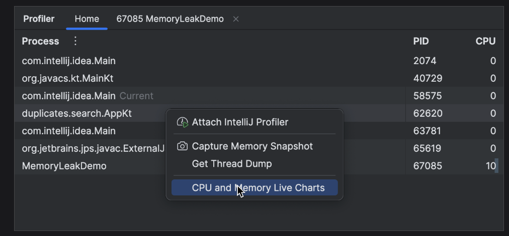
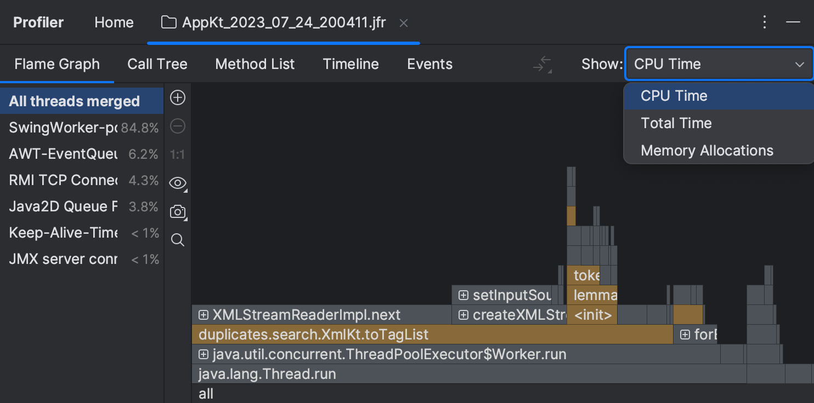

我们在开发生产的过程中为了提高程序性能和观测程序执行情况，我们总是需要监控cpu使用率，线程状态等数据。在这里我推荐几款比较好用方便的调优工具

## IntelliJ Profiler 

该工具是idea 自带的性能分析工具，基本上可以满足我们日常开发需求，它拥有的功能：

- CPU 和内存实时图表；
- CPU 和分配分析；
- 内存快照；
- 线程快照。

### 使用方式

在main方法上选择 “IntelliJ Profiler” 的方式启动main方法


启动成功后，会在idea控制台显示内存cpu的实时监控图表：

也可以通过 `View | Tool Windows | Profiler` 打开监控面板选择需要监控的java进程：


打开后可以查看cpu、线程、堆栈监控信息：


### 生成快照
在main方法上选择 “IntelliJ Profiler” 的方式启动main方法，在Profiler工具窗口中，点击` Stop Profiling and Show Results.` 会生成
对应快照，可以在home栏中查看：


默认情况下，IntelliJ Profiler 仅收集 Java 堆栈跟踪，但它也可以收集本机调用数据，设置方式如图：

直接点击对应的快照就能查看快照信息：


idea 是通过 Java Flight Recorder 和异步分析器来对java进程进行分析，
IntelliJ IDEA 提供了几个视图来分析快照：

- Flame graph：每个方法的耗时和调用链路形成的火焰图
- Call tree：表示代码调用关系
- Method list：提供各个方法的汇总统计信息
- Timeline：以可视化方式呈现随时间变化的线程活动

生成内存快照：

内存快照分析界面如图：


快照的左侧部分显示应用程序中的类的列表、每个类有多少个活动实例、以及所有实例的`Shallow size`和`Retained size`。
Shallow Size是指实例自身占用的内存, 可以理解为保存该'数据结构'需要多少内存, 不包括它引用的其他实例。
Retained Size是指当实例A被回收时, 可以同时被回收的实例的Shallow Size之和。

快照右侧包括`Biggest Objects`、`GC Roots`、`Merged Paths`、`Summary`、`Packages`。
`Biggest Objects` 是大对象列表，堆内存中的对象按大小倒序展示。
`GC Roots`是被标记为 `GC Root`的对象。
`Merged Paths`选项卡按类显示分组对象，并显示到保留它们的支配器对象的路径。这些信息有助于理解为什么保留特定类的实例。
`Summary` 展示了线程的总大小、实例数量和堆栈跟踪等信息。
`Packages`按包显示所有对象的细分，可以定位哪个模块占用内存较多。

生成线程快照方式和内存快照一致：


点击 `Get Thread Dumo`后，在idea 调优界面上左侧会显示当前线程，右侧会显示线程的调用链路，点击工具栏上的导出按钮可以将线程快照导出：


### 调优实战

我们模拟一个 往list 塞很多对象的情况：
```java
    public static void main(String[] args) throws IOException, InterruptedException {
        List<In> test=new ArrayList<>();
        for (int i = 0; i < 100; i++) {
            In in = new In();
            in.setTest("vvvvvvvvvvvvvvvvv"+i);
            test.add(in);
            Thread.sleep(50L);
        }
    }
    
    public static class  In{
        String test;

        public void setTest(String test) {
            this.test = test;
        }
    }
```
然后以 “IntelliJ Profiler” 的方式启动main方法，并导出内存快照：


通过火焰图和调用树不难看出该方法耗时集中在sleep方法上。


通过内存快照的packages 可以定位到我们非jdk 对象中 Test.In 对象占比最多。

实际开发过程中可以通过类似方式定位到耗时的代码和生成大量对象的类，从而进一步对代码进行优化

## arthas

前面我们介绍的`IntelliJ Profiler` 只能在日常开发中使用，而到服务器中我们怎么去做代码的一些指标的监控呢，这里我推荐使用arthas.
对于springboot应用，我们只需要引入依赖：
```xml
<dependency>
    <groupId>com.taobao.arthas</groupId>
    <artifactId>arthas-spring-boot-starter</artifactId>
    <version>3.6.7</version>
</dependency>
```

当我们启动springboot 应用时，会同步启动arthas监控程序。此时我们只需要在应用所在服务器执行：

```shell
telnet 127.0.0.1 3658
```

就能进入arthas控制台。如图：


进入arthas 控制台的方式有 http 请求和telnet的方式，这里我们只介绍telnet方式，如果你的应用是在公网环境，可以远程telnet对应的服务器端口，
那么我们需要给arthas设置密码，或者禁用外网访问，相关配置如下：
```properties
# 为-1 则关闭端口
arthas.telnetPort=3658
arthas.httpPort=8563
# telnet 的ip,配置为127.0.0.1 则只能本地telnet
arthas.ip=127.0.0.1
arthas.username=arthas
arthas.password=arthas

```

接下来我们结合场景介绍一些常用指令，为了方便操作，我们需要装一个`arthas idea plugin` 插件。

### 观测方法执行耗时

许多时候我们做性能优化，需要定位到耗时的代码，从而进一步分析是锁导致耗时还是数据库io导致耗时等。
这个时候我们需要`trace` 这个指令来观测代码执行耗时。

在安装了插件的前提下，鼠标光标定位到需要观测的方法名上，右击选择 `arthas command` 然后选中 `trace` 指令，会在粘贴板上生成一条指令，类似：

```shell
trace com.xxx.xxx method  -n 5 --skipJDKMethod false 
```
在arthas控制台上粘贴指令后执行，可观察到每行代码的耗时，如图：


依此我们可以定位到耗时代码的具体位置，从而进行优化。

trace 指令功能介绍及相关参数：

| 参数名称 | 参数说明 |
|-------|-------|
| class-pattern | 类名表达式匹配 |
| method-pattern | 方法名表达式匹配 |
| condition-express | 条件表达式 |
| [E] | 开启正则表达式匹配，默认为通配符匹配 |
| [n:] | 命令执行次数，默认值为 100。 |
| #cost | 方法执行耗时 |
| [m <arg>] | 指定 Class 最大匹配数量，默认值为 50。长格式为[maxMatch <arg>] |

### 监控方法出入参

很多时候面对一些线上的诡异bug，如果我们能实时的监控到方法的出入参就可以很快速的定位到问题。在arthas中`watch`指令可以实现该操作：
```shell
watch com.xxx.xxx.xxx method '{params,returnObj,throwExp}'  
```
执行效果如图：

很多时候我们只想监控特定入参调用时的方法出参情况，这个时候我们可以通过过滤参数来实现：


也可以通过`grep`指令来过滤:


这里用到了 ongl 表达式，官方文档地址：https://commons.apache.org/dormant/commons-ognl/language-guide.html


### 线上热更新代码。
热更新涉及到的相关指令
```shell
jad --source-only com.muggle.test Message > Message.java
```
这个指令是将jvm中加载的字节码反编译，该反编译对泛型支持不是很好，如果类中存在泛型，反编译出来的源码是错误的。

```shell
sc -d com.muggle.test Message
```
这个指令可以查看类的类加载器。


```shell
mc -c 18b4aac2 /data/Test.java 
```
这个指令通过类加载器对类文件进行编译。

```shell
retransform ./com/muggle/test/Test.class
```
这个指令是加载class文件进行热更新。

这几个指令可以在pod中没办法上传文件到服务器中的场景中，反编译class文件，修改后再编译热更新。

### 其他

查看springboot 参数：
```shell
vmtool --action getInstances --className org.springframework.context.ConfigurableApplicationContext --express 'instances[0].getEnvironment().getProperty("server.port")'
```

查看当前系统的实时数据面板:
```shell
dashboard
```

生成内存快照：
```shell
heapdump arthas-output/dump.hprof
```

监控方法：
```shell
monitor -c 5 demo.MathGame primeFactors
```
