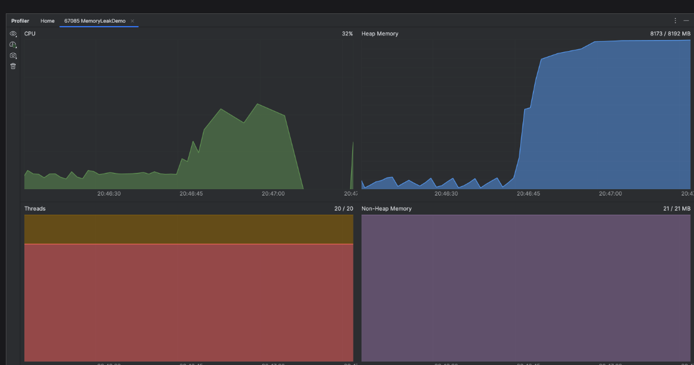

我们在开发生产的过程中为了提高程序性能和观测程序执行情况，我们总是需要监控cpu使用率，线程状态等数据。在这里我推荐几款比较好用方便的调优工具

## IntelliJ Profiler 

该工具是idea 自带的性能分析工具，基本上可以满足我们日常开发需求，它拥有的功能：

- CPU 和内存实时图表；
- CPU 和分配分析；
- 内存快照；
- 线程快照。

### 使用方式

在main方法上选择 “IntelliJ Profiler” 的方式启动main方法


启动成功后，会在idea控制台显示内存cpu的实时监控图表：

也可以通过 `View | Tool Windows | Profiler` 打开监控面板选择需要监控的java进程：


打开后可以查看cpu、线程、堆栈监控信息：


### 生成快照
在main方法上选择 “IntelliJ Profiler” 的方式启动main方法，在Profiler工具窗口中，点击` Stop Profiling and Show Results.` 会生成
对应快照，可以在home栏中查看：


默认情况下，IntelliJ Profiler 仅收集 Java 堆栈跟踪，但它也可以收集本机调用数据，设置方式如图：

直接点击对应的快照就能查看快照信息：


idea 是通过 Java Flight Recorder 和异步分析器来对java进程进行分析，
IntelliJ IDEA 提供了几个视图来分析快照：

- Flame graph：每个方法的耗时和调用链路形成的火焰图
- Call tree：表示代码调用关系
- Method list：提供各个方法的汇总统计信息
- Timeline：以可视化方式呈现随时间变化的线程活动

生成内存快照：

内存快照分析界面如图：


快照的左侧部分显示应用程序中的类的列表、每个类有多少个活动实例、以及所有实例的`Shallow size`和`Retained size`。
Shallow Size是指实例自身占用的内存, 可以理解为保存该'数据结构'需要多少内存, 不包括它引用的其他实例。
Retained Size是指当实例A被回收时, 可以同时被回收的实例的Shallow Size之和。

快照右侧包括`Biggest Objects`、`GC Roots`、`Merged Paths`、`Summary`、`Packages`。
`Biggest Objects` 是大对象列表，堆内存中的对象按大小倒序展示。
`GC Roots`是被标记为 `GC Root`的对象。
`Merged Paths`选项卡按类显示分组对象，并显示到保留它们的支配器对象的路径。这些信息有助于理解为什么保留特定类的实例。
`Summary` 展示了线程的总大小、实例数量和堆栈跟踪等信息。
`Packages`按包显示所有对象的细分，可以定位哪个模块占用内存较多。

生成线程快照方式和内存快照一致：


点击 `Get Thread Dumo`后，在idea 调优界面上左侧会显示当前线程，右侧会显示线程的调用链路，点击工具栏上的导出按钮可以将线程快照导出：


### 调优实战

我们模拟一个 往list 塞很多对象的情况：
```java
    public static void main(String[] args) throws IOException, InterruptedException {
        List<In> test=new ArrayList<>();
        for (int i = 0; i < 100; i++) {
            In in = new In();
            in.setTest("vvvvvvvvvvvvvvvvv"+i);
            test.add(in);
            Thread.sleep(50L);
        }
    }
    
    public static class  In{
        String test;

        public void setTest(String test) {
            this.test = test;
        }
    }
```
然后以 “IntelliJ Profiler” 的方式启动main方法，并导出内存快照：


通过火焰图和调用树不难看出该方法耗时集中在sleep方法上。


通过内存快照的packages 可以定位到我们非jdk 对象中 Test.In 对象占比最多。

实际开发过程中可以通过类似方式定位到耗时的代码和生成大量对象的类，从而进一步对代码进行优化

## arthas

前面我们介绍的`IntelliJ Profiler` 只能在开发环境中