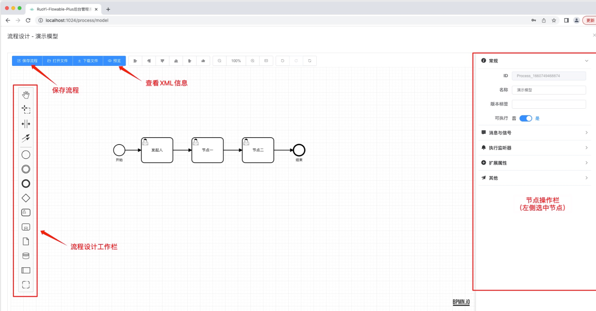
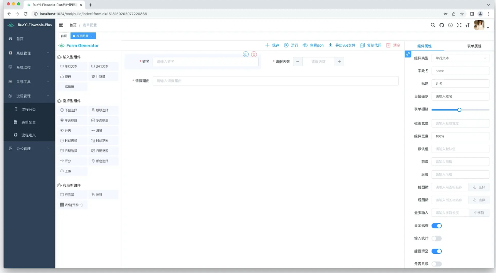

## RuoYi-Flowable-Plus 介绍

最近在研究工作流，发现了 `RuoYi-Flowable-Plus` 这个项目，对其源码进行了一些简单研究，做一个记录给上手工作流的小伙伴提供一个入门教程

[RuoYi-Flowable-Plus文档](http://rfp-doc.konbai.work/)

主要功能介绍：

1.流程设计器

2.表单设计器

我们可以通过若依管理端配置一个表单和流程，并将表单和流程进行关联。当我们通过该流程定义发起一个
流程的时候，会填写绑定的表单，并且该表单会在流程中流转，如图所示：

使用场景：OA系统，erp系统，crm系统等。

## flowable 介绍

参考文档：

## 流程绘制与审批

## 会签、或签实现

## 抄送功能

## 业务规则任务介绍
