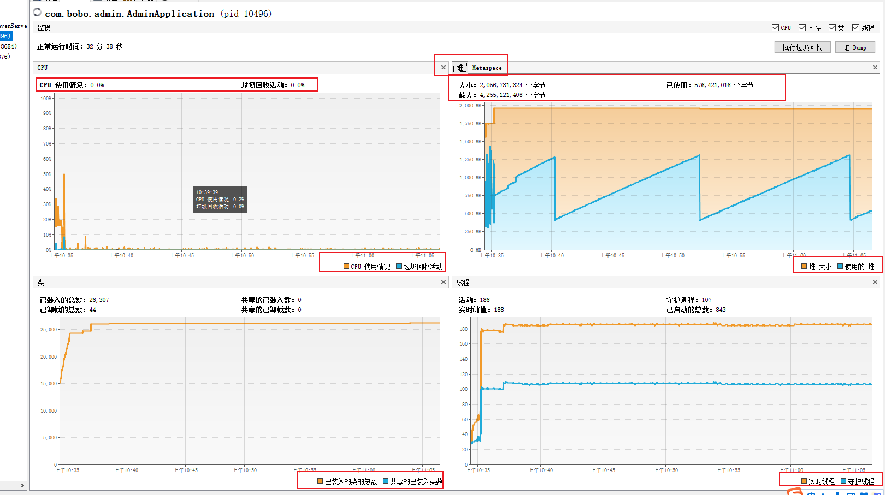
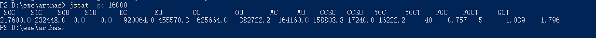
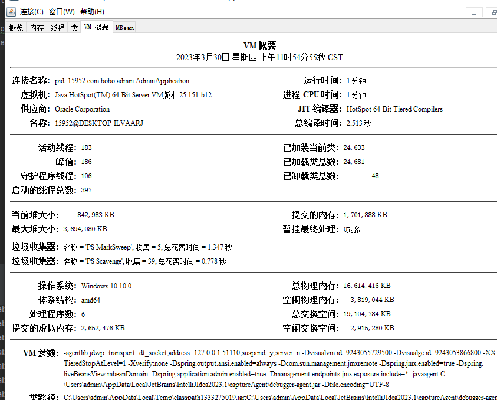
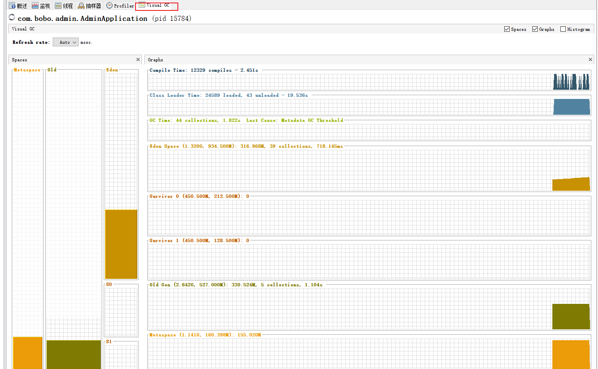
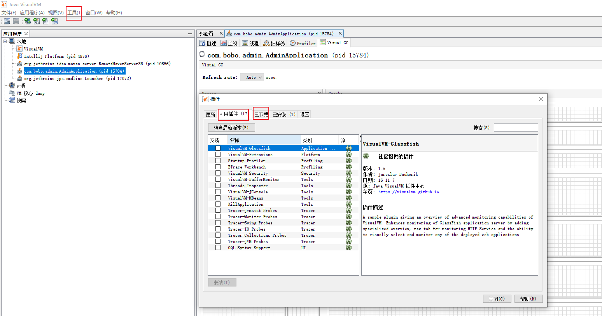

jvisiualVM能看到什么：



查看运行中的 jvm 使用了什么垃圾收集器：
```
java -XX:+PrintCommandLineFlags -version

jmap -heap 15784
```
其中 ` -XX:+UseParallelGC` 表示使用了 ps +po ,调整为 cms+pn 的方法：
```
-XX:+UseConcMarkSweepGC
-XX:+UseParNewGC

G1
-XX:+UseG1GC
```
其他参数：

```
-XX:+CMSParallelRemarkEnabled
采用并行标记方式降低停顿。

-XX:+CMSConcurrentMTEnabled
当该标志被启用时，并发的CMS阶段将以多线程执行
```

GC 统计的方法:

```
jstat -gc 16000
```


S0：幸存1区当前使用比例
S1：幸存2区当前使用比例
E：伊甸园区使用比例
O：老年代使用比例
M：元数据区使用比例
CCS：压缩使用比例
YGC：年轻代垃圾回收次数
YGCT：年轻代垃圾回收时间
FGC：老年代垃圾回收次数
FGCT：老年代垃圾回收时间
GCT：垃圾回收时间总和

GC 日志统计GC频率，通过 GCeasy  在线分析：

```
-XX:+PrintGCDetails -XX:+PrintGCTimeStamps -XX:+PrintGCDateStamps -Xloggc:/path/to/gc.log
```


Jconsole ：





Visual GC 安装

