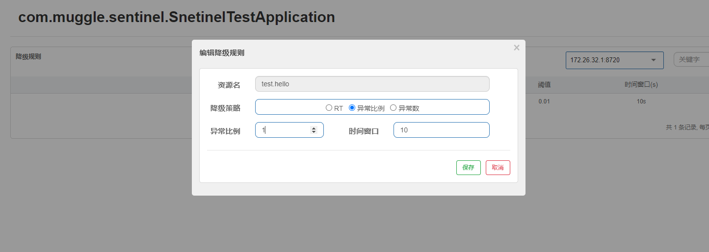
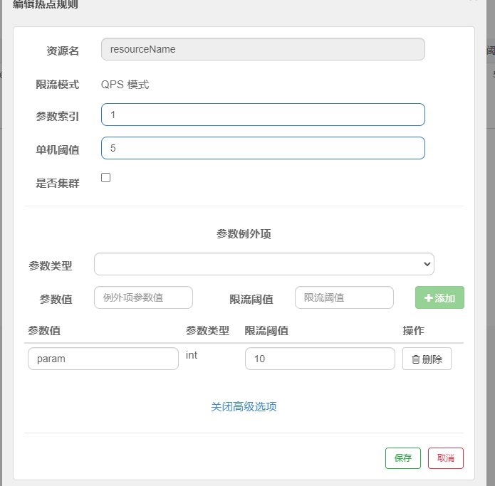
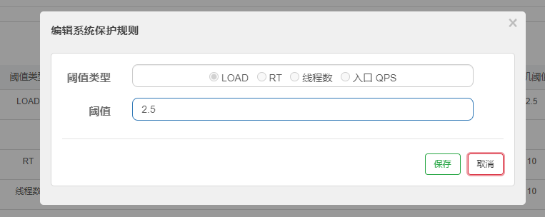

## sentinel介绍
sentinel 是阿里开源的流量控制，熔断降级，系统负载保护的一个Java组件；

Sentinel 分为两个部分:
核心库（Java 客户端）不依赖任何框架/库，能够运行于所有 Java 运行时环境，同时对 Dubbo / Spring Cloud 等框架也有较好的支持。
控制台（Dashboard）基于 Spring Boot 开发，打包后可以直接运行，不需要额外的 Tomcat 等应用容器。
Quick Start

[sentinel 官方文档点击这里](https://github.com/alibaba/Sentinel/wiki/%E4%BB%8B%E7%BB%8D)

## sentinel Quick Start
我们这里还是以springboot 项目写一个demo，创建完成springboot 项目之后pom中引入依赖：

```pom
<dependency>
    <groupId>com.alibaba.csp</groupId>
    <artifactId>sentinel-core</artifactId>
    <version>1.8.1</version>
</dependency>
```
然后定义流控规则并加载到内存：
```java

@Configuration
public class SentileConfig {


    @PostConstruct
    private void initRules() throws Exception {
        FlowRule rule1 = new FlowRule();
        rule1.setResource("test.hello");
        rule1.setGrade(RuleConstant.FLOW_GRADE_QPS);
        rule1.setCount(1);   // 每秒调用最大次数为 1 次
        List<FlowRule> rules = new ArrayList<>();
        rules.add(rule1);
        // 将控制规则载入到 Sentinel
        com.alibaba.csp.sentinel.slots.block.flow.FlowRuleManager.loadRules(rules);
    }
}
```

然后创建 `controller` 并定义资源：

```java

@RestController
public class TestController {
   

    @GetMapping("/test0")
    public String test0(){
        try {
            Entry resourceName = SphU.entry("test.hello");
            return resourceName.toString();
        } catch (BlockException e) {
            e.printStackTrace();
            return "error";
        }
    }
}

```

然后我们启动项目并访问 `http://localhost:8081/test0` 然后不断的刷新，就会发现如果刷新频率超过一秒就会返回error 否则会返回一个时间戳。
这里这些类的api和源码我们先不介绍，只对其功能先做一个大致的体验。

接下来我们继续引入依赖：
```xml
        <dependency>
            <groupId>com.alibaba.csp</groupId>
            <artifactId>sentinel-annotation-aspectj</artifactId>
            <version>1.8.1</version>
        </dependency>
```

同时注入一个切面到springboot 中去：

```java
    @Bean
    public SentinelResourceAspect sentinelResourceAspect() {
        return new SentinelResourceAspect();
    }

```

这个时候我们就可以通过注解去做流量控制了，写一个接口测试一下：

```java
    @GetMapping("/test")
    @SentinelResource(value = "test.hello")
    public String test(){
        return "success";
    }

```

同样通过浏览器访问这个接口并不断刷新，会发现会频率过快的时候会返回 springboot 的错误页面，这是因为当aop切面会抛出 `BlockException`，当没有对应的
异常处理器的时候springboot就会返回默认错误页面。这个时候我们有两种方式处理我们超出访问频率的时候的逻辑。

第一种，加降级方法：

```java
 @GetMapping("/test")
    @SentinelResource(value = "test.hello",fallback = "testFallback")
    public String test(){
        return "success";
    }
    
    public String testFallback() {
        return "xxx";
    }

```

第二种，加`BlockException`异常处理器：

```java

@ControllerAdvice
public class ExceptionHandlerConfig {

    private Logger logger = LoggerFactory.getLogger(this.getClass());

    @ExceptionHandler(BlockException.class)
    @ResponseBody
    public ResultWrapper sentinelBlockHandler(BlockException e) {
        logger.warn("Blocked by Sentinel: {}", e.getRule());
        // Return the customized result.
        return "error";
    }
}

```


## 对所有controller 层做流控
`sentinel` 还提供了 spring-mvc 的拦截器，配置该拦截器你可以对你项目的所有所有请求进行流控管理，首先我们需要引入依赖：
```xml
        <dependency>
            <groupId>com.alibaba.csp</groupId>
            <artifactId>sentinel-spring-webmvc-adapter</artifactId>
            <version>1.8.1</version>
        </dependency>
```

然后注入一个sentinel 的拦截器：
```java
@Configuration
public class SimpleWebmvcConfig implements WebMvcConfigurer {
    @Override
    public void addInterceptors(InterceptorRegistry registry) {
        // 注冊sentinel 拦截器
        SentinelWebMvcConfig config = new SentinelWebMvcConfig();
        config.setHttpMethodSpecify(true);
        config.setWebContextUnify(true);
        config.setBlockExceptionHandler(new SimpleBlockExceptionHandler());
        registry.addInterceptor(new SentinelWebInterceptor(config)).addPathPatterns("/**");
    }
}
```

代码中 `SimpleBlockExceptionHandler` 是自定义流控异常处理器，作用是处理流控异常 `BlockException` 源码如下：
```java

public class SimpleBlockExceptionHandler implements BlockExceptionHandler {
    @Override
    public void handle(HttpServletRequest httpServletRequest, HttpServletResponse httpServletResponse, BlockException e) throws Exception {
        httpServletResponse.setContentType("application/json");
        PrintWriter out = httpServletResponse.getWriter();
        out.print("{\"code\":500}");
        out.flush();
        out.close();
    }
}
```
`SentinelWebMvcConfig` 是流控配置类，通过其属性命名就不难猜出其作用 `isHttpMethodSpecify` 是否区分请求方式；
`isWebContextUnify`是否使用统一web上下文； `UrlCleaner` 是url清理器，作用是对url进行整理

## 接入控制台
`sentinel` 为我们提供了一个控制台应用，通过这个控制台我们可以直观的看到流控数据，动态的修改流控规则，下面让我们看看如何接入控制台。

首先引入依赖：

```xml
        <dependency>
            <groupId>com.alibaba.csp</groupId>
            <artifactId>sentinel-transport-simple-http</artifactId>
            <version>1.8.1</version>
        </dependency>
```

这个依赖sentinel连接 控制端的通讯包。

然后添加配置：
```properties
csp.sentinel.dashboard.server=localhost:8080
```

注意，因为这个配置项不是属于 springboot的 所以不能添加在application中，要通过 -D 的方式在jvm启动的时候添加这个配置项。

再去 [sentinel的github](https://github.com/alibaba/Sentinel/releases) 下载 控制台jar包 ，启动该jar包；访问8080 端口，
登录账号密码和密码都是 sentinel。这个控制台实际上是一个springboot应用，启动端口和账号密码都可以通过application 修改。
接下来，启动我们自己的应用，并访问一些接口，我们就能再界面上看到监控数据：


通过控制台我们可以监控流量，管理流控降级等规则，这些规则都是存储在我们程序应用的内存中的，因此我们还需要学会这些规则的配置使用及其持久化。

sentinel 官方还提供了 springcloud 的包，可以让我们很方便的在 spring cloud 项目中使用sentinel，springcloud 中使用 sentinel和 springboot
中使用sentinel方式差不多，只是多了一个链路调用；因此我们要先学会了如何在 springboot中使用它。


# sentinel 实战

## 簇点链路


## 流控规则持久化

我们之前配置的流控规则都是存储在应用的内存中的，这种方式明显无法满足我们实际开发的需求，一旦项目被重启，流控规则就被初始化了，需要我们再次去重新配置，因此规则的持久化就显得很有必要了。

本节会介绍几类主流持久化方式并对自定义持久化做介绍

### 文件持久化

文件持久化是通过 sentinel spi 扩展点来加载本地文件中的持久化数据到内存中，它依赖接口 `InitFunc`，对于非spring项目这种方式可以很便捷的实现
文件持久化。

实现文件持久化首先要自定义一个类并实现`InitFunc` 接口：

```java

public class MyflieInitFunc implements InitFunc {
    @Override
    public void init() throws Exception {
        URL resource = MyflieInitFunc.class.getClassLoader().getResource("");
        File file = new File(resource.getPath()+"/config/flow.json");
        File fileParent = file.getParentFile();
        if(!fileParent.exists()){
            fileParent.mkdirs();
        }
        if (!file.exists()){
            file.createNewFile();
        }
        ReadableDataSource<String, List<FlowRule>> flowReadDataSource = new FileRefreshableDataSource<>(
            resource.getPath()+"/config/flow.json",
            source -> JSON.parseObject(
                source,
                new TypeReference<List<FlowRule>>() {
                }
            ));
        FlowRuleManager.register2Property(flowReadDataSource.getProperty());
        WritableDataSource<List<FlowRule>> flowWriteDataSource = new FileWritableDataSource<>(
            resource.getPath()+"/config/flow.json",
            t->JSON.toJSONString(t)
        );
        WritableDataSourceRegistry.registerFlowDataSource(flowWriteDataSource);
    }
}
```

然后在resources 文件夹下新建文件 `META-INF\services\com.alibaba.csp.sentinel.init.InitFunc` 
内容为`MyflieInitFunc` 的类路径：
```properties
com.muggle.sentinel.config.MyflieInitFunc
```

完成以上步骤后，文件持久化的方式就配置完成了。

`InitFunc` 的资源初始化方法 `init()` 并不是在项目启动的时候调用的，而是在首次产生流控数据的时候调用的，
也就是说它是一个懒加载的方法。
在文件持久化配置中，`FileRefreshableDataSource` , `FileWritableDataSource` , `FlowRuleManager` 这三个类是有必要去熟识的。

- FlowRuleManager 流控规则管理器，用于对流控规则的加载和管理，每类规则都有对应的管理器，后文会介绍。
- FileRefreshableDataSource 流控规则读取及刷新的类，该类配置到sentinel中后会定时拉取流控文件中的流控规则
- FileWritableDataSource 流控规则写入类，当我们在控制台编辑新的流控规则后，控制台会将规则推送给应用，应用接收到推送的规则后，
会通过该类将数据写入流控文件中

### `FlowRuleManager` 源码分析

```java

public class FlowRuleManager {
    private static final AtomicReference<Map<String, List<FlowRule>>> flowRules = new AtomicReference();
    private static final FlowRuleManager.FlowPropertyListener LISTENER = new FlowRuleManager.FlowPropertyListener();
    private static SentinelProperty<List<FlowRule>> currentProperty = new DynamicSentinelProperty();
    private static final ScheduledExecutorService SCHEDULER = Executors.newScheduledThreadPool(1, new NamedThreadFactory("sentinel-metrics-record-task", true));
     
    public static List<FlowRule> getRules() {
       
        List<FlowRule> rules = new ArrayList();
        Iterator var1 = ((Map)flowRules.get()).entrySet().iterator();

        while(var1.hasNext()) {
            Entry<String, List<FlowRule>> entry = (Entry)var1.next();
            rules.addAll((Collection)entry.getValue());
        }

        return rules;
    }
    
    public static void loadRules(List<FlowRule> rules){
         currentProperty.updateValue(rules);
    }
    
     public static boolean hasConfig(String resource) {
         return ((Map)flowRules.get()).containsKey(resource);
    }
}
```
该类的静态属性包括 流控规则数组 `flowRules` ，用于监控流控规则更新的监听器`LISTENER` , 轮询监听流控配置的线程池`SCHEDULER`,sentinel 配置类`currentProperty`.
而它几个api也很明了，就是对流控规则的增删改查。

### `FileRefreshableDataSource` 源码分析

`FileRefreshableDataSource` 继承了`AutoRefreshDataSource`,而`AutoRefreshDataSource` 中有一个线程池 `service` 用于拉取 文件中存储的规则
以及拉取间隔 `recommendRefreshMs` .
：

```java

public abstract class AutoRefreshDataSource<S, T> extends AbstractDataSource<S, T> {
    private ScheduledExecutorService service;
    protected long recommendRefreshMs = 3000L;

    public AutoRefreshDataSource(Converter<S, T> configParser) {
        super(configParser);
        this.startTimerService();
    }
......
     private void startTimerService() {
            this.service = Executors.newScheduledThreadPool(1, new NamedThreadFactory("sentinel-datasource-auto-refresh-task", true));
            this.service.scheduleAtFixedRate(new Runnable() {
                public void run() {
                    try {
                        if (!AutoRefreshDataSource.this.isModified()) {
                            return;
                        }
    
                        T newValue = AutoRefreshDataSource.this.loadConfig();
                        AutoRefreshDataSource.this.getProperty().updateValue(newValue);
                    } catch (Throwable var2) {
                        RecordLog.info("loadConfig exception", var2);
                    }
    
                }
            }, this.recommendRefreshMs, this.recommendRefreshMs, TimeUnit.MILLISECONDS);
        }

}
``` 
我们重点关注 `startTimerService` 这个方法,这个方法是在构造器里面调用的，也就是说当你new 一个 `FileRefreshableDataSource` 时就会调用该方法

该方法就是通过线程池定时调用`isModified` 方法判断配置是否更新过，如果更新了就同步更新到父类属性 `SentinelProperty` 中，代码对应:

```java
 AutoRefreshDataSource.this.getProperty().updateValue(newValue)
```
不难判读出，父类抽象类的`property` 属性才是真正的获取规则提供拦截判断的关键属性。后文也会用到这个知识点，这里记一下。
 
我们可以看一下 `FileRefreshableDataSource` 构造函数：

```java

 public FileRefreshableDataSource(File file, Converter<String, T> configParser) throws FileNotFoundException {
        this(file, configParser, 3000L, 1048576, DEFAULT_CHAR_SET);
    }

    public FileRefreshableDataSource(String fileName, Converter<String, T> configParser) throws FileNotFoundException {
        this(new File(fileName), configParser, 3000L, 1048576, DEFAULT_CHAR_SET);
    }

    public FileRefreshableDataSource(File file, Converter<String, T> configParser, int bufSize) throws FileNotFoundException {
        this(file, configParser, 3000L, bufSize, DEFAULT_CHAR_SET);
    }

    public FileRefreshableDataSource(File file, Converter<String, T> configParser, Charset charset) throws FileNotFoundException {
        this(file, configParser, 3000L, 1048576, charset);
    }

    public FileRefreshableDataSource(File file, Converter<String, T> configParser, long recommendRefreshMs, int bufSize, Charset charset) 
```

不难看出，如果在 new `FileRefreshableDataSource` 时不指定刷新间隔就取默认值 3000 毫秒。

### `FileWritableDataSource` 源码分析

```java

public class FileWritableDataSource<T> implements WritableDataSource<T> {
    private static final Charset DEFAULT_CHARSET = Charset.forName("UTF-8");
    private final Converter<T, String> configEncoder;
    private final File file;
    private final Charset charset;
    private final Lock lock;
    
    public void write(T value) throws Exception {
        this.lock.lock();
        try {
            String convertResult = (String)this.configEncoder.convert(value);
            FileOutputStream outputStream = null;

            try {
                outputStream = new FileOutputStream(this.file);
                byte[] bytesArray = convertResult.getBytes(this.charset);
                RecordLog.info("[FileWritableDataSource] Writing to file {}: {}", new Object[]{this.file, convertResult});
                outputStream.write(bytesArray);
                outputStream.flush();
            } finally {
                if (outputStream != null) {
                    try {
                        outputStream.close();
                    } catch (Exception var16) {
                    }
                }

            }
        } finally {
            this.lock.unlock();
        }
    }
}

```
代码结构也很了然，一个数据转换器，一个 file 一个lock ,当框架调用 `write` 方法时上锁并往 file中写配置。

分析得差不多了，让我们看看实战效果吧；

首先启动项目和控制台，然后在控制台上配置一个流控规则，可以观察到项目规则存储文件中多了点内容：


```json
[{"clusterConfig":{"acquireRefuseStrategy":0,"clientOfflineTime":2000,"fallbackToLocalWhenFail":true,"resourceTimeout":2000,"resourceTimeoutStrategy":0,"sampleCount":10,"strategy":0,"thresholdType":0,"windowIntervalMs":1000},"clusterMode":false,"controlBehavior":0,"count":1.0,"grade":1,"limitApp":"default","maxQueueingTimeMs":500,"resource":"test","strategy":0,"warmUpPeriodSec":10}]
```

我们重启项目和控制台规则也不会丢失，规则持久化生效。

通过分析我们知道，这种持久化方式是一种拉模式，胜在配置简单，不需要外部数据源就能完成流控数据的持久化。由于规则是用 FileRefreshableDataSource 定时更新的，所以规则更新会有延迟。
如果FileRefreshableDataSource定时时间过大，可能长时间延迟；如果FileRefreshableDataSource过小，又会影响性能；
因为规则存储在本地文件，如果需要迁移微服务，那么需要把规则文件一起迁移，否则规则会丢失。

文件持久化能应付我们需求的大部分场景，但对于微服务而言是不那么满足要求的；
因为文件持久化就必定要求我们在服务器上提供一个用于存储配置文件的文件夹，而微服务项目大部分情况是容器部署，这就让文件持久化显得不那么好用了。

为此，官方提供了自定义的持久化maven依赖：
```xml
        <dependency>
            <groupId>com.alibaba.csp</groupId>
            <artifactId>sentinel-datasource-extension</artifactId>
        </dependency>

```
以及在这个依赖的基础上开发的以CONSUL NACOS REDIS 作为数据源的maven 依赖：

```xml
        <dependency>
            <artifactId>sentinel-datasource-consul</artifactId>
            <groupId>com.alibaba.csp</groupId>
        </dependency>
        <dependency>
            <artifactId>sentinel-datasource-redis</artifactId>
            <groupId>com.alibaba.csp</groupId>
        </dependency>

        <dependency>
            <artifactId>sentinel-datasource-nacos</artifactId>
            <groupId>com.alibaba.csp</groupId>
        </dependency>

```
### redis 持久化
以上三种种持久化不同于文件持久化，它们是推模式的，而且迁移部署起来更为方便，符合微服务的特性。接下来我们就以nacos持久化为例来学习一下这种方式是怎么配置的。

首先引入 nacos 相关依赖依赖：
```xml

        <dependency>
            <artifactId>sentinel-datasource-nacos</artifactId>
            <groupId>com.alibaba.csp</groupId>
        </dependency>
```
然后通过`FlowRuleManager` 注册数据源就ok了
```java
        ReadableDataSource<String, List<FlowRule>> flowRuleDataSource = new NacosDataSource<>(remoteAddress, groupId, dataId,
            source -> JSON.parseObject(source, new TypeReference<List<FlowRule>>() {
            }));
        FlowRuleManager.register2Property(flowRuleDataSource.getProperty());
```
remoteAddress 是nacos 的地址； groupId和dataId均为nacos配置中心的属性，在创建配置项的时候由使用者自定义，如图为在nacos创建配置项的截图：


启动nacos，启动我们的项目和控制台，然后修改nacos中的配置项，就能再控制台上观测到规则变化，nacos中存储的规则也是json,我们可以把文件持久化教程中产生json
复制进去，这里就不在赘述。

这种模式是推模式，优点是这种方式有更好的实时性和一致性保证。因为我们和文件持久化比起来少注册了一个与`FileWritableDataSource` 对应的类，
也就是说应用中更新的规则不能反写到nacos,只能通过nacos读取到配置；因此我们在控制台上修改的规则也不会持久化到nacos中。这样设计是合理的，因为nacos作为
配置中心不应该允许应用去反写自己的配置。

## 源码分析

因为文件持久化分析了一部分源码，因此这里不会对源码分析太多，只简单的介绍它是如何去读取到配置的。


```java

public class NacosDataSource<T> extends AbstractDataSource<String, T> {

    private static final int DEFAULT_TIMEOUT = 3000;
    private final ExecutorService pool;
    private final Listener configListener;
    private final String groupId;
    private final String dataId;
    private final Properties properties;
    private ConfigService configService;

    public NacosDataSource(final Properties properties, final String groupId, final String dataId, Converter<String, T> parser) {
        super(parser);
        this.pool = new ThreadPoolExecutor(1, 1, 0L, TimeUnit.MILLISECONDS, new ArrayBlockingQueue(1), new NamedThreadFactory("sentinel-nacos-ds-update"), new DiscardOldestPolicy());
        this.configService = null;
        if (!StringUtil.isBlank(groupId) && !StringUtil.isBlank(dataId)) {
            AssertUtil.notNull(properties, "Nacos properties must not be null, you could put some keys from PropertyKeyConst");
            this.groupId = groupId;
            this.dataId = dataId;
            this.properties = properties;
            this.configListener = new Listener() {
                public Executor getExecutor() {
                    return NacosDataSource.this.pool;
                }

                public void receiveConfigInfo(String configInfo) {
                    RecordLog.info("[NacosDataSource] New property value received for (properties: {}) (dataId: {}, groupId: {}): {}", new Object[]{properties, dataId, groupId, configInfo});
                    T newValue = NacosDataSource.this.parser.convert(configInfo);
                    NacosDataSource.this.getProperty().updateValue(newValue);
                }
            };
            this.initNacosListener();
            this.loadInitialConfig();
        } else {
            throw new IllegalArgumentException(String.format("Bad argument: groupId=[%s], dataId=[%s]", groupId, dataId));
        }
    }
}
```
我们看它的构造方法，创建了一个线程池，然后通过这个线程池 new 了一个nacos的Listener，Listener是一个监听器，initNacosListener() 方法是将监听器
注册到 nacos的configService 里面，通过这个监听器去监听nacos的配置变化，当配置发生更新的时候，调用监听器的 `receiveConfigInfo` 方法：

```java
public void receiveConfigInfo(String configInfo) {
    RecordLog.info("[NacosDataSource] New property value received for (properties: {}) (dataId: {}, groupId: {}): {}", new Object[]{properties, dataId, groupId, configInfo});
    T newValue = NacosDataSource.this.parser.convert(configInfo);
    NacosDataSource.this.getProperty().updateValue(newValue);
}

```

前面分析文件持久话我们就分析过，配置最终要被更新到父类的`property` 属性里面，再这里我们也看到了同样的代码。

# sentinel 规则配置及使用

sentinel 增加规则的方式 包括三种，数据源加载，代码加载，控制台加载；每一类流控规则我都会从这三个方面去说明如何使用。

## 流量控制

流量控制是通过监控应用流量的qps或者并发线程数是否达到阈值来保护应用的一种手段，避免应用被瞬时的流量高峰冲垮，从而保障系统的高可用。

流量控制的方式：

- 并发线程数流控：通过控制并发线程数来保证访问资源的流量不超过某个阈值
- qps流控：通过控制资源的qps来达到流控的目的，qps相比较于并发线程数流控效果更为直观。

流量控制的相关概念：

- resource：资源名称，资源可以是一个代码块或者方法
- count: 限流阈值
- grade: 限流阈值类型
- limitApp: 流控针对的调用来源，若为default则不区划来源，在分布式系统中该参数有用
- strategy: 限流策略
- controlBehavior: 流控行为，包括直接拒绝，warm up ,排队等待。直接拒接就是超出阈值，直接拒绝后面的请求；warm up 是让系统预热一段时间，
它的阈值并不是一开始就是设定值，会随着qps 或线程数的增加而慢慢提高到设定值；排队等待是请求过多时，让请求匀速的进入后台进行处理。采用漏斗算法，
控制流量设置超时时间，超时的则将请求抛弃，返回错误信息

流控规则代码方式配置示例：

```java

        FlowRule rule1 = new FlowRule();
        rule1.setResource("test.hello");
        rule1.setGrade(RuleConstant.FLOW_GRADE_QPS);
        // 每秒调用最大次数为 1 次
        rule1.setCount(1);
        List<FlowRule> rules = new ArrayList<>();
        // 将控制规则载入到 Sentinel
        FlowRuleManager.loadRules(rules);
```

流控规则控制台配置示例：


流控规则数据源json示例：


```json
[{"clusterConfig":{"acquireRefuseStrategy":0,"clientOfflineTime":2000,"fallbackToLocalWhenFail":true,"resourceTimeout":2000,"resourceTimeoutStrategy":0,"sampleCount":10,"strategy":0,"thresholdType":0,"windowIntervalMs":1000},"clusterMode":false,"controlBehavior":0,"count":1.0,"grade":1,"limitApp":"default","maxQueueingTimeMs":500,"resource":"test","strategy":0,"warmUpPeriodSec":10}]
```

## 降级规则

熔断降级会在调用链路中当某个资源指数超出阈值时对这个资源的调用进行熔断，在熔断时间窗口内所有调用都快速失败调用降级方法，直到熔断恢复；
降级熔断和流控规则的区别是在超出阈值后的时间窗内所有的调用都会被降级，直到熔断恢复。

熔断降级相关概念：

- resource：资源名称，资源可以是一个代码块或者方法 
- count: 熔断阈值
- grade: 熔断阈值类型(秒级RT/秒级异常比例/分钟级异常数)
- timeWindow: 降级的时间，单位秒
- rtSlowRequestAmount: RT模式下1秒内连续多少个请求的平均RT超出阈值才能触发熔断
- minRequestAmount: 异常熔断触发的最小请求数，请求数小于该值时即使异常比例超过阈值也不会熔断


熔断降级策略：

- 秒级RT（默认）：在1秒内进入的n个响应中，如果最终的平均响应时间超过了阈值，那么在接下来的timeWindow 时间内会自动熔断降级接下来的响应。
- 秒级异常比例：当每秒请求数超过n个，且异常请求的比例超过阈值，那么在接下来的timeWindow 时间内会自动熔断降级接下来的响应。
- 分钟级异常数：当一分钟内请求的数量超过阈值后会熔断，因为统计时长是一分钟，当timeWindow降级熔断时间小于一分钟，当降级熔断结束后可能仍超过异常阈值继续进入熔断降级状态

降级熔断代码配置
```java
    DegradeRule rule = new DegradeRule();
    List<DegradeRule> rules1=new ArrayList<>();
    //资源名称
    rule.setResource("test.hello");
    // 熔断平均响应时间阈值
    rule.setCount(0.01);
    // 秒级RT
    rule.setGrade(RuleConstant.DEGRADE_GRADE_RT);
    rule.setTimeWindow(10);
    rules1.add(rule);
    DegradeRuleManager.loadRules(rules1);
```

流控规则控制台配置示例：


## 热点规则

热点规则是对热点数据进行限流，支持对特定参数和参数的值限流。热点限流会统计参数中的热点参数，并根据配置的限流阈值与模式对包含热点参数的资源进行限流。
Sentinel利用LRU策略统计最近最常访问的热点参数，结合令牌桶算法来进行参数级别的流控。

热点规则的概念：

- resource：资源名称，资源可以是一个代码块或者方法 
- count: 熔断阈值
- grade: 熔断阈值类型(秒级RT/秒级异常比例/分钟级异常数)
- durationInSec: 统计窗口时间长度（单位为秒，默认1S） 默认1S
- controlBehavior: 流控效果（支持快速失败和匀速排队模式，默认快速失败）
- maxQueueingTimeMs: 最大排队等待时长（仅在匀速排队模式生效）
- paramIdx: 热点参数的索引，必填，对应 SphU.entry(xxx, args) 中的参数索引位置
- paramFlowItemList: 参数例外项，可以针对指定的参数值单独设置限流阈值，不受前面 count 阈值的限制。仅支持基本类型和字符串类型


热点规则代码配置
```java
    ParamFlowRule paramFlowRule = new ParamFlowRule("resourceName")
            .setParamIdx(0)
            .setCount(5);
    // 单独设置限流 QPS，设置param 参数限流规则
    ParamFlowItem item = new ParamFlowItem().setObject("param")
            .setClassType(int.class.getName())
            .setCount(10);
    paramFlowRule.setParamFlowItemList(Collections.singletonList(item));
    ParamFlowRuleManager.loadRules(Collections.singletonList(paramFlowRule));
```
流控规则控制台配置示例：



## 系统规则

系统规则限流是从整体维度上去进行流控，结合应用的load,cpu使用率,总体平均RT,入口QPS和并发线程数等几个维度的监控指标来对总体的流量进行限流，在系统稳定的前提下保证系统的吞吐量

系统规则模式：

- load 自适应: 当系统负载高于某个阈值，就禁止或者减少流量的进入，当load 开始好转，则恢复流量的进入，通过读取操作系统参数 load1 来判断，仅对类unix系统生效。
- cpu 使用率: 当cpu 使用率超过阈值开始限流
- 平均RT: 当系统平均响应时间超过阈值开始限流
- 并发线程数: 当并发线程数超过阈值开始限流
- 入口qps: 当系统入口qps超过阈值开始限流

系统规则的概念

- highestSystemLoad: 负载触发值
- avgRt: 平均响应时间
- qps: 应用入口qps
- highestCpuUsage: cpu使用率

系统规则配置代码示例：

因为系统规则只对入口规则进行限定,所以需要将资源通过注解配置 `@SentinelResource(entryType = EntryType.IN)` 来指定为入口资源

```java
    // 指定资源为入口资源
    @GetMapping("/test3")
    @SentinelResource(entryType = EntryType.IN)
    public String test3(){
        return ">>>>>>>>";
    }

    SystemRule systemRule = new SystemRule();
    systemRule.setHighestCpuUsage(0.8);
    systemRule.setAvgRt(10);  
    systemRule.setQps(10);   
    systemRule.setMaxThread(10);  
    systemRule.setHighestSystemLoad(2.5);   
    SystemRuleManager.loadRules(Collections.singletonList(systemRule));
```


## 授权规则

授权规则的作用是根据调用来源来拦截调用资源的请求，当不符合放行规则的请求过来就会被拒绝掉。

授权规则的概念

- resource: 资源名
- limitApp: 请求来源，对应的黑名单或者白名单；
- qps: 应用入口qps
- strategy: 限制模式，分黑名单模式（authority_black），白名单模式（authority_white 默认）

## 集群流控

## sentinel核心类解析
FlowSlot

https://blog.csdn.net/guzhangyu12345/article/details/107490874


## 
    
## 结语

## 